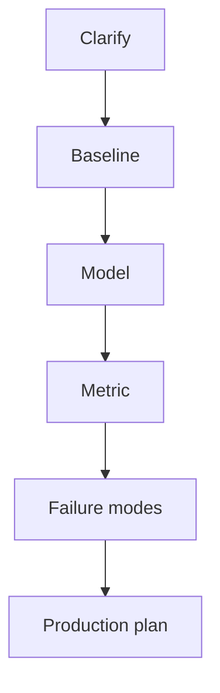

# Interview Guide

## What Interviewers Are Really Testing

AI and ML interviews test whether you can turn uncertain data problems into useful systems. You need
to show fundamentals, practical judgment, communication, and operational awareness. A correct formula
is useful, but a strong answer also explains assumptions, metrics, failures, and deployment.

## Core Answer Framework

1. Clarify the product goal and user decision.
2. Define inputs, labels, constraints, and success metrics.
3. Start with a simple baseline.
4. Choose a model family and justify the tradeoff.
5. Evaluate with realistic splits and segment analysis.
6. Discuss failure modes, monitoring, rollback, and iteration.

## Common Interview Areas

- ML fundamentals and bias-variance reasoning.
- Statistics, experiments, and uncertainty.
- Classical ML algorithms and evaluation.
- Deep learning and transformers.
- LLMs, RAG, vector search, agents, and guardrails.
- ML system design and production AI operations.
- Behavioral stories about ambiguity, debugging, and impact.

## Practice Plan

Use [interview-prep/](interview-prep/) for question drills, [mocks/](mocks/) for full rounds, and
[cheatsheets/](cheatsheets/) for quick revision. After every mock, rewrite one answer in a tighter
structure.

## Diagram

---
## Navigation

[⬅ Previous](STUDY_PLAN.md) | [🏠 Home](README.md) | [➡ Next](PROJECTS.md)
