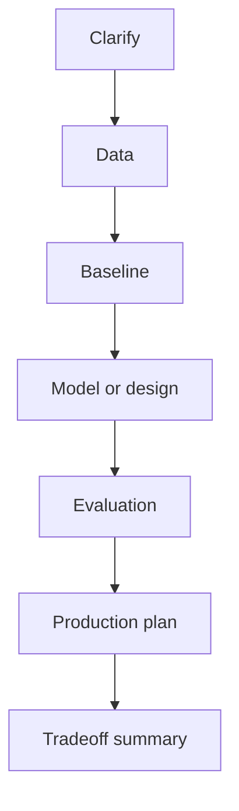

# Interview Guide

## What Interviewers Are Testing

AI and ML interviews test whether you can turn uncertain data problems into useful systems. A strong
answer moves from product framing to data, baseline, model choice, evaluation, failure modes, and
production operations. Formulas matter, but they are not enough without assumptions and tradeoffs.

## Core Answer Framework

| Step | What to say |
| --- | --- |
| Clarify | User, decision, scope, constraints, and cost of mistakes |
| Data | Inputs, labels, feedback, freshness, permissions, and leakage risks |
| Baseline | The simplest measurable approach and why it is a fair reference |
| Model or design | The chosen method, why it fits, and what complexity it adds |
| Evaluation | Primary metric, guardrails, slices, regression set, and error analysis |
| Production | Serving path, latency, cost, monitoring, rollback, privacy, and ownership |

## Strong Answer Pattern

1. State the goal in one sentence.
2. Define input, output, and metric.
3. Start with a baseline.
4. Add the model or architecture only after naming the failure the baseline cannot handle.
5. Evaluate with slices and hard examples.
6. Discuss deployment constraints and rollback.
7. End with the biggest tradeoff.

## Common Interview Areas

| Area | High-signal topics |
| --- | --- |
| Fundamentals | Splits, leakage, baselines, bias-variance, metrics, and generalization |
| Statistics | A/B tests, uncertainty, sampling bias, causality, and experiment design |
| Classical ML | Linear models, trees, ensembles, clustering, calibration, and interpretability |
| Deep Learning | Backpropagation, optimization, regularization, transformers, and debugging |
| LLM Systems | Prompting, RAG, vector search, agents, guardrails, evaluation, and serving |
| System Design | Offline-online paths, data flow, monitoring, scaling, reliability, and cost |
| Behavioral | Ownership, ambiguity, debugging, stakeholder communication, and impact |

## Traps to Avoid

- Starting with a model name before clarifying the decision.
- Reporting one aggregate metric without segment analysis.
- Ignoring leakage, delayed labels, drift, or feedback loops.
- Treating offline performance as production readiness.
- Forgetting privacy, authorization, audit logs, rollback, and human review.

## Practice Plan

Use [interview-prep/](interview-prep/) for question drills, [machine-learning-system-design/](machine-learning-system-design/)
for architecture practice, [mocks/](mocks/) for full rounds, and [cheatsheets/](cheatsheets/) for
quick revision. After every mock, rewrite one answer using the framework above.

## Diagram

