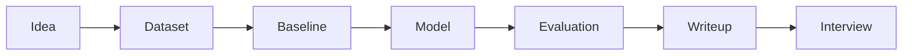

# Projects

Projects turn passive reading into real skill. Each project should produce a clear README, reproducible
steps, evaluation results, error analysis, and an interview-ready explanation.

## Project Catalog

| Project | Type | Outcome |
| --- | --- | --- |
| [End to End Classical ML Project](capstone-projects/01-end-to-end-classical-ml-project.md) | Portfolio project | Build, evaluate, explain |
| [House Price Prediction](capstone-projects/02-house-price-prediction.md) | Portfolio project | Build, evaluate, explain |
| [Fraud Detection System](capstone-projects/03-fraud-detection-system.md) | Portfolio project | Build, evaluate, explain |
| [Customer Churn Prediction](capstone-projects/04-customer-churn-prediction.md) | Portfolio project | Build, evaluate, explain |
| [Recommendation System](capstone-projects/05-recommendation-system.md) | Portfolio project | Build, evaluate, explain |
| [Search Ranking System](capstone-projects/06-search-ranking-system.md) | Portfolio project | Build, evaluate, explain |
| [Image Classifier](capstone-projects/07-image-classifier.md) | Portfolio project | Build, evaluate, explain |
| [NLP Text Classifier](capstone-projects/08-nlp-text-classifier.md) | Portfolio project | Build, evaluate, explain |
| [Semantic Search Engine](capstone-projects/09-semantic-search-engine.md) | Portfolio project | Build, evaluate, explain |
| [RAG Chatbot](capstone-projects/10-rag-chatbot.md) | Portfolio project | Build, evaluate, explain |
| [Enterprise RAG Assistant](capstone-projects/11-enterprise-rag-assistant.md) | Portfolio project | Build, evaluate, explain |
| [LLM Evaluation Dashboard](capstone-projects/12-llm-evaluation-dashboard.md) | Portfolio project | Build, evaluate, explain |
| [Agentic Research Assistant](capstone-projects/13-agentic-research-assistant.md) | Portfolio project | Build, evaluate, explain |
| [AI Customer Support Agent](capstone-projects/14-ai-customer-support-agent.md) | Portfolio project | Build, evaluate, explain |
| [Production ML Platform](capstone-projects/15-production-ml-platform.md) | Portfolio project | Build, evaluate, explain |

## System Design Practice

Use these prompts when you want architecture practice rather than implementation practice.

| Prompt | Focus | Outcome |
| --- | --- | --- |
| [Design A Recommendation System](machine-learning-system-design/01-design-a-recommendation-system.md) | Ranking and personalization | Explain candidate generation, ranking, metrics, and feedback |
| [Design A Search Ranking System](machine-learning-system-design/02-design-a-search-ranking-system.md) | Retrieval and ranking | Explain indexing, ranking features, evaluation, and latency |
| [Design A Fraud Detection Platform](machine-learning-system-design/03-design-a-fraud-detection-platform.md) | Risk scoring | Explain labels, thresholds, review queues, and drift |
| [Design An ML Training Platform](machine-learning-system-design/04-design-an-ml-training-platform.md) | Training infrastructure | Explain data, orchestration, artifacts, registry, and reproducibility |
| [Design A Feature Store](machine-learning-system-design/05-design-a-feature-store.md) | Feature management | Explain offline-online consistency, freshness, and serving |
| [Design A RAG Platform](machine-learning-system-design/06-design-a-rag-platform.md) | Retrieval-augmented generation | Explain ingestion, retrieval, generation, evaluation, and security |
| [Design An Agent Platform](machine-learning-system-design/07-design-an-agent-platform.md) | Tool-using agents | Explain tool permissions, memory, observability, and fallback |
| [Design An LLM Evaluation System](machine-learning-system-design/08-design-an-llm-evaluation-system.md) | Evaluation infrastructure | Explain datasets, rubrics, judges, regression checks, and reporting |
| [Design A Real Time Inference System](machine-learning-system-design/09-design-a-real-time-inference-system.md) | Low-latency serving | Explain routing, caching, batching, fallbacks, and monitoring |
| [Design An AI Copilot Platform](machine-learning-system-design/10-design-an-ai-copilot-platform.md) | Product architecture | Explain context, tools, permissions, UX, and quality guardrails |

## Project Quality Bar

- A baseline is implemented before advanced modeling.
- Data assumptions and limitations are documented.
- Evaluation includes more than one aggregate score.
- Failure cases are shown honestly.
- The project can be explained in two minutes and defended for twenty minutes.

## Diagram

