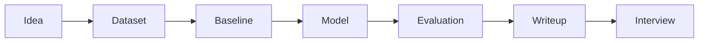

# Projects

Projects turn passive reading into real skill. Each project should produce a clear README, reproducible
steps, evaluation results, error analysis, and an interview-ready explanation.

## Project Catalog

| Project | Type | Outcome |
| --- | --- | --- |
| [End to End Classical ML Project](capstone-projects/01-end-to-end-classical-ml-project.md) | Portfolio project | Build, evaluate, explain |
| [House Price Prediction](capstone-projects/02-house-price-prediction.md) | Portfolio project | Build, evaluate, explain |
| [Fraud Detection System](capstone-projects/03-fraud-detection-system.md) | Portfolio project | Build, evaluate, explain |
| [Customer Churn Prediction](capstone-projects/04-customer-churn-prediction.md) | Portfolio project | Build, evaluate, explain |
| [Recommendation System](capstone-projects/05-recommendation-system.md) | Portfolio project | Build, evaluate, explain |
| [Search Ranking System](capstone-projects/06-search-ranking-system.md) | Portfolio project | Build, evaluate, explain |
| [Image Classifier](capstone-projects/07-image-classifier.md) | Portfolio project | Build, evaluate, explain |
| [NLP Text Classifier](capstone-projects/08-nlp-text-classifier.md) | Portfolio project | Build, evaluate, explain |
| [Semantic Search Engine](capstone-projects/09-semantic-search-engine.md) | Portfolio project | Build, evaluate, explain |
| [RAG Chatbot](capstone-projects/10-rag-chatbot.md) | Portfolio project | Build, evaluate, explain |
| [Enterprise RAG Assistant](capstone-projects/11-enterprise-rag-assistant.md) | Portfolio project | Build, evaluate, explain |
| [LLM Evaluation Dashboard](capstone-projects/12-llm-evaluation-dashboard.md) | Portfolio project | Build, evaluate, explain |
| [Agentic Research Assistant](capstone-projects/13-agentic-research-assistant.md) | Portfolio project | Build, evaluate, explain |
| [AI Customer Support Agent](capstone-projects/14-ai-customer-support-agent.md) | Portfolio project | Build, evaluate, explain |
| [Production ML Platform](capstone-projects/15-production-ml-platform.md) | Portfolio project | Build, evaluate, explain |

## Project Quality Bar

- A baseline is implemented before advanced modeling.
- Data assumptions and limitations are documented.
- Evaluation includes more than one aggregate score.
- Failure cases are shown honestly.
- The project can be explained in two minutes and defended for twenty minutes.

## Diagram

