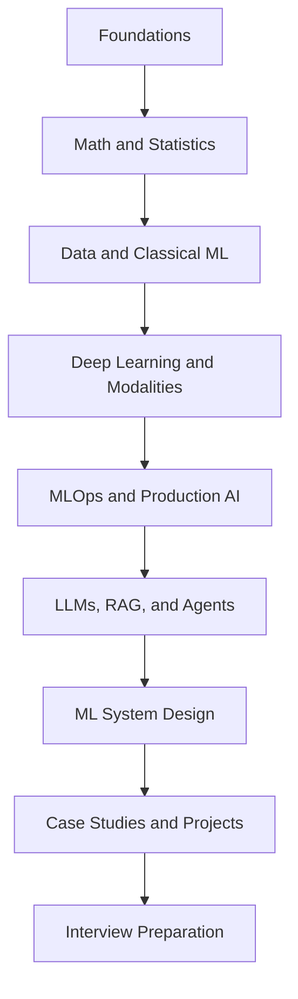

# Roadmap

This roadmap keeps the repository practical. Move from foundations to implementation, then to
production systems, case studies, projects, and interviews. Each phase should end with something you
can explain out loud.

## Summary

| Phase | Area | Focus | Outcome |
| --- | --- | --- | --- |
| 0 | Setup and Learning Strategy | Read the root README, choose a study plan, and set up Python examples. | A realistic schedule and a clear definition of done for each study block. |
| 1 | ML Foundations | Study `fundamentals/` and practice framing inputs, labels, metrics, baselines, and splits. | You can explain what makes a problem suitable for ML and what makes an evaluation misleading. |
| 2 | Math for ML | Study `math/` with emphasis on vectors, matrices, gradients, optimization, entropy, and distance. | You can explain the math intuition behind loss minimization, similarity, PCA, and backpropagation. |
| 3 | Statistics and Experimentation | Study `statistics/` and connect uncertainty, sampling, hypothesis tests, and A/B tests to product decisions. | You can reason about noisy evidence, confidence, leakage, bias, and causal claims. |
| 4 | Data Science Workflow | Study `data-science/` and practice cleaning, exploration, visualization, feature engineering, and communication. | You can inspect a dataset, expose quality risks, and explain findings without overstating them. |
| 5 | Classical ML | Study `classical-ml/` and implement simple baselines before model selection. | You can choose and compare linear models, trees, ensembles, clustering methods, and metrics. |
| 6 | Deep Learning | Study `deep-learning/` and trace forward propagation, backpropagation, optimizers, regularization, and transformers. | You can debug training behavior and explain architecture tradeoffs clearly. |
| 7 | Applied Modalities | Study `nlp/`, `computer-vision/`, and `recommender-systems/`. | You can map text, image, and ranking tasks to data, models, metrics, and failure modes. |
| 8 | MLOps and Production AI | Study `mlops/` and `production-ai/` together. | You can describe reproducibility, serving, monitoring, rollback, latency, cost, privacy, and governance. |
| 9 | Generative AI and LLMs | Study `generative-ai/` and `llms/`. | You can explain transformer-style generation, prompting, tuning choices, evaluation, guardrails, and serving constraints. |
| 10 | Vector Search, RAG, and Agents | Study `vector-databases/`, `rag/`, and `agents/`. | You can design grounded assistants, retrieval pipelines, tool use, memory, observability, and risk controls. |
| 11 | ML System Design | Study `machine-learning-system-design/` and draw each architecture. | You can walk through requirements, data flow, serving, scaling, evaluation, monitoring, and tradeoffs. |
| 12 | Case Studies and Projects | Study `case-studies/`, then build from `capstone-projects/`. | You can turn concepts into a portfolio-quality project with evaluation and interview explanation. |
| 13 | Interview Preparation | Use `interview-prep/`, `mocks/`, `quizzes/`, and `cheatsheets/`. | You can answer under time pressure with baseline, metric, failure mode, and production judgment. |

## How to Use This Roadmap

1. Read the listed folders in order.
2. Complete the mini exercises inside each lesson.
3. Use one quiz or cheatsheet for retrieval practice.
4. Build or sketch one small artifact before advancing.
5. Explain the phase using baseline, metric, failure mode, and production tradeoff.

## Phase 0. Setup and Learning Strategy

**Focus:** Read the root README, choose a study plan, and set up Python examples.

**Practice:** Write one concrete example, one failure mode, one interview question, and one metric
for this phase before moving on.

**Expected outcome:** A realistic schedule and a clear definition of done for each study block.

## Phase 1. ML Foundations

**Focus:** Study `fundamentals/` and practice framing inputs, labels, metrics, baselines, and splits.

**Practice:** Write one concrete example, one failure mode, one interview question, and one metric
for this phase before moving on.

**Expected outcome:** You can explain what makes a problem suitable for ML and what makes an evaluation misleading.

## Phase 2. Math for ML

**Focus:** Study `math/` with emphasis on vectors, matrices, gradients, optimization, entropy, and distance.

**Practice:** Write one concrete example, one failure mode, one interview question, and one metric
for this phase before moving on.

**Expected outcome:** You can explain the math intuition behind loss minimization, similarity, PCA, and backpropagation.

## Phase 3. Statistics and Experimentation

**Focus:** Study `statistics/` and connect uncertainty, sampling, hypothesis tests, and A/B tests to product decisions.

**Practice:** Write one concrete example, one failure mode, one interview question, and one metric
for this phase before moving on.

**Expected outcome:** You can reason about noisy evidence, confidence, leakage, bias, and causal claims.

## Phase 4. Data Science Workflow

**Focus:** Study `data-science/` and practice cleaning, exploration, visualization, feature engineering, and communication.

**Practice:** Write one concrete example, one failure mode, one interview question, and one metric
for this phase before moving on.

**Expected outcome:** You can inspect a dataset, expose quality risks, and explain findings without overstating them.

## Phase 5. Classical ML

**Focus:** Study `classical-ml/` and implement simple baselines before model selection.

**Practice:** Write one concrete example, one failure mode, one interview question, and one metric
for this phase before moving on.

**Expected outcome:** You can choose and compare linear models, trees, ensembles, clustering methods, and metrics.

## Phase 6. Deep Learning

**Focus:** Study `deep-learning/` and trace forward propagation, backpropagation, optimizers, regularization, and transformers.

**Practice:** Write one concrete example, one failure mode, one interview question, and one metric
for this phase before moving on.

**Expected outcome:** You can debug training behavior and explain architecture tradeoffs clearly.

## Phase 7. Applied Modalities

**Focus:** Study `nlp/`, `computer-vision/`, and `recommender-systems/`.

**Practice:** Write one concrete example, one failure mode, one interview question, and one metric
for this phase before moving on.

**Expected outcome:** You can map text, image, and ranking tasks to data, models, metrics, and failure modes.

## Phase 8. MLOps and Production AI

**Focus:** Study `mlops/` and `production-ai/` together.

**Practice:** Write one concrete example, one failure mode, one interview question, and one metric
for this phase before moving on.

**Expected outcome:** You can describe reproducibility, serving, monitoring, rollback, latency, cost, privacy, and governance.

## Phase 9. Generative AI and LLMs

**Focus:** Study `generative-ai/` and `llms/`.

**Practice:** Write one concrete example, one failure mode, one interview question, and one metric
for this phase before moving on.

**Expected outcome:** You can explain transformer-style generation, prompting, tuning choices, evaluation, guardrails, and serving constraints.

## Phase 10. Vector Search, RAG, and Agents

**Focus:** Study `vector-databases/`, `rag/`, and `agents/`.

**Practice:** Write one concrete example, one failure mode, one interview question, and one metric
for this phase before moving on.

**Expected outcome:** You can design grounded assistants, retrieval pipelines, tool use, memory, observability, and risk controls.

## Phase 11. ML System Design

**Focus:** Study `machine-learning-system-design/` and draw each architecture.

**Practice:** Write one concrete example, one failure mode, one interview question, and one metric
for this phase before moving on.

**Expected outcome:** You can walk through requirements, data flow, serving, scaling, evaluation, monitoring, and tradeoffs.

## Phase 12. Case Studies and Projects

**Focus:** Study `case-studies/`, then build from `capstone-projects/`.

**Practice:** Write one concrete example, one failure mode, one interview question, and one metric
for this phase before moving on.

**Expected outcome:** You can turn concepts into a portfolio-quality project with evaluation and interview explanation.

## Phase 13. Interview Preparation

**Focus:** Use `interview-prep/`, `mocks/`, `quizzes/`, and `cheatsheets/`.

**Practice:** Write one concrete example, one failure mode, one interview question, and one metric
for this phase before moving on.

**Expected outcome:** You can answer under time pressure with baseline, metric, failure mode, and production judgment.

## Roadmap Diagram

