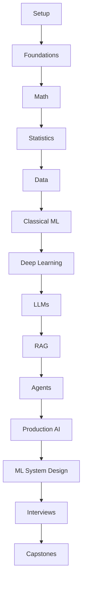

# Roadmap

## Phase 0. Setup and learning strategy

**Goal:** Build practical mastery of setup and learning strategy with enough depth to explain, implement, and
evaluate the ideas.

**Concepts:** problem framing, data assumptions, baselines, model behavior, metrics, failure modes,
and production tradeoffs as they apply to this phase.

**Files to read:** README.md, STUDY_PLAN.md.

**Exercises:** complete lesson mini exercises, answer the closest quiz, and write one paragraph that
connects the phase to a real product.

**Expected outcome:** You can explain the phase clearly, identify common mistakes, and apply the
ideas in a small project or interview answer.

## Phase 1. Foundations

**Goal:** Build practical mastery of foundations with enough depth to explain, implement, and
evaluate the ideas.

**Concepts:** problem framing, data assumptions, baselines, model behavior, metrics, failure modes,
and production tradeoffs as they apply to this phase.

**Files to read:** fundamentals/01-what-is-machine-learning.md through fundamentals/10-end-to-end-ml-workflow.md.

**Exercises:** complete lesson mini exercises, answer the closest quiz, and write one paragraph that
connects the phase to a real product.

**Expected outcome:** You can explain the phase clearly, identify common mistakes, and apply the
ideas in a small project or interview answer.

## Phase 2. Math for ML

**Goal:** Build practical mastery of math for ml with enough depth to explain, implement, and
evaluate the ideas.

**Concepts:** problem framing, data assumptions, baselines, model behavior, metrics, failure modes,
and production tradeoffs as they apply to this phase.

**Files to read:** math/01-why-math-matters-for-ml.md through math/12-distance-metrics.md.

**Exercises:** complete lesson mini exercises, answer the closest quiz, and write one paragraph that
connects the phase to a real product.

**Expected outcome:** You can explain the phase clearly, identify common mistakes, and apply the
ideas in a small project or interview answer.

## Phase 3. Statistics and probability

**Goal:** Build practical mastery of statistics and probability with enough depth to explain, implement, and
evaluate the ideas.

**Concepts:** problem framing, data assumptions, baselines, model behavior, metrics, failure modes,
and production tradeoffs as they apply to this phase.

**Files to read:** statistics/01-probability-basics.md through statistics/12-statistics-for-interviews.md.

**Exercises:** complete lesson mini exercises, answer the closest quiz, and write one paragraph that
connects the phase to a real product.

**Expected outcome:** You can explain the phase clearly, identify common mistakes, and apply the
ideas in a small project or interview answer.

## Phase 4. Python, NumPy, Pandas, visualization

**Goal:** Build practical mastery of python, numpy, pandas, visualization with enough depth to explain, implement, and
evaluate the ideas.

**Concepts:** problem framing, data assumptions, baselines, model behavior, metrics, failure modes,
and production tradeoffs as they apply to this phase.

**Files to read:** data-science/01-data-science-workflow.md through data-science/10-communicating-results.md.

**Exercises:** complete lesson mini exercises, answer the closest quiz, and write one paragraph that
connects the phase to a real product.

**Expected outcome:** You can explain the phase clearly, identify common mistakes, and apply the
ideas in a small project or interview answer.

## Phase 5. Classical ML

**Goal:** Build practical mastery of classical ml with enough depth to explain, implement, and
evaluate the ideas.

**Concepts:** problem framing, data assumptions, baselines, model behavior, metrics, failure modes,
and production tradeoffs as they apply to this phase.

**Files to read:** classical-ml/01-linear-regression.md through classical-ml/15-time-series-basics.md.

**Exercises:** complete lesson mini exercises, answer the closest quiz, and write one paragraph that
connects the phase to a real product.

**Expected outcome:** You can explain the phase clearly, identify common mistakes, and apply the
ideas in a small project or interview answer.

## Phase 6. Model evaluation

**Goal:** Build practical mastery of model evaluation with enough depth to explain, implement, and
evaluate the ideas.

**Concepts:** problem framing, data assumptions, baselines, model behavior, metrics, failure modes,
and production tradeoffs as they apply to this phase.

**Files to read:** classical-ml/16-model-selection.md through classical-ml/18-evaluation-metrics.md.

**Exercises:** complete lesson mini exercises, answer the closest quiz, and write one paragraph that
connects the phase to a real product.

**Expected outcome:** You can explain the phase clearly, identify common mistakes, and apply the
ideas in a small project or interview answer.

## Phase 7. Feature engineering

**Goal:** Build practical mastery of feature engineering with enough depth to explain, implement, and
evaluate the ideas.

**Concepts:** problem framing, data assumptions, baselines, model behavior, metrics, failure modes,
and production tradeoffs as they apply to this phase.

**Files to read:** data-science/04-feature-engineering.md, data-science/05-handling-missing-values.md, data-science/06-handling-imbalanced-data.md.

**Exercises:** complete lesson mini exercises, answer the closest quiz, and write one paragraph that
connects the phase to a real product.

**Expected outcome:** You can explain the phase clearly, identify common mistakes, and apply the
ideas in a small project or interview answer.

## Phase 8. Deep learning

**Goal:** Build practical mastery of deep learning with enough depth to explain, implement, and
evaluate the ideas.

**Concepts:** problem framing, data assumptions, baselines, model behavior, metrics, failure modes,
and production tradeoffs as they apply to this phase.

**Files to read:** deep-learning/01-what-is-a-neural-network.md through deep-learning/15-deep-learning-interview-patterns.md.

**Exercises:** complete lesson mini exercises, answer the closest quiz, and write one paragraph that
connects the phase to a real product.

**Expected outcome:** You can explain the phase clearly, identify common mistakes, and apply the
ideas in a small project or interview answer.

## Phase 9. NLP

**Goal:** Build practical mastery of nlp with enough depth to explain, implement, and
evaluate the ideas.

**Concepts:** problem framing, data assumptions, baselines, model behavior, metrics, failure modes,
and production tradeoffs as they apply to this phase.

**Files to read:** nlp/01-nlp-overview.md through nlp/11-nlp-evaluation.md.

**Exercises:** complete lesson mini exercises, answer the closest quiz, and write one paragraph that
connects the phase to a real product.

**Expected outcome:** You can explain the phase clearly, identify common mistakes, and apply the
ideas in a small project or interview answer.

## Phase 10. Computer vision

**Goal:** Build practical mastery of computer vision with enough depth to explain, implement, and
evaluate the ideas.

**Concepts:** problem framing, data assumptions, baselines, model behavior, metrics, failure modes,
and production tradeoffs as they apply to this phase.

**Files to read:** computer-vision/01-computer-vision-overview.md through computer-vision/08-multimodal-models.md.

**Exercises:** complete lesson mini exercises, answer the closest quiz, and write one paragraph that
connects the phase to a real product.

**Expected outcome:** You can explain the phase clearly, identify common mistakes, and apply the
ideas in a small project or interview answer.

## Phase 11. Recommender systems

**Goal:** Build practical mastery of recommender systems with enough depth to explain, implement, and
evaluate the ideas.

**Concepts:** problem framing, data assumptions, baselines, model behavior, metrics, failure modes,
and production tradeoffs as they apply to this phase.

**Files to read:** recommender-systems/01-recommender-systems-overview.md through recommender-systems/08-recommender-system-case-study.md.

**Exercises:** complete lesson mini exercises, answer the closest quiz, and write one paragraph that
connects the phase to a real product.

**Expected outcome:** You can explain the phase clearly, identify common mistakes, and apply the
ideas in a small project or interview answer.

## Phase 12. MLOps

**Goal:** Build practical mastery of mlops with enough depth to explain, implement, and
evaluate the ideas.

**Concepts:** problem framing, data assumptions, baselines, model behavior, metrics, failure modes,
and production tradeoffs as they apply to this phase.

**Files to read:** mlops/01-what-is-mlops.md through mlops/12-ml-system-design.md.

**Exercises:** complete lesson mini exercises, answer the closest quiz, and write one paragraph that
connects the phase to a real product.

**Expected outcome:** You can explain the phase clearly, identify common mistakes, and apply the
ideas in a small project or interview answer.

## Phase 13. Generative AI

**Goal:** Build practical mastery of generative ai with enough depth to explain, implement, and
evaluate the ideas.

**Concepts:** problem framing, data assumptions, baselines, model behavior, metrics, failure modes,
and production tradeoffs as they apply to this phase.

**Files to read:** generative-ai/01-generative-ai-overview.md through generative-ai/08-generative-ai-evaluation.md.

**Exercises:** complete lesson mini exercises, answer the closest quiz, and write one paragraph that
connects the phase to a real product.

**Expected outcome:** You can explain the phase clearly, identify common mistakes, and apply the
ideas in a small project or interview answer.

## Phase 14. LLM fundamentals

**Goal:** Build practical mastery of llm fundamentals with enough depth to explain, implement, and
evaluate the ideas.

**Concepts:** problem framing, data assumptions, baselines, model behavior, metrics, failure modes,
and production tradeoffs as they apply to this phase.

**Files to read:** llms/01-what-is-an-llm.md through llms/07-context-windows.md.

**Exercises:** complete lesson mini exercises, answer the closest quiz, and write one paragraph that
connects the phase to a real product.

**Expected outcome:** You can explain the phase clearly, identify common mistakes, and apply the
ideas in a small project or interview answer.

## Phase 15. Prompting and evaluation

**Goal:** Build practical mastery of prompting and evaluation with enough depth to explain, implement, and
evaluate the ideas.

**Concepts:** problem framing, data assumptions, baselines, model behavior, metrics, failure modes,
and production tradeoffs as they apply to this phase.

**Files to read:** llms/08-prompt-engineering.md through llms/12-guardrails.md.

**Exercises:** complete lesson mini exercises, answer the closest quiz, and write one paragraph that
connects the phase to a real product.

**Expected outcome:** You can explain the phase clearly, identify common mistakes, and apply the
ideas in a small project or interview answer.

## Phase 16. Embeddings and vector databases

**Goal:** Build practical mastery of embeddings and vector databases with enough depth to explain, implement, and
evaluate the ideas.

**Concepts:** problem framing, data assumptions, baselines, model behavior, metrics, failure modes,
and production tradeoffs as they apply to this phase.

**Files to read:** vector-databases/01-what-is-a-vector-database.md through vector-databases/10-vector-database-interview-patterns.md.

**Exercises:** complete lesson mini exercises, answer the closest quiz, and write one paragraph that
connects the phase to a real product.

**Expected outcome:** You can explain the phase clearly, identify common mistakes, and apply the
ideas in a small project or interview answer.

## Phase 17. RAG

**Goal:** Build practical mastery of rag with enough depth to explain, implement, and
evaluate the ideas.

**Concepts:** problem framing, data assumptions, baselines, model behavior, metrics, failure modes,
and production tradeoffs as they apply to this phase.

**Files to read:** rag/01-what-is-rag.md through rag/16-rag-interview-patterns.md.

**Exercises:** complete lesson mini exercises, answer the closest quiz, and write one paragraph that
connects the phase to a real product.

**Expected outcome:** You can explain the phase clearly, identify common mistakes, and apply the
ideas in a small project or interview answer.

## Phase 18. Agents

**Goal:** Build practical mastery of agents with enough depth to explain, implement, and
evaluate the ideas.

**Concepts:** problem framing, data assumptions, baselines, model behavior, metrics, failure modes,
and production tradeoffs as they apply to this phase.

**Files to read:** agents/01-what-is-an-ai-agent.md through agents/13-agent-interview-patterns.md.

**Exercises:** complete lesson mini exercises, answer the closest quiz, and write one paragraph that
connects the phase to a real product.

**Expected outcome:** You can explain the phase clearly, identify common mistakes, and apply the
ideas in a small project or interview answer.

## Phase 19. Production AI systems

**Goal:** Build practical mastery of production ai systems with enough depth to explain, implement, and
evaluate the ideas.

**Concepts:** problem framing, data assumptions, baselines, model behavior, metrics, failure modes,
and production tradeoffs as they apply to this phase.

**Files to read:** production-ai/01-production-ai-overview.md through production-ai/12-building-enterprise-ai-systems.md.

**Exercises:** complete lesson mini exercises, answer the closest quiz, and write one paragraph that
connects the phase to a real product.

**Expected outcome:** You can explain the phase clearly, identify common mistakes, and apply the
ideas in a small project or interview answer.

## Phase 20. Machine learning system design

**Goal:** Build practical mastery of ML system design with enough depth to explain architectures,
tradeoffs, scaling, reliability, security, observability, and interview reasoning.

**Concepts:** recommendation systems, search ranking, fraud detection platforms, training
platforms, feature stores, RAG platforms, agent platforms, LLM evaluation systems, real-time
inference, and AI copilot platforms.

**Files to read:** machine-learning-system-design/01-design-a-recommendation-system.md through machine-learning-system-design/10-design-an-ai-copilot-platform.md.

**Exercises:** draw each architecture, identify the baseline, name online and offline metrics, and
write the biggest tradeoff in one paragraph.

**Expected outcome:** You can walk through an ML system design interview with requirements, data
flow, serving path, evaluation, monitoring, failure handling, and tradeoffs.

## Phase 21. Interview preparation

**Goal:** Build practical mastery of interview preparation with enough depth to explain, implement, and
evaluate the ideas.

**Concepts:** problem framing, data assumptions, baselines, model behavior, metrics, failure modes,
and production tradeoffs as they apply to this phase.

**Files to read:** interview-prep/README.md through interview-prep/15-final-revision-checklist.md.

**Exercises:** complete lesson mini exercises, answer the closest quiz, and write one paragraph that
connects the phase to a real product.

**Expected outcome:** You can explain the phase clearly, identify common mistakes, and apply the
ideas in a small project or interview answer.

## Phase 22. Capstone projects

**Goal:** Build practical mastery of capstone projects with enough depth to explain, implement, and
evaluate the ideas.

**Concepts:** problem framing, data assumptions, baselines, model behavior, metrics, failure modes,
and production tradeoffs as they apply to this phase.

**Files to read:** capstone-projects/01-end-to-end-classical-ml-project.md through capstone-projects/15-production-ml-platform.md.

**Exercises:** complete lesson mini exercises, answer the closest quiz, and write one paragraph that
connects the phase to a real product.

**Expected outcome:** You can explain the phase clearly, identify common mistakes, and apply the
ideas in a small project or interview answer.

## Roadmap Diagram

