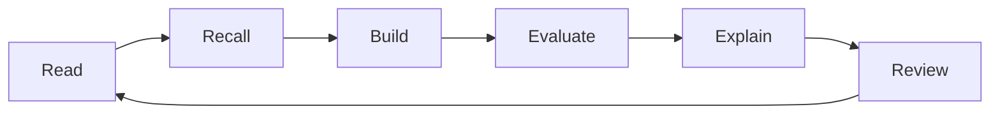

# Study Plan

Use these plans as schedules, not rules. Keep the order when possible, but slow down when a topic
needs more practice. Every week should produce a visible artifact: notes, a diagram, a baseline, an
evaluation, a case-study walkthrough, or a mock interview review.

## 12-Week Focused Plan

| Week | Topics | Files | Outcome |
| --- | --- | --- | --- |
| 1 | Foundations | `fundamentals/` | Frame one product problem with input, label, metric, and baseline. |
| 2 | Math | `math/` | Explain gradients, matrix multiplication, and similarity with one worked example. |
| 3 | Statistics | `statistics/` | Design an A/B test and list leakage or sampling risks. |
| 4 | Data Science | `data-science/` | Clean a small dataset and write an EDA memo. |
| 5 | Classical ML | `classical-ml/` | Train a baseline and compare two metrics. |
| 6 | Deep Learning | `deep-learning/` | Trace a forward pass and debug one training failure. |
| 7 | NLP, Vision, Recommenders | `nlp/`, `computer-vision/`, `recommender-systems/` | Map each modality to its data, metric, and common failure. |
| 8 | MLOps and Production AI | `mlops/`, `production-ai/` | Draw a serving and monitoring plan. |
| 9 | Generative AI and LLMs | `generative-ai/`, `llms/` | Compare prompting, RAG, and fine-tuning for one use case. |
| 10 | Vector Search, RAG, Agents | `vector-databases/`, `rag/`, `agents/` | Design a grounded assistant with permissions and evaluation. |
| 11 | ML System Design and Case Studies | `machine-learning-system-design/`, `case-studies/` | Complete two architecture walkthroughs. |
| 12 | Projects and Interviews | `capstone-projects/`, `interview-prep/`, `mocks/` | Finish one project plan and run two mock rounds. |

## 24-Week Balanced Plan

| Week | Topics | Files | Outcome |
| --- | --- | --- | --- |
| 1 | Foundations | `fundamentals/` | Read, summarize, and answer one quiz. |
| 2 | Foundations | `fundamentals/` | Frame one product problem with input, label, metric, and baseline. |
| 3 | Math | `math/` | Read, summarize, and answer one quiz. |
| 4 | Math | `math/` | Explain gradients, matrix multiplication, and similarity with one worked example. |
| 5 | Statistics | `statistics/` | Read, summarize, and answer one quiz. |
| 6 | Statistics | `statistics/` | Design an A/B test and list leakage or sampling risks. |
| 7 | Data Science | `data-science/` | Read, summarize, and answer one quiz. |
| 8 | Data Science | `data-science/` | Clean a small dataset and write an EDA memo. |
| 9 | Classical ML | `classical-ml/` | Read, summarize, and answer one quiz. |
| 10 | Classical ML | `classical-ml/` | Train a baseline and compare two metrics. |
| 11 | Deep Learning | `deep-learning/` | Read, summarize, and answer one quiz. |
| 12 | Deep Learning | `deep-learning/` | Trace a forward pass and debug one training failure. |
| 13 | NLP, Vision, Recommenders | `nlp/`, `computer-vision/`, `recommender-systems/` | Read, summarize, and answer one quiz. |
| 14 | NLP, Vision, Recommenders | `nlp/`, `computer-vision/`, `recommender-systems/` | Map each modality to its data, metric, and common failure. |
| 15 | MLOps and Production AI | `mlops/`, `production-ai/` | Read, summarize, and answer one quiz. |
| 16 | MLOps and Production AI | `mlops/`, `production-ai/` | Draw a serving and monitoring plan. |
| 17 | Generative AI and LLMs | `generative-ai/`, `llms/` | Read, summarize, and answer one quiz. |
| 18 | Generative AI and LLMs | `generative-ai/`, `llms/` | Compare prompting, RAG, and fine-tuning for one use case. |
| 19 | Vector Search, RAG, Agents | `vector-databases/`, `rag/`, `agents/` | Read, summarize, and answer one quiz. |
| 20 | Vector Search, RAG, Agents | `vector-databases/`, `rag/`, `agents/` | Design a grounded assistant with permissions and evaluation. |
| 21 | ML System Design and Case Studies | `machine-learning-system-design/`, `case-studies/` | Read, summarize, and answer one quiz. |
| 22 | ML System Design and Case Studies | `machine-learning-system-design/`, `case-studies/` | Complete two architecture walkthroughs. |
| 23 | Projects and Interviews | `capstone-projects/`, `interview-prep/`, `mocks/` | Read, summarize, and answer one quiz. |
| 24 | Projects and Interviews | `capstone-projects/`, `interview-prep/`, `mocks/` | Finish one project plan and run two mock rounds. |

## 6-Week Interview Revision Plan

| Week | Topics | Files | Outcome |
| --- | --- | --- | --- |
| 1 | Core ML | `fundamentals/`, `math/`, `statistics/` | Explain splits, leakage, metrics, and uncertainty. |
| 2 | Data and Classical ML | `data-science/`, `classical-ml/` | Defend a baseline and compare model families. |
| 3 | Deep Learning and Modalities | `deep-learning/`, `nlp/`, `computer-vision/`, `recommender-systems/` | Explain architectures and task metrics. |
| 4 | Production and LLM Systems | `mlops/`, `production-ai/`, `llms/`, `rag/`, `agents/` | Discuss latency, cost, monitoring, safety, and evaluation. |
| 5 | System Design | `machine-learning-system-design/`, `case-studies/` | Complete three whiteboard-style designs. |
| 6 | Mocks and Final Review | `interview-prep/`, `mocks/`, `cheatsheets/` | Run timed mocks and repair weak answers. |

## Weekly Routine

| Activity | Time | Output |
| --- | --- | --- |
| Reading | 2 to 4 sessions | Five-bullet summary per file |
| Practice | 1 to 2 sessions | Quiz answers, exercises, or notebook edits |
| Build or design | 1 session | Baseline, diagram, or project note |
| Interview rehearsal | 1 session | Spoken answer with feedback notes |
| Review | 30 minutes | Updated weak-topic list |

## Project-First Route

1. Choose one guide from [capstone-projects/](capstone-projects/) or one prompt from [machine-learning-system-design/](machine-learning-system-design/).
2. Read only the files needed for the next implementation or design step.
3. Build a baseline before adding model complexity.
4. Add evaluation before optimizing.
5. Keep a project journal with data choices, failed experiments, and tradeoffs.
6. Turn the final writeup into resume bullets and interview stories.

## Diagram

