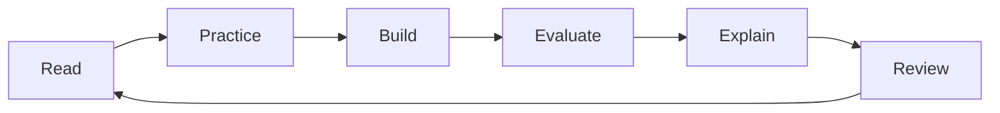

# Study Plan

Use these plans as schedules, not rules. If a week feels too dense, keep the order and slow down.
Every week includes reading, exercises, a mini-project, and interview practice because real skill
comes from recall and application.

ML system design should be practiced after production AI and before final mock interviews. Use
`machine-learning-system-design/` to turn model knowledge into architecture explanations.

## 12-Week Aggressive Plan

| Week | Topics | Files | Exercises | Mini-project | Interview practice |
| --- | --- | --- | --- | --- | --- |
| 1 | ML basics | `fundamentals/` | Define labels, splits, metrics | Dataset framing memo | Explain bias and variance |
| 2 | Math and stats | `math/, statistics/` | Compute gradients and uncertainty | A/B test analysis | Explain leakage |
| 3 | Data and classical ML | `data-science/, classical-ml/` | Train baselines | Tabular classifier | Compare models |
| 4 | Deep learning | `deep-learning/` | Trace forward and backward pass | Tiny neural net | Debug loss curves |
| 5 | NLP, vision, recommenders | `nlp/, computer-vision/, recommender-systems/` | Evaluate task metrics | Search or ranking demo | Discuss embeddings |
| 6 | MLOps and production | `mlops/, production-ai/` | Design monitoring | Serving sketch | System design tradeoffs |
| 7 | GenAI and LLMs | `generative-ai/, llms/` | Prompt and evaluate | LLM app design | Discuss hallucinations |
| 8 | Vector DB, RAG, agents | `vector-databases/, rag/, agents/` | Build retrieval flow | RAG assistant | Agent risk controls |
| 9 | ML system design | `machine-learning-system-design/` | Draw data and serving paths | Design review memo | System design tradeoffs |
| 10 | Case studies | `case-studies/` | Write architecture notes | Choose one case | Metrics and failure modes |
| 11 | ML basics | `fundamentals/` | Define labels, splits, metrics | Dataset framing memo | Explain bias and variance |
| 12 | Math and stats | `math/, statistics/` | Compute gradients and uncertainty | A/B test analysis | Explain leakage |

## 24-Week Balanced Plan

| Week | Topics | Files | Exercises | Mini-project | Interview practice |
| --- | --- | --- | --- | --- | --- |
| 1 | ML basics | `fundamentals/` | Define labels, splits, metrics | Dataset framing memo | Explain bias and variance |
| 2 | Math and stats | `math/, statistics/` | Compute gradients and uncertainty | A/B test analysis | Explain leakage |
| 3 | Data and classical ML | `data-science/, classical-ml/` | Train baselines | Tabular classifier | Compare models |
| 4 | Deep learning | `deep-learning/` | Trace forward and backward pass | Tiny neural net | Debug loss curves |
| 5 | NLP, vision, recommenders | `nlp/, computer-vision/, recommender-systems/` | Evaluate task metrics | Search or ranking demo | Discuss embeddings |
| 6 | MLOps and production | `mlops/, production-ai/` | Design monitoring | Serving sketch | System design tradeoffs |
| 7 | GenAI and LLMs | `generative-ai/, llms/` | Prompt and evaluate | LLM app design | Discuss hallucinations |
| 8 | Vector DB, RAG, agents | `vector-databases/, rag/, agents/` | Build retrieval flow | RAG assistant | Agent risk controls |
| 9 | Case studies | `case-studies/` | Write architecture notes | Choose one case | Metrics and failure modes |
| 10 | Capstone and mocks | `capstone-projects/, mocks/` | Finish portfolio story | Capstone demo | Full mock loop |
| 11 | ML basics | `fundamentals/` | Define labels, splits, metrics | Dataset framing memo | Explain bias and variance |
| 12 | Math and stats | `math/, statistics/` | Compute gradients and uncertainty | A/B test analysis | Explain leakage |
| 13 | Data and classical ML | `data-science/, classical-ml/` | Train baselines | Tabular classifier | Compare models |
| 14 | Deep learning | `deep-learning/` | Trace forward and backward pass | Tiny neural net | Debug loss curves |
| 15 | NLP, vision, recommenders | `nlp/, computer-vision/, recommender-systems/` | Evaluate task metrics | Search or ranking demo | Discuss embeddings |
| 16 | MLOps and production | `mlops/, production-ai/` | Design monitoring | Serving sketch | System design tradeoffs |
| 17 | GenAI and LLMs | `generative-ai/, llms/` | Prompt and evaluate | LLM app design | Discuss hallucinations |
| 18 | Vector DB, RAG, agents | `vector-databases/, rag/, agents/` | Build retrieval flow | RAG assistant | Agent risk controls |
| 19 | ML system design | `machine-learning-system-design/` | Draw data and serving paths | Design review memo | System design tradeoffs |
| 20 | Case studies | `case-studies/` | Write architecture notes | Choose one case | Metrics and failure modes |
| 21 | ML basics | `fundamentals/` | Define labels, splits, metrics | Dataset framing memo | Explain bias and variance |
| 22 | Math and stats | `math/, statistics/` | Compute gradients and uncertainty | A/B test analysis | Explain leakage |
| 23 | Data and classical ML | `data-science/, classical-ml/` | Train baselines | Tabular classifier | Compare models |
| 24 | Deep learning | `deep-learning/` | Trace forward and backward pass | Tiny neural net | Debug loss curves |

## 6-Week Interview Revision Plan

| Week | Topics | Files | Exercises | Mini-project | Interview practice |
| --- | --- | --- | --- | --- | --- |
| 1 | ML basics | `fundamentals/` | Define labels, splits, metrics | Dataset framing memo | Explain bias and variance |
| 2 | Math and stats | `math/, statistics/` | Compute gradients and uncertainty | A/B test analysis | Explain leakage |
| 3 | Data and classical ML | `data-science/, classical-ml/` | Train baselines | Tabular classifier | Compare models |
| 4 | Deep learning | `deep-learning/` | Trace forward and backward pass | Tiny neural net | Debug loss curves |
| 5 | NLP, vision, recommenders | `nlp/, computer-vision/, recommender-systems/` | Evaluate task metrics | Search or ranking demo | Discuss embeddings |
| 6 | MLOps, production, and system design | `mlops/, production-ai/, machine-learning-system-design/` | Design monitoring | Serving sketch | System design tradeoffs |

## Weekend-Only Plan

Use one weekend for each major folder. Saturday is for reading and notes. Sunday is for exercises,
one notebook or source example, and a spoken interview explanation. Expect this route to take about
six months if you also complete capstones.

## Project-First Plan

1. Choose one guide from [capstone-projects/](capstone-projects/) or one system design prompt from [machine-learning-system-design/](machine-learning-system-design/).
2. Read only the files needed for the next implementation step.
3. Build a baseline in the first weekend.
4. Add evaluation before adding complexity.
5. Keep a project journal with data choices, failed experiments, and tradeoffs.
6. Turn the final writeup into interview stories and resume bullets.

## Diagram

