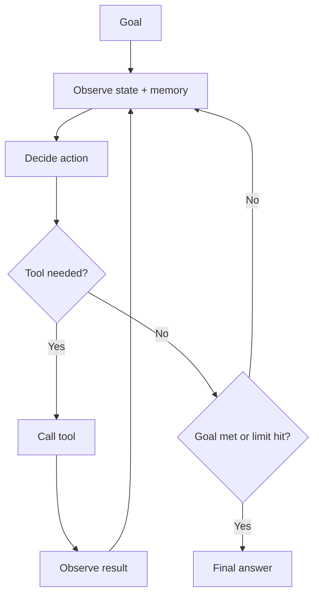

# What Is an AI Agent

## Beginner-Friendly Intuition

An AI agent is a language model placed in a loop where it can take actions, see the results, and decide
what to do next, until a goal is met. A plain LLM answers in one shot. An agent can search, call a tool,
read the result, and try again. Picture a capable assistant who can not only answer but also look things
up, use a calculator, and check its own work before replying.

## Formal Explanation

An agent couples a reasoning model with tools, memory, and a control loop. Each iteration: observe the
current state (and any memory), decide an action (often a tool call) using the model, execute it, observe
the result, and repeat until a stop condition fires. Formally it is a perceive-decide-act loop where the
policy is an LLM and the action space is a set of tools. Key components are the model (reasoning), tools
(acting), memory (state across steps), and guardrails (budgets, permissions, stop conditions).

## Why It Matters in Real Jobs

Agents unlock multi-step automation that a single call cannot do: triage a ticket and resolve it, research
a question across sources, or edit code and run tests. But the same ability to act creates new failure
modes, looping, wrong tool calls, compounding errors, and irreversible actions. So the engineering value
is in knowing when an agent is justified and how to constrain it, not in building the most autonomous
system possible.

## How It Works Step by Step

1. **Receive a goal** and any constraints or budget.
2. **Observe** the current state and relevant memory.
3. **Decide** the next action with the model (answer or call a tool).
4. **Act and observe** the tool result, updating state.
5. **Stop** when the goal is met or a limit (steps, cost, confidence) is reached.

## Real-World Example

A coding agent is told "fix the failing test". It reads the test, edits a file, runs the test suite,
observes a new failure, edits again, and reruns until the suite passes or it hits a step limit. A single
LLM call could suggest a fix but could not iterate against real feedback. The loop, plus the ability to run
tests, is what makes it an agent rather than a chatbot.

## Common Mistakes

- Building an agent when a single LLM call or a fixed workflow would do.
- No stop conditions, so the loop runs forever.
- Giving the agent powerful tools with no permissions or approval.
- Equating "agent" with "fully autonomous" instead of a controlled loop.

## Production Concerns

Cost-per-loop is the variable that bites at scale. Estimate it as
average steps times average tokens per step times the per-token
price; one stalled loop at 30 steps can cost more than a hundred
healthy ones. Track p50 and p95 cost per task and alert on tail
spend. Every tool call goes through a permission check, and the
check writes to an audit log: caller identity, tool name, arguments
hash, decision, timestamp. The log is the forensic record when an
agent does something it should not have. Set a tool timeout per
call (5-30s typical for read-only, longer for compute) and convert
timeouts into observation messages the model can react to, rather
than silently failing the loop.

## Interview Angle

**Question:** What makes something an agent rather than just an LLM call?

**Strong answer:** A control loop where the model takes actions via tools, observes results, and iterates
toward a goal with memory and stop conditions. The power and the risk both come from acting in the world.

**Weak answer:** "An agent is a smarter chatbot," with no mention of tools, loop, or control.

**Follow-up questions:**

- When is an agent overkill?
- What components does an agent need beyond the model?
- What new failure modes does the loop introduce?

## Mini Exercise

Take a task you do that needs several steps and lookups. Describe it as an agent: the goal, two tools it
would need, the stop condition, and one action that should require human approval.

## Diagram

---
## Navigation

[⬅ Previous](../rag/16-rag-interview-patterns.md) | [🏠 Home](../README.md) | [➡ Next](02-agent-loop.md)
