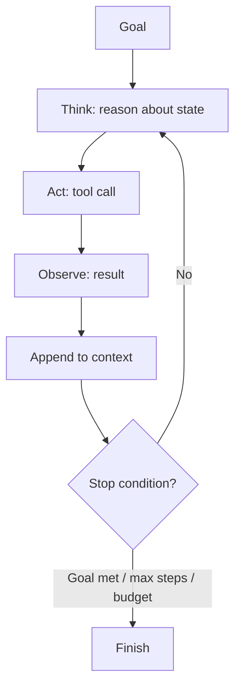

# Agent Loop

## Beginner-Friendly Intuition

The agent loop is the heartbeat of every agent: think, act, observe, repeat. The model looks at where
things stand, picks an action, the system runs it, and the result feeds back into the next think step. The
loop continues until the goal is done or a limit stops it. Get this loop and its stop conditions right and
most of agent engineering falls into place.

## Formal Explanation

The canonical loop is ReAct (reason and act): the model produces a thought, then an action (a tool call),
the system executes it and returns an observation, and the cycle repeats. Variants include plan-and-execute
(plan all steps first, then run them) and reflection loops (critique the result and retry). Each iteration
appends thought, action, and observation to the context, which is both the agent's working memory and its
growing cost. Stop conditions, goal reached, max steps, budget exhausted, or low confidence, bound the
loop.

## Why It Matters in Real Jobs

The loop is where agents both shine and fail. Without explicit stop conditions, an agent can loop forever,
burning tokens and money. As the context grows each step, cost and latency climb and the model can lose
track. The most important production controls, step caps, cost budgets, and progress checks, all live in
how you implement the loop.

## How It Works Step by Step

1. **Think:** the model reasons about the goal and current state.
2. **Act:** it emits an action, usually a structured tool call.
3. **Observe:** the system runs the action and returns the result.
4. **Update:** append the thought, action, and observation to context.
5. **Check stop conditions:** goal met, max steps, budget, or low confidence; else loop.

## Real-World Example

A research agent answering "what changed in our pricing this year" thinks it needs the current and prior
price lists, calls a search tool, observes results, reasons that it still needs the prior version,
searches again, then composes the answer. A step cap of 8 and a token budget prevent it from spiraling if a
search keeps returning irrelevant pages. The loop made multi-step research possible; the caps made it safe.

## Common Mistakes

- No stop conditions, so the loop never terminates.
- Letting context grow unbounded, inflating cost and confusing the model.
- No progress check, so the agent repeats the same failing action.
- Hiding tool errors from the model instead of feeding them back for correction.

## Interview Angle

**Question:** How do you stop an agent from looping forever?

**Strong answer:** Explicit stop conditions in the loop: a max-step cap, a token or cost budget, a
progress check that detects repeated actions, and a low-confidence escalation. The loop must be bounded by
design.

**Weak answer:** "The model will know when to stop," with no enforced limits.

**Follow-up questions:**

- ReAct vs plan-and-execute, when to use each?
- How does context growth affect cost and quality?
- How do you detect that the agent is stuck?

## Mini Exercise

Write the loop for an agent that books a meeting: list the think-act-observe steps for a typical run, and
specify three stop conditions with concrete values.

## Diagram

---
## Navigation

[⬅ Previous](01-what-is-an-ai-agent.md) | [🏠 Home](../README.md) | [➡ Next](03-tools-and-function-calling.md)
