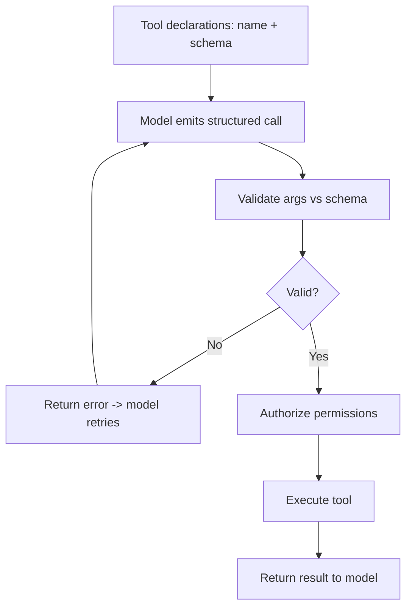

# Tools and Function Calling

## Beginner-Friendly Intuition

Tools are how an agent does anything beyond generating text: search the web, query a database, run code,
send an email. Function calling is the mechanism: you describe each tool with a name and a structured
schema of arguments, and the model outputs a request to call one with specific arguments. The system runs
it and hands the result back. The model decides what to call; your code decides what is allowed.

## Formal Explanation

Each tool is declared with a name, a description (so the model knows when to use it), and a JSON schema for
its parameters. The model, prompted with these declarations, emits a structured call (tool name plus
arguments) instead of prose. The runtime validates the arguments against the schema, executes the tool, and
returns the result for the model to reason over. Reliability hinges on clear descriptions, strict schema
validation, error feedback to the model, and permission checks before execution.

## Why It Matters in Real Jobs

Tools are the agent's hands, and hands can break things. A tool with vague description gets called at the
wrong time; an unvalidated argument can cause errors or security issues; an unpermissioned tool can take an
irreversible action. Most agent reliability and safety work is really tool design: good schemas, tight
permissions, validation, and clear error messages the model can recover from.

## How It Works Step by Step

1. **Declare tools:** name, clear description, and a strict argument schema.
2. **Model selects:** given the goal, it emits a structured call with arguments.
3. **Validate:** check arguments against the schema; reject and return an error if invalid.
4. **Authorize and execute:** confirm permissions, run the tool, capture the result.
5. **Return result:** feed it back so the model continues or finishes.

## Real-World Example

A support agent has a `reset_password(user_id)` tool. The model calls it with a user_id, but validation
catches that the id format is wrong and returns an error string. The model reads the error, fixes the
argument, and retries. For a higher-risk `issue_refund(amount)` tool, the system requires human approval
before execution. Clear schemas made the call reliable; permissions made the risky one safe.

## Common Mistakes

- Vague tool descriptions, so the model calls the wrong tool or at the wrong time.
- No argument validation, passing malformed or unsafe inputs to the tool.
- Hiding tool errors instead of returning them for the model to self-correct.
- Exposing powerful tools with no permission or approval gate.

## Interview Angle

**Question:** How do you make tool use reliable and safe?

**Strong answer:** Clear descriptions and strict argument schemas, validate every call, return errors so
the model can retry, and gate risky tools behind permissions and human approval. Treat tool design as the
core reliability surface.

**Weak answer:** "Give the model some functions and let it call them," with no validation or permissions.

**Follow-up questions:**

- How does the model know which tool to use?
- What happens when a tool call has bad arguments?
- Which tools would you put behind human approval?

## Mini Exercise

Design two tools for an agent (one read-only, one state-changing). Write each schema, and specify the
validation and the approval rule for the state-changing one.

## Diagram

---
## Navigation

[⬅ Previous](02-agent-loop.md) | [🏠 Home](../README.md) | [➡ Next](04-planning-and-reasoning.md)
