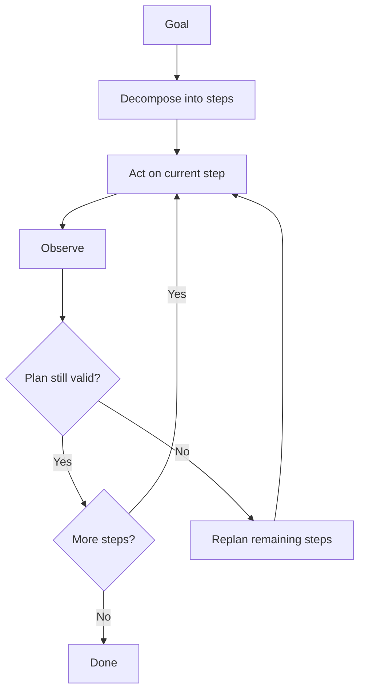

# Planning and Reasoning

## Beginner-Friendly Intuition

Planning is how an agent breaks a big goal into steps before or while it acts. Some agents plan the whole
sequence upfront; others figure out the next step as they go, reacting to what they learn. Reasoning is the
thinking that chooses each action. Good planning keeps the agent on track for complex goals; bad or absent
planning makes it wander or repeat itself.

## Formal Explanation

Two dominant styles. Plan-and-execute: the model produces an explicit multi-step plan first, then executes
each step (easier to inspect, but brittle if reality diverges from the plan). ReAct (interleaved): the
model reasons and acts one step at a time, adapting to each observation (flexible, but can drift without a
goal anchor). Reasoning techniques like chain-of-thought and self-reflection improve step selection.
Replanning, revising the plan when an observation invalidates it, combines the strengths of both.

## Why It Matters in Real Jobs

For multi-step tasks, the difference between an agent that finishes and one that loops is usually planning.
A plan gives structure and a way to track progress; pure reaction can get stuck redoing work. But rigid
plans fail when the environment surprises the agent, so production agents usually interleave acting with
the ability to replan. Interviewers probe whether you understand this tradeoff.

## How It Works Step by Step

1. **Decompose:** turn the goal into sub-goals or steps.
2. **Choose a style:** upfront plan for predictable tasks, interleaved for exploratory ones.
3. **Act on the current step** using reasoning to pick the action.
4. **Check progress:** did the observation advance or invalidate the plan?
5. **Replan if needed:** revise remaining steps rather than blindly following a stale plan.

## Real-World Example

An agent asked to "prepare a competitor summary" plans: identify competitors, gather each one's recent
news, then synthesize. Midway, a search reveals a new competitor not in the original plan, so it replans to
include it. A purely upfront plan would have missed the new entrant; a purely reactive agent might have
wandered without structure. Interleaving planning with replanning handled both.

## Common Mistakes

- No plan, so the agent reacts step to step and loses the thread on complex goals.
- A rigid upfront plan with no replanning when reality diverges.
- Treating chain-of-thought as a guarantee of correctness rather than a heuristic.
- No progress tracking, so the agent cannot tell it is stuck.

## Interview Angle

**Question:** Plan-and-execute or ReAct for an agent?

**Strong answer:** It depends on predictability. Plan-and-execute suits well-defined tasks and is easy to
inspect; ReAct suits exploratory tasks. In practice I interleave acting with replanning so the agent adapts
without losing structure.

**Weak answer:** Picking one with no reasoning about task predictability or replanning.

**Follow-up questions:**

- When does an upfront plan fail?
- What is replanning and why does it help?
- How do you track whether the agent is making progress?

## Mini Exercise

For a multi-step task you know, write a three-step upfront plan, then describe one observation that would
force a replan and how the agent should revise.

## Diagram

---
## Navigation

[⬅ Previous](03-tools-and-function-calling.md) | [🏠 Home](../README.md) | [➡ Next](05-memory-in-agents.md)
