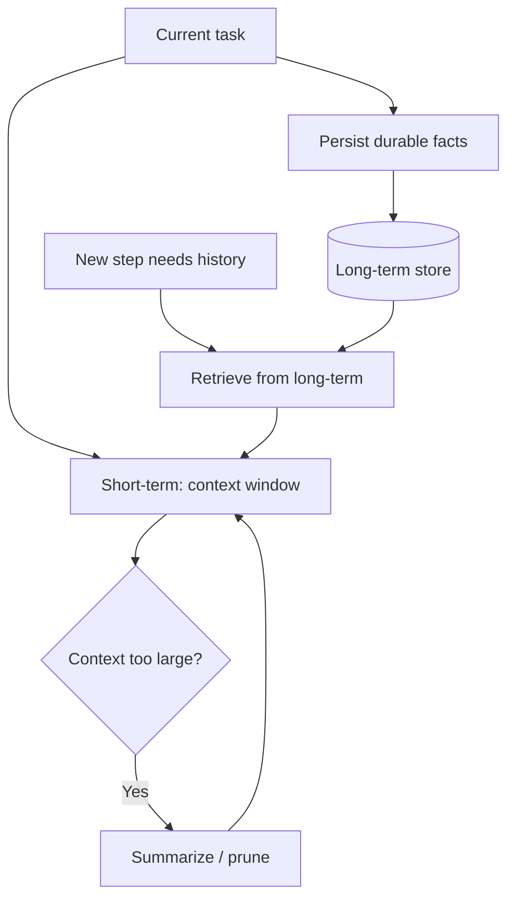

# Memory In Agents

## Beginner-Friendly Intuition

Memory is how an agent remembers things across a task and across sessions. Short-term memory is the running
context of the current task (what it has done so far). Long-term memory is durable knowledge stored
outside the context window (past conversations, learned facts, user preferences) that the agent retrieves
when relevant. Without memory, an agent forgets everything between steps or sessions and repeats itself.

## Formal Explanation

Short-term memory is the model's context window, holding the recent thought-action-observation history; it
is bounded and grows costly each step. Long-term memory is external storage, often a vector store of past
interactions or facts, queried by retrieval when needed and written to as the agent learns. Memory
management includes summarizing or pruning the working context to stay within limits, and deciding what is
worth persisting. The design question is always what to keep in context now versus fetch on demand.

## Why It Matters in Real Jobs

Context windows are finite and expensive. A long task overflows short-term memory, so you must summarize or
offload. A returning user expects the agent to remember prior context, which requires long-term memory.
Done badly, memory either drops crucial state mid-task or bloats the context with irrelevant history that
raises cost and confuses the model. Good memory design is central to both capability and cost.

## How It Works Step by Step

1. **Hold working state** in the context: recent steps and the current goal.
2. **Summarize or prune** when the context grows too large.
3. **Persist** durable facts (preferences, outcomes) to long-term store.
4. **Retrieve** relevant long-term memory when the current step needs it.
5. **Forget responsibly:** expire or delete stale or sensitive memory.

## Real-World Example

A personal assistant agent learns over weeks that a user prefers morning meetings and a specific format for
summaries. These preferences live in long-term memory. When the user returns, the agent retrieves them
instead of asking again. During a single long research task, the agent summarizes earlier findings into a
compact note so the context does not overflow, keeping cost bounded while preserving the key results.

## Common Mistakes

- Letting the context grow unbounded until it overflows or costs spike.
- Persisting everything, so retrieval returns noise.
- Storing sensitive user data in memory with no expiry or controls.
- Confusing short-term (context) with long-term (external store) memory.

## Interview Angle

**Question:** How does memory work in an agent and why do you need two kinds?

**Strong answer:** Short-term memory is the bounded context of the current task; long-term memory is an
external store retrieved on demand for durable facts and past sessions. You summarize the context to stay
in budget and persist only what is worth remembering.

**Weak answer:** "The model remembers things," with no distinction between context and external storage.

**Follow-up questions:**

- How do you handle a context window that fills up?
- What do you choose to persist long term?
- How do you handle privacy in long-term memory?

## Mini Exercise

For an assistant agent, list three things to keep in short-term memory and three to persist long term. Then
describe how you would shrink the context during a long task without losing key state.

## Diagram

---
## Navigation

[⬅ Previous](04-planning-and-reasoning.md) | [🏠 Home](../README.md) | [➡ Next](06-single-agent-vs-multi-agent.md)
