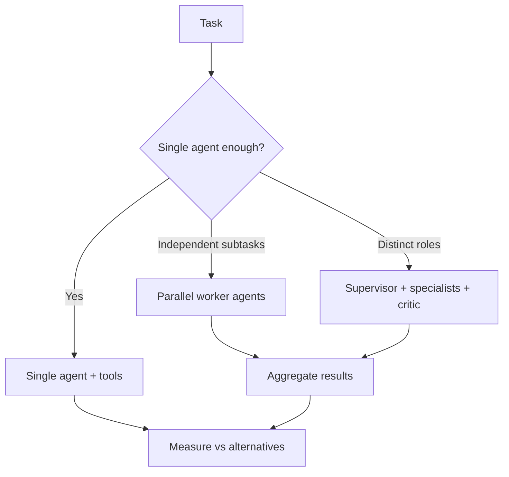

# Single Agent vs Multi Agent

## Beginner-Friendly Intuition

A single agent does the whole task in one loop. A multi-agent system splits the work among specialized
agents (a planner, workers, a critic) that coordinate. Multi-agent sounds powerful, but it adds
coordination overhead, more cost, and more ways to fail. The honest default is a single agent; reach for
multiple only when the roles are genuinely separable and a single agent demonstrably struggles.

## Formal Explanation

A single-agent system has one model in one loop with a set of tools. A multi-agent system decomposes the
problem across agents with distinct roles and a coordination protocol: a supervisor that delegates,
parallel workers on independent subtasks, or a generator-critic pair. Benefits are specialization,
parallelism, and separation of concerns. Costs are communication overhead, harder debugging, error
propagation between agents, and higher token usage. The decision is an engineering tradeoff, not a
capability ladder.

## Why It Matters in Real Jobs

Teams frequently over-engineer with multi-agent designs that a single well-prompted agent would handle for
a fraction of the cost and far easier debugging. Multi-agent genuinely helps when subtasks are independent
(parallelize) or require different tools and context (separation). Knowing when each applies, and
defaulting to simplicity, is a strong senior signal.

## How It Works Step by Step

1. **Start single:** one agent, one loop, the full toolset.
2. **Find the limit:** where does a single agent measurably fail (context, conflicting roles, serial
   bottleneck)?
3. **Decompose by need:** parallel workers for independent subtasks, or roles for distinct skills.
4. **Define coordination:** how agents pass work and results, and who decides when done.
5. **Re-measure:** confirm the multi-agent version actually beats the single agent on cost and quality.

## Real-World Example

A document-processing pipeline must extract data from 100 files. A single agent processing them serially is
slow, so parallel worker agents each handle a subset, with a supervisor aggregating, a real win from
independence. By contrast, a "research assistant" built as five chatting agents often performs worse and
costs more than one agent with good tools, because the subtasks were not actually independent and
coordination added noise.

## Common Mistakes

- Defaulting to multi-agent because it sounds advanced.
- Splitting a task whose subtasks are not actually independent.
- Underestimating coordination overhead and error propagation.
- No clear protocol for how agents hand off and when the system stops.

## Production Concerns

Multi-agent systems contend for shared resources: rate limits on
upstream APIs, GPU pool, vector store. Without load balancing,
parallel workers thrash and degrade each other. Use a shared budget
plus a queue with backpressure. Failure recovery is harder when
multiple agents share state: checkpoint each subtask, deduplicate on
retry (idempotency keys per subtask), and prefer at-least-once with
dedup over exactly-once. Distributed tracing is essential: every
agent's call carries a parent trace ID; the system can reconstruct
the full execution graph on demand. Without it, debugging a failed
multi-agent run is archaeology. A failed worker should not silently
hold up the supervisor; set per-worker timeouts and treat missing
results as observed errors the supervisor reasons about.

## Interview Angle

**Question:** Single agent or multi-agent for this task?

**Strong answer:** Default to single agent for simplicity and debuggability. I move to multi-agent only
when subtasks are independent (to parallelize) or need distinct tools and context, and only after a single
agent measurably falls short.

**Weak answer:** "Multi-agent, because more agents are more capable."

**Follow-up questions:**

- When does multi-agent genuinely help?
- What overhead does coordination add?
- How does error propagation differ between the two?

## Mini Exercise

Describe one task where multi-agent clearly helps and one where a single agent is better. For each, state
the deciding factor (independence, distinct skills, simplicity).

## Diagram

---
## Navigation

[⬅ Previous](05-memory-in-agents.md) | [🏠 Home](../README.md) | [➡ Next](07-agentic-rag.md)
