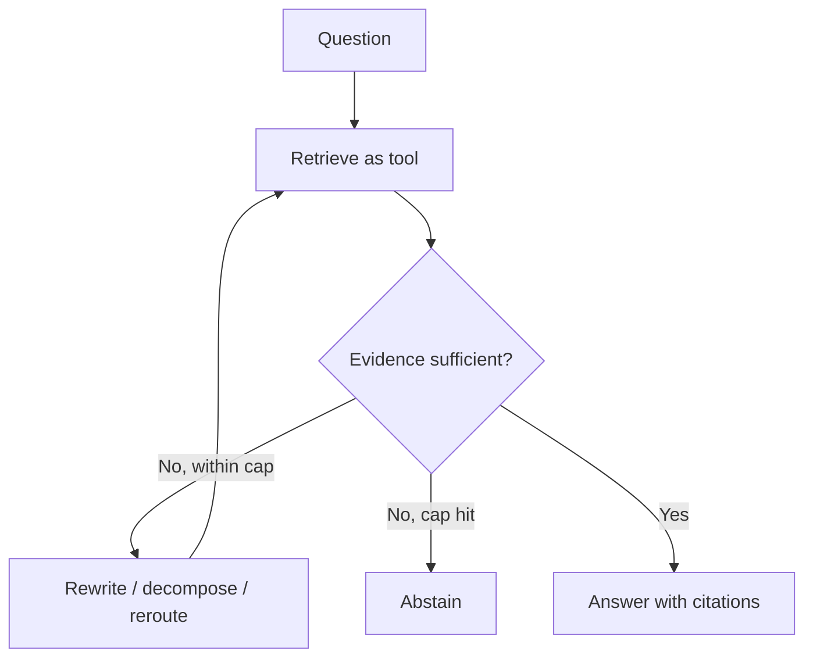

# Agentic RAG

## Beginner-Friendly Intuition

Basic RAG retrieves once and answers. Agentic RAG lets the model decide when and what to retrieve, possibly
multiple times, as part of an agent loop. Instead of a fixed pipeline, the agent reasons: do I have enough
to answer, or do I need to search again with a better query? It is RAG that can iterate, route to different
sources, and check its own evidence.

## Formal Explanation

Agentic RAG treats retrieval as a tool the agent invokes within its loop, rather than a fixed pre-step. The
agent can: rewrite the query and retrieve again if results are weak, decompose a complex question and
retrieve per sub-question, route to the right source (docs, database, web), and reflect on whether the
retrieved evidence actually supports an answer before responding. This adds adaptivity at the cost of more
LLM calls, latency, and the usual agent risks (loops, runaway cost).

## Why It Matters in Real Jobs

Some questions cannot be answered by a single retrieval: multi-hop facts, comparisons across documents, or
queries where the first search returns nothing useful. Agentic RAG handles these by retrieving iteratively.
But it is also a common place to over-engineer, adding agentic loops where one good retrieval would do. The
skill is enabling iteration only for the questions that need it, with strict budgets.

## How It Works Step by Step

1. **Attempt retrieval** for the query as a tool call.
2. **Reflect:** is the evidence sufficient and relevant?
3. **If not, adapt:** rewrite the query, decompose it, or route to another source, and retrieve again.
4. **Cap the loop:** limit retrieval iterations and total cost.
5. **Answer** under a cite-or-abstain contract once evidence is sufficient, or abstain.

## Real-World Example

A user asks "Did our Q3 revenue beat the target the board set in January?" The agent retrieves the Q3
revenue figure, reflects that it still needs the January board target, retrieves that, then compares and
answers with both citations. A single retrieval would have returned one figure and produced an
unsupported guess. A two-iteration cap kept the loop bounded.

## Common Mistakes

- Using agentic RAG when basic single-shot RAG would answer the question.
- No cap on retrieval iterations, so cost and latency spiral.
- Skipping the reflection step, so the agent does not know when to stop searching.
- Dropping the cite-or-abstain contract once retrieval becomes iterative.

## Interview Angle

**Question:** When would you use agentic RAG over standard RAG?

**Strong answer:** When questions need multiple or adaptive retrievals (multi-hop, cross-source, or
weak-first-result cases). I make retrieval a tool the agent can re-invoke, with a reflection step and an
iteration cap, and keep cite-or-abstain.

**Weak answer:** "Agentic RAG is just better RAG," with no cost or necessity reasoning.

**Follow-up questions:**

- What does the reflection step decide?
- How do you bound the retrieval loop?
- When is it over-engineering?

## Mini Exercise

Write a multi-hop question that needs two retrievals. Trace the agent's loop (retrieve, reflect, retrieve,
answer) and state the iteration cap you would set.

## Diagram

---
## Navigation

[⬅ Previous](06-single-agent-vs-multi-agent.md) | [🏠 Home](../README.md) | [➡ Next](08-workflow-agents.md)
