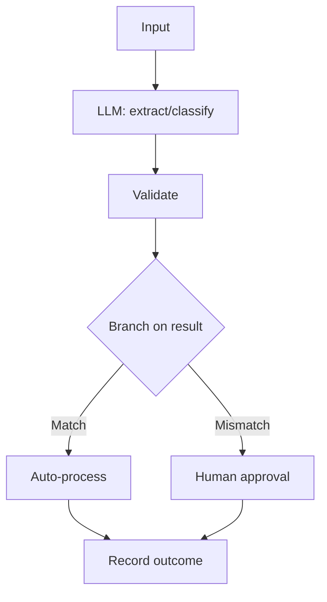

# Workflow Agents

## Beginner-Friendly Intuition

Not every task needs a free-roaming agent. Many real jobs follow a known sequence: read input, classify,
look something up, draft a response, get approval, send. A workflow agent runs LLM steps inside a fixed,
predefined flow with branches, rather than letting the model improvise the whole path. You get most of the
benefit of LLMs with far more predictability, lower cost, and easier debugging.

## Formal Explanation

A workflow (or "chain") is a directed graph of steps where the structure is defined by you, and LLM calls
fill specific nodes (classify, extract, summarize, decide). Control flow, branching, retries, and stopping
is explicit code, not model-decided. This sits between a single LLM call and a fully autonomous agent: more
capable than one call, more constrained than an open loop. You choose a workflow when the task path is
known and reliability matters more than flexibility.

## Why It Matters in Real Jobs

Most production "AI features" are better built as workflows than autonomous agents. A fixed flow is
testable, cheap, and predictable, with no risk of the model wandering or looping. The industry lesson has
been to use the least autonomy that solves the problem: workflow first, autonomous agent only when the path
genuinely cannot be predetermined. Interviewers value candidates who do not reach for autonomy by default.

## How It Works Step by Step

1. **Map the path:** identify the fixed steps and decision branches.
2. **Assign LLM nodes:** put a model call where judgment or generation is needed.
3. **Code the control flow:** branching, retries, and stop logic in your code, not the model.
4. **Add human gates:** insert approval where actions are risky.
5. **Test each node:** evaluate steps independently because the flow is deterministic.

## Real-World Example

An invoice-processing feature follows a fixed flow: extract fields with an LLM, validate against the
purchase order, branch to auto-approve if amounts match or route to a human if they do not, then record the
result. Because the path is fixed, each step is unit-tested and the whole flow is predictable. Building this
as an autonomous agent would add cost and risk for zero benefit, since the path never really varies.

## Common Mistakes

- Using an autonomous agent when the task path is actually fixed.
- Letting the model control flow that should be deterministic code.
- No human gate before a consequential branch (auto-approve everything).
- Not testing individual nodes despite the flow being deterministic.

## Interview Angle

**Question:** When would you build a workflow instead of an autonomous agent?

**Strong answer:** When the task path is known. A workflow puts LLM calls in fixed nodes with coded control
flow, so it is testable, cheap, and predictable. I reserve autonomy for tasks whose path cannot be
predetermined.

**Weak answer:** Treating everything as an autonomous agent regardless of how fixed the path is.

**Follow-up questions:**

- Where do LLM calls belong in a workflow?
- How does a workflow improve testability over an open agent?
- When does a workflow stop being enough?

## Mini Exercise

Take a repetitive task with a known path. Draw it as a workflow: the fixed steps, one branch, the LLM
nodes, and where a human approval gate belongs.

## Diagram

---
## Navigation

[⬅ Previous](07-agentic-rag.md) | [🏠 Home](../README.md) | [➡ Next](09-autonomous-agents-risks.md)
