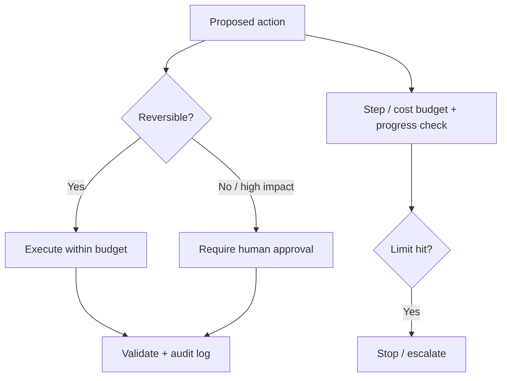

# Autonomous Agents Risks

## Beginner-Friendly Intuition

The more freedom you give an agent to act, the more ways it can go wrong. An autonomous agent that can send
emails, spend money, or change systems can do real damage if it misreads a goal, loops, or gets
manipulated. Autonomy is not free capability; it is capability plus risk. Managing that risk with budgets,
permissions, and human gates is the core of responsible agent engineering.

## Formal Explanation

Key risks of autonomous agents: runaway loops (no stop condition, burning cost), irreversible actions
(sending, deleting, paying) taken in error, goal misspecification (the agent optimizes the literal
instruction, not the intent), compounding errors (a wrong early step poisons later ones), prompt injection
(untrusted input hijacks the agent), and unbounded cost. Controls: step and cost budgets, least-privilege
permissioned tools, human approval for high-risk actions, validation and sandboxing, reversibility where
possible, and full audit logging.

## Why It Matters in Real Jobs

An agent that auto-resets the wrong account, emails the wrong customer, or spends beyond budget is an
incident, not a bug. Because actions touch the real world, the cost of a mistake is higher than a wrong
chat answer. Production autonomy is therefore staged: start read-only, enable reversible actions, and gate
irreversible ones behind approval. Interviewers want to see that you design for failure by default.

## How It Works Step by Step

1. **Classify actions** by reversibility and blast radius.
2. **Apply least privilege:** each tool gets only the permissions it needs.
3. **Gate high-risk actions** behind human approval.
4. **Bound the loop** with step, time, and cost budgets and progress checks.
5. **Log and audit** every action; prefer reversible operations and sandboxes.

## Real-World Example

A finance agent is allowed to draft and queue payments but never to send them; a human approves the queue.
When a prompt-injected vendor email tries to redirect a payment, the agent treats the email as data, the
amount fails validation, and the human catches the anomaly at the approval gate. Multiple layers, validation
plus approval plus audit, stopped a single failure from becoming a loss.

## Common Mistakes

- Granting irreversible-action tools with no human approval.
- No step or cost budget, so the agent loops and overspends.
- Trusting tool inputs and external content (injection surface).
- No audit log, so an incident cannot be reconstructed.

## Interview Angle

**Question:** What are the risks of an autonomous agent and how do you control them?

**Strong answer:** Runaway loops, irreversible mistakes, goal misspecification, compounding errors, and
injection. I classify actions by reversibility, apply least privilege, gate risky actions behind human
approval, bound the loop with budgets, and audit everything.

**Weak answer:** "Agents are mostly safe if the model is good," ignoring action risk.

**Follow-up questions:**

- Which actions would you never automate without approval?
- How do you bound cost and loops?
- How does injection threaten an autonomous agent?

## Mini Exercise

List five actions an agent might take, rank them by reversibility, and for the two riskiest specify the
control (approval, budget, validation) you would require.

## Diagram

---
## Navigation

[⬅ Previous](08-workflow-agents.md) | [🏠 Home](../README.md) | [➡ Next](10-agent-evaluation.md)
