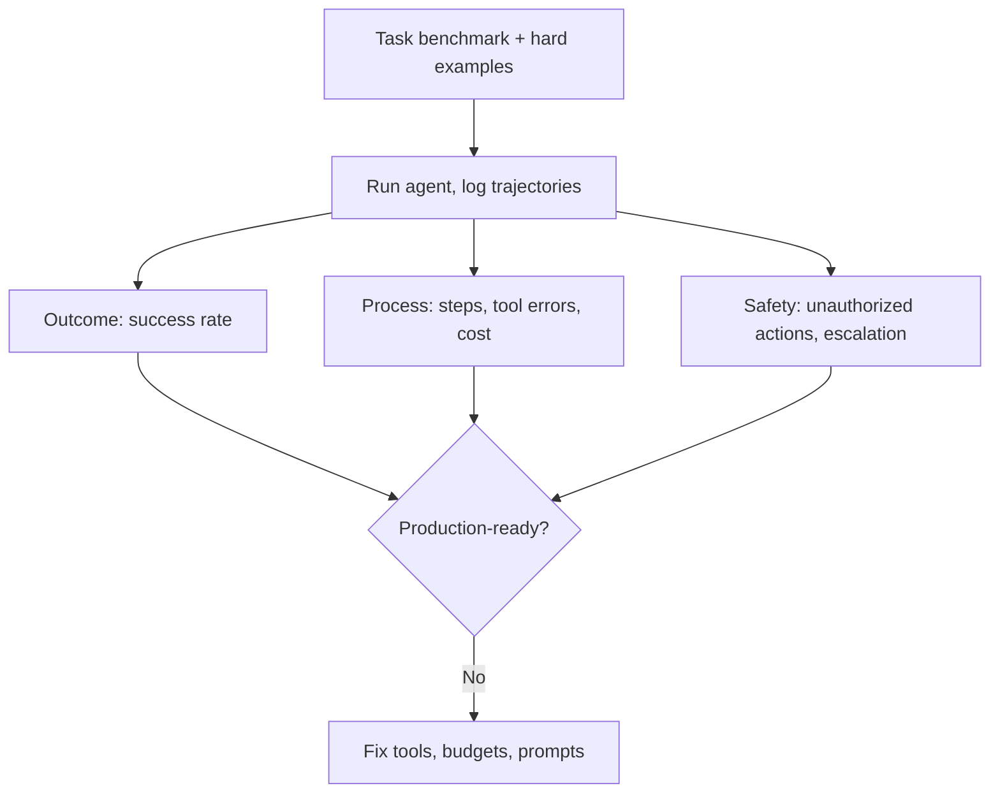

# Agent Evaluation

## Beginner-Friendly Intuition

Grading an agent is harder than grading a single answer, because an agent takes a path of many steps and you
care about both the outcome and how it got there. An agent can reach the right answer through a wasteful,
lucky, or unsafe route. Good evaluation looks at the whole trajectory: did it succeed, how efficiently, and
did it stay within the rules?

## Formal Explanation

Agent evaluation spans outcome and process. Outcome metrics: task success rate (did it achieve the goal),
and correctness of the final result. Process metrics: steps per task, tool-call count and tool-error rate,
cost and latency per task, and adherence to constraints (did it stay in budget, did it call only permitted
tools). Safety metrics: rate of unsafe or unauthorized actions, and escalation precision (did it hand off
at the right time). You need a benchmark of representative tasks with known good outcomes, plus a
hard-example set of tricky and should-refuse cases.

## Why It Matters in Real Jobs

An agent that succeeds 70 percent of the time but takes 30 steps and occasionally takes an unauthorized
action is not production-ready, even if its success rate looks fine. Only trajectory-level evaluation
exposes inefficiency, runaway cost, and unsafe behavior. Without it, you ship something that demos well and
fails or overspends at scale. This is why "how do you evaluate an agent" is a standard senior question.

## How It Works Step by Step

1. **Build a task benchmark** with known correct outcomes and varied difficulty.
2. **Run the agent** and log full trajectories.
3. **Score outcomes:** success rate and correctness.
4. **Score process:** steps, tool errors, cost, latency, constraint adherence.
5. **Score safety:** unauthorized actions and escalation precision, with a hard-example suite.

## Real-World Example

A support agent shows 80 percent task success offline. Trajectory evaluation reveals it averages 12 steps
(should be 4), has a 15 percent tool-error rate, and once attempted an unauthorized refund that approval
caught. These process and safety metrics, invisible in a success-rate-only view, drive the real fixes:
clearer tool descriptions and a tighter budget. Outcome alone would have hidden the problems.

## Common Mistakes

- Measuring only final-answer success, ignoring steps, cost, and safety.
- No task benchmark, so evaluation is anecdotal.
- Ignoring tool-error rate and unauthorized-action rate.
- No hard-example or should-refuse cases in the suite.

## Production Concerns

Statistical significance matters at small benchmark sizes; a 50-task
benchmark with a 5-point success rate change has a wide confidence
interval. Bootstrap CIs on success rate; require non-overlap before
declaring an improvement. The cost-quality Pareto frontier
visualizes the tradeoff: plot success rate against cost per task
across configurations. The chosen point is the operating decision;
ship the configuration on the frontier, not strictly the highest
success rate. Regression alerts have their own SLO: drop in success
rate beyond historical noise pages the on-call within minutes;
slower drift triggers a ticket. The benchmark itself drifts: refresh
quarterly with new failure cases from production traces. Without
refresh, the benchmark passes while real users see new failure
modes.

## Interview Angle

**Question:** How do you evaluate an agent?

**Strong answer:** On the trajectory, not just the answer. Outcome metrics (success rate), process metrics
(steps, tool errors, cost, constraint adherence), and safety metrics (unauthorized actions, escalation
precision), against a task benchmark plus hard examples.

**Weak answer:** "Check if it completes the task," with no process or safety metrics.

**Follow-up questions:**

- Why is outcome-only evaluation insufficient?
- What process metrics matter most for cost?
- How do you test that it escalates at the right time?

## Mini Exercise

For an agent you can imagine, define one outcome metric, two process metrics, and one safety metric. Then
describe a hard-example case it should handle by escalating rather than acting.

## Diagram

---
## Navigation

[⬅ Previous](09-autonomous-agents-risks.md) | [🏠 Home](../README.md) | [➡ Next](11-agent-observability.md)
