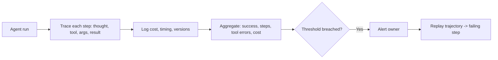

# Agent Observability

## Beginner-Friendly Intuition

When an agent does something wrong in production, you need to replay exactly what it thought, what tools it
called, and what it saw, step by step. Observability is the logging and tracing that makes an agent's
behavior visible. Without it, an agent is a black box that occasionally misbehaves; with it, every run is a
traceable record you can debug.

## Formal Explanation

Agent observability captures the full trajectory per run: each reasoning step, every tool call with its
arguments and result, errors, timing and cost per step, the model and prompt versions, and the final
outcome. These traces power both per-incident debugging (replay one run to find where it went wrong) and
aggregate monitoring (success rate, average steps, tool-error rate, cost, and unauthorized-action rate over
time). Good tracing also captures decision points so you can see why the agent chose an action.

## Why It Matters in Real Jobs

Agents fail in subtle, path-dependent ways: a tool returns a misleading result, the agent loops, or it
escalates too late. None of these are visible from the final output alone. Observability turns them into
inspectable traces and alertable trends. It is also how you catch a slow regression, such as tool-error
rate creeping up after a dependency change, before users feel it.

## How It Works Step by Step

1. **Trace every step:** thought, action, arguments, result, error, timing, cost.
2. **Version the run:** model, prompt, and tool versions on each trace.
3. **Aggregate metrics:** success rate, steps per task, tool-error rate, cost, unauthorized actions.
4. **Alert on thresholds:** page an owner when a metric breaches.
5. **Replay incidents:** step through a specific trajectory to locate the failing step.

## Real-World Example

Users report an agent occasionally "gives up". The trace shows it hits the step limit because one search
tool started returning empty results after an API change, sending the agent into repeated retries. The
tool-error-rate dashboard had ticked up the same day. Because every step was logged and versioned, the root
cause was found in one trace replay rather than days of guessing.

## Common Mistakes

- Logging only the final answer, not the step-by-step trajectory.
- No versioning, so you cannot attribute a regression to a change.
- No aggregate dashboards or alert thresholds.
- Capturing sensitive tool inputs and outputs without access controls.

## Production Concerns

Full-trajectory logging at scale is expensive; sample adaptively.
Sample 100 percent of failed runs, 100 percent of escalations, 1-5
percent of successful runs. The failure traces are where the value
is. PII redaction in traces is non-negotiable: tool arguments and
results often carry user data; strip or hash before storage. Tools
that return PII are flagged at registration so the trace pipeline
applies the right redaction policy. Alert routing differs by metric:
operational metrics page SRE; tool-error spikes page the tool owner;
unauthorized-action spikes page security; cost spikes page the
product owner. On-call escalation has a documented path with
acknowledgement and resolution SLAs per severity. Runbooks per known
failure (looping, tool-cascade failure, prompt drift) cut MTTR from
hours to minutes.

## Interview Angle

**Question:** An agent misbehaved on one request yesterday. How do you debug it?

**Strong answer:** Replay its trajectory from the trace: each thought, tool call, argument, and result,
plus the versions in play. That pinpoints the failing step (a bad tool result, a loop, a wrong decision)
and aggregate dashboards tell me if it is systemic.

**Weak answer:** "Run it again and see," with no tracing.

**Follow-up questions:**

- What do you log per step?
- Which aggregate metrics would you alert on?
- How do you protect sensitive data in traces?

## Mini Exercise

List the fields you would log per agent step to make any run replayable. Then name three aggregate metrics
you would alert on and the likely cause behind a spike in each.

## Diagram

---
## Navigation

[⬅ Previous](10-agent-evaluation.md) | [🏠 Home](../README.md) | [➡ Next](12-agent-system-design.md)
