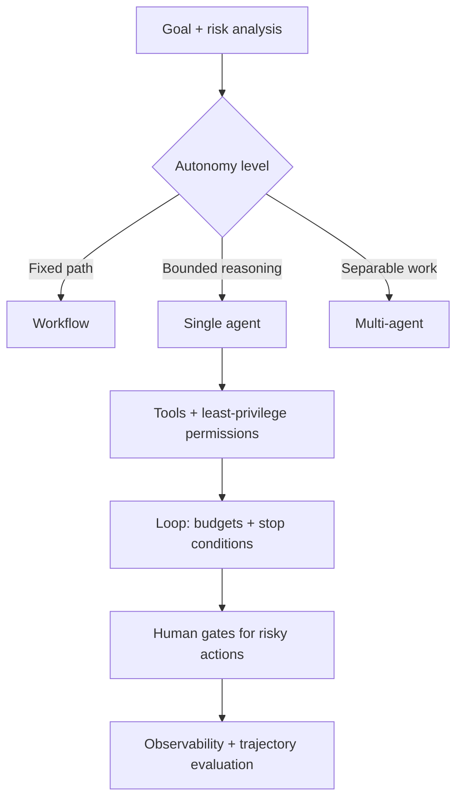

# Agent System Design

## Beginner-Friendly Intuition

Designing an agent system means deciding the loop, the tools and their permissions, the memory, the
guardrails, and how a human stays in control, all before you worry about the model. The biggest design
choice is how much autonomy to grant: a fixed workflow, a single bounded agent, or a multi-agent system.
The right answer is usually the least autonomy that does the job.

## Formal Explanation

An agent system design specifies: the autonomy level (workflow vs single agent vs multi-agent), the tool
set with per-tool permissions and validation, the memory strategy (short-term context management plus
long-term store), the control loop with stop conditions and budgets, human-in-the-loop gates for risky
actions, observability and evaluation, and security against injection and misuse. The design must make the
cost of a wrong action explicit and ensure the system fails safely.

## Why It Matters in Real Jobs

Agent system design is a rising interview format and a hard real build, because the happy path is the easy
part. The judgment is in the controls: which tools, which permissions, where humans approve, how loops are
bounded, and how you evaluate a trajectory. A candidate who jumps to "a multi-agent framework" without
these has not designed a safe system.

## How It Works Step by Step

1. **Choose autonomy:** workflow if the path is fixed, single agent if bounded reasoning is needed,
   multi-agent only for genuinely separable work.
2. **Define tools and permissions:** least privilege, schemas, validation, approval gates.
3. **Design memory:** context management and a long-term store if needed.
4. **Bound the loop:** stop conditions, step and cost budgets, progress checks.
5. **Add controls:** human gates, observability, evaluation, and injection defenses.

## Real-World Example

Designing an IT-support agent: read-only tools (search, read ticket) run freely; state-changing tools
(reset password) validate and log; irreversible ones (delete account) require human approval. The single-
agent loop caps at 8 steps with a token budget and escalates on low confidence. Every step is traced,
trajectories are evaluated for false resolutions, and rollout is staged from triage-only to gated actions.
The design centers on safety, not raw capability.

## Common Mistakes

- Choosing multi-agent or full autonomy by default.
- Tools without least-privilege permissions or validation.
- No budgets or stop conditions on the loop.
- No human gate for irreversible actions and no trajectory evaluation.

## Production Concerns

Staged rollout follows a defined gate: shadow (no user impact, log
trajectories) -> canary 1-5 percent -> ramp 25/50/100 over days,
each gate checking trajectory metrics, cost, error rate, unauthorized
actions. Hard rollback at any gate breach. Capacity planning treats
agents as variable-step jobs: peak QPS times average steps per task
times tokens per step gives the upstream model load; provision for
peak with autoscaling on queue depth, not just request rate.
Incident response template per severity: P1 (security, mass abuse,
spend overrun) pages immediately, kill switch as the first action;
P2 (degraded but contained) pages with 1-hour SLA; P3 (single-user
issue) ticketed. Postmortem for every P1 with an action item that
updates the design. The operating cost per agent task is published
on the dashboard; budget alerts fire at 70 and 90 percent of the
monthly cap.

## Interview Angle

**Question:** Design an agent that resolves a class of support tickets.

**Strong answer:** Pick the least autonomy that works, classify tools by risk with least privilege and
approval gates, bound the loop with budgets and stop conditions, add memory, observability, trajectory
evaluation, and injection defenses, and stage the rollout by risk.

**Weak answer:** "Use an autonomous multi-agent framework with these tools," skipping permissions, budgets,
and human gates.

**Follow-up questions:**

- How do you decide the autonomy level?
- Which actions need human approval?
- How do you bound and evaluate the agent?

## Mini Exercise

Design an agent for a task you know. Specify autonomy level, three tools with permissions, two stop
conditions, one human-approval gate, and one trajectory metric you would track.

## Diagram

---
## Navigation

[⬅ Previous](11-agent-observability.md) | [🏠 Home](../README.md) | [➡ Next](13-agent-interview-patterns.md)
