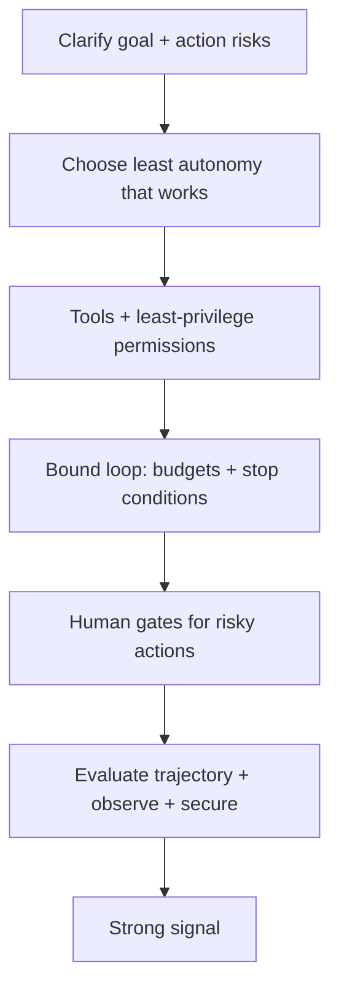

# Agent Interview Patterns

## Beginner-Friendly Intuition

Agent interview questions reward restraint and rigor. The candidates who do well do not reach for maximum
autonomy; they pick the least autonomy that solves the problem, then make the controls explicit: tool
permissions, budgets, stop conditions, human gates, and trajectory evaluation. Whatever the prompt, the
winning move is to show you design for failure, not just for the happy path.

## Formal Explanation

The recurring frame for any agent prompt:

- **Clarify:** the goal, which actions are reversible, the cost of a wrong action, and the budget.
- **Choose autonomy:** workflow if the path is fixed, single agent if bounded reasoning is needed,
  multi-agent only when work is separable.
- **Tools and permissions:** least privilege, schemas, validation, and approval gates for risky actions.
- **Bound the loop:** stop conditions, step and cost budgets, progress checks.
- **Evaluate and operate:** trajectory metrics, observability, injection defenses, and staged rollout.

## Why It Matters in Real Jobs

These patterns mirror how safe agents are actually built. An engineer whose instinct is "does this even
need an agent, and how do I bound it" ships reliable systems; one who reaches for autonomous multi-agent
frameworks ships incidents. The interview is screening for that production instinct under a realistic
prompt.

## How It Works Step by Step

1. **Restate and clarify** the goal, action risks, and constraints.
2. **Justify the autonomy level** explicitly.
3. **Design tools with permissions** and name the approval gates.
4. **Bound the loop** with concrete budgets and stop conditions.
5. **Close with evaluation, observability, security, and a staged rollout.**

## Real-World Example

Asked to "build an agent that manages calendar invites", a strong candidate notes most of it is a fixed
workflow, uses a single bounded agent only for the ambiguous scheduling, gives the send-invite tool an
approval gate, caps the loop, and finishes with trajectory evaluation and audit logging. A weak candidate
proposes several autonomous agents chatting, then stalls on "what stops it from emailing the wrong person".

## Common Mistakes

- Defaulting to autonomous or multi-agent designs.
- Forgetting tool permissions, budgets, and human gates.
- Evaluating only the final outcome, not the trajectory.
- Ignoring prompt injection and irreversible-action risk.

## Production Concerns

Common failure modes from postmortems map to interview red flags:
prompt-injection from retrieved content (defense missing in the
design), unbounded loops (no stop condition specified), unauthorized
tool calls (no permission scopes named), runaway cost (no budget),
silent regression (no monitoring or eval), wrong-user data leak (no
ACL on retrieval and memory). Naming each unprompted is a strong
signal. A pre-ship verification checklist: budgets defined, kill
switch tested, audit log retained, eval suite passing,
prompt-injection defenses tested, rollback tested, named on-call,
runbooks written. Strong candidates close their answer with this
list. The interviewer is also looking for restraint: the candidate
who says "this is a workflow, not an agent" gains points where the
candidate who reaches for multi-agent loses them.

## Interview Angle

**Question:** The interviewer asks "does this need an agent at all?"

**Strong answer:** Often no. If the path is fixed, a workflow is more reliable and cheaper. I use an agent
only when the task needs adaptive multi-step reasoning, and then I bound it with budgets, permissions, and
human gates.

**Weak answer:** Assuming an agent is required and maximizing autonomy.

**Follow-up questions:**

- When is a workflow better than an agent?
- How do you bound cost and loops?
- Which actions require human approval and why?

## Mini Exercise

Take a mock prompt (for example "design an agent to triage and resolve support tickets"). Write a
twelve-line answer using the clarify, choose-autonomy, tools-and-permissions, bound-the-loop,
evaluate-and-operate frame, including one approval gate.

## Diagram

---
## Navigation

[⬅ Previous](12-agent-system-design.md) | [🏠 Home](../README.md) | [➡ Next](../production-ai/01-production-ai-overview.md)
