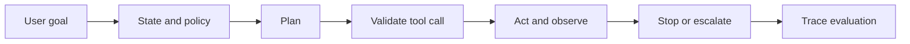

# Agent Interview Patterns

## Beginner-Friendly Intuition

Agent interviews test whether you can design a model-controlled workflow without letting the model
do unsafe or undefined work. An agent is not just an LLM with tools. It is a loop with state,
planning, tool contracts, observations, stopping rules, permissions, evaluation, and escalation.

The most important pattern is to constrain agency. Start with a deterministic workflow, add model
decisions only where they help, validate every tool call, and require human approval for risky state
changes.

## Formal Explanation

An agent design answer should define:

- **Task boundary:** what the agent may do, what it may never do, and when it must escalate.
- **State model:** user goal, intermediate plan, tool results, memory, permissions, and audit trace.
- **Tool contract:** schema, preconditions, authorization, idempotency, side effects, timeouts, and
  error handling.
- **Control loop:** plan, act, observe, validate, revise, stop, or ask for help.
- **Evaluation:** task success, unsafe action rate, unnecessary tool calls, intervention rate,
  latency, cost, and auditability.
- **Operations:** sandboxing, secrets handling, prompt injection defense, replay, monitoring, and
  rollback.

## Why It Matters in Real Jobs

Agents can create value when tasks require multiple steps, tools, and changing state. They can also
create severe risk by taking the wrong action confidently. The problem is rarely "make the model
smarter." The problem is deciding which actions should be automated, which require confirmation, and
which should remain outside the agent boundary.

Interviewers expect you to reason about permissions and failure recovery. An agent that can send
emails, update records, issue refunds, or deploy code must be designed as a controlled system.

## How It Works Step by Step

1. **Scope the workflow.** Define the goal, success criteria, allowed tools, forbidden actions, and
   escalation conditions.
2. **Build the deterministic baseline.** Use forms, rules, scripts, retrieval, and human approval
   before adding autonomous planning.
3. **Specify tools.** Give each tool a schema, validation rule, permission check, timeout, and
   observable result.
4. **Add planning carefully.** Limit steps, require intermediate checks, and prevent hidden state
   changes.
5. **Evaluate traces.** Review actions, not just final answers. Score success, safety, cost, and
   unnecessary work.
6. **Operate with controls.** Log audit traces, redact secrets, detect prompt injection, and monitor
   unsafe-action attempts.

## Real-World Example

For a customer-support refund agent, the baseline is a policy lookup plus a draft response for a
human agent. The next step might allow the model to classify refund eligibility and prepare a tool
call. The tool should validate account status, order amount, policy constraints, and approval
requirements before any refund is issued.

The highest-risk failure is not a bad sentence. It is issuing an unauthorized refund, exposing
private account data, or promising a policy exception. Those risks require permissions, approval
thresholds, audit logs, and rollback procedures.

## Common Mistakes

- Calling a chatbot an agent without defining tools, state, or stopping rules.
- Giving tools broad permissions instead of least-privilege scopes.
- Evaluating only final task success and ignoring unsafe near misses.
- Allowing write actions without validation or human approval.
- Treating memory as always useful without privacy, freshness, and deletion rules.
- Hiding tool errors from the user or the monitoring system.
- Letting retrieved or user-provided text change tool policy.

## Interview Angle

Interviewers use agent prompts to test safety and systems thinking.

**Question:** Design an agent that schedules meetings across calendars and sends follow-up emails.

**Strong answer:** Start with a deterministic scheduling assistant, define calendar and email tool
schemas, require permission for external emails, validate recipients and times, log all actions,
handle conflicts, escalate ambiguous requests, and evaluate task success plus unsafe send rate.

**Weak answer:** Let an LLM read calendars and send emails whenever it thinks the plan is good.

**Follow-up questions:**

- What tools should be read-only at first?
- How do you handle a tool timeout after partial progress?
- What actions require human confirmation?
- How would you test the agent before real users?

## Mini Exercise

Pick one workflow: expense approval, meeting scheduling, support refunds, code review, or research
summaries. Write allowed actions, forbidden actions, tool schemas, approval rules, evaluation
metrics, and one audit-log entry for a failed attempt.

## Diagram

---
## Navigation

[⬅ Previous](12-agent-system-design.md) | [🏠 Home](../README.md) | [➡ Next](../production-ai/01-production-ai-overview.md)
