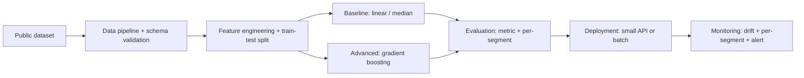

# End-to-End Classical ML Project

## Goal

Ship a complete classical ML project end-to-end on a tabular
problem of your choice: data ingestion, baseline, advanced model,
evaluation, deployment, and monitoring. The output is a portfolio
artifact you can defend in interview with specific numbers,
specific decisions, and one production tradeoff.

## Why This Project Matters

Classical ML on tabular data is the most common production
machine-learning system in the world. Banks, e-commerce, ad-tech,
and SaaS run on gradient-boosted trees and logistic regression,
not on the latest neural architectures. Hiring managers ask "have
you shipped a model end-to-end" because the path from notebook to
production exposes every gap (leakage, training-serving skew,
drift, monitoring) that a research project can ignore.

## Intuition

The model is one component of a system. The system around it is
ten other components: data pipeline, feature engineering,
baseline, advanced model, evaluation, deployment, monitoring,
governance, eval harness, iteration loop. Building each component
in a small but real form, even on a single dataset, teaches the
production discipline that no single course covers.

## Explanation

Pick a tabular problem with a clear decision (a number to predict
or a class to assign). Implement the eleven layers of a
production system, even if each layer is small: feature pipeline,
training, registry, serving, monitoring. Use a public dataset
(Kaggle, UCI) so the data is known and the project is
reproducible by reviewers. Document each decision with the
constraint that motivated it. The portfolio artifact is the
GitHub repo plus a README that walks a reader through the
project in 10 minutes.

## Example Use Case

A reviewer (hiring manager) clones the repo and runs the
walkthrough. They see the data assumptions, the baseline metric,
the advanced model lift, the per-segment evaluation, the
deployment notes, and the monitoring rules. They can answer:
"would this work in production for a different team?"

## System Shape

## Dataset Idea

Pick one of these public datasets so the work is reproducible:
- UCI Adult (income classification, 32K rows).
- Kaggle Titanic (survival classification, 1K rows; small but
  classic).
- Lending Club (loan default, 100K-1M rows).
- NYC Taxi (regression on tip percentage, millions of rows).

Avoid synthetic data unless the project is explicitly about
synthetic-data quality.

## Step-by-Step Implementation Plan

1. **Week 1: setup and EDA.** Clone the dataset, document the
   schema, identify the target, run EDA, list data-quality
   risks. Commit a notebook with the findings.
2. **Week 1: baseline.** Build a logistic regression or median
   baseline. Measure the primary metric on a held-out test set
   with a confidence interval. Commit the baseline result with
   the metric definition.
3. **Week 2: advanced model.** Train a gradient-boosted model
   (XGBoost or LightGBM). Tune hyperparameters with cross-
   validation. Compare to baseline; report the lift with a
   confidence interval.
4. **Week 2: evaluation.** Per-segment metrics; calibration plot;
   error analysis. Identify three slices where the model fails;
   document each.
5. **Week 3: deployment.** Wrap the model in a small API
   (FastAPI) or a batch scoring script. Containerize. Document
   the inference contract.
6. **Week 3: monitoring.** Add per-feature drift alerts (PSI),
   per-segment performance dashboards, and a rollback plan.
7. **Week 4: documentation.** Write the model card (intended
   use, performance, limits, fairness, monitoring). Write the
   README. Record a 5-minute walkthrough video.

## Evaluation

Primary metric: ROC-AUC or PR-AUC for classification, MAE or
WAPE for regression, calibrated to the dataset's label balance.
Target: beat the baseline by a margin larger than the confidence
interval. Per-segment metrics on at least 3 segments. Calibration
plot for classification.

## Evaluation Strategy

- Stratified train-test split (and cross-validation in
  development); time-aware split if the data has a temporal
  dimension.
- Bootstrap confidence intervals on the metric.
- At least 3 success cases and 3 failure cases described
  qualitatively.
- A small regression set protecting the most important
  behavior.

## Extensions

- Add fairness analysis with disparate-impact metrics.
- Add a feature-importance breakdown (SHAP values).
- Add a CI workflow that runs the eval on every PR.
- Add a feature store separating offline and online feature
  computation.
- Open-source the project with a clean README.

## Common Mistakes

- Skipping the baseline; jumping to a complex model.
- Reporting one aggregate number without per-segment analysis.
- No deployment artifact; the model lives in a notebook.
- No monitoring; "the model is fine" with no production
  signal.
- No model card; reviewers cannot judge intended use or limits.

## Interview Angle

Strong walkthrough: 30-second pitch (problem, dataset, baseline,
lift, deployment, monitoring); 5-minute deep dive with the
contract, the baseline number, the lift with CI, the per-segment
finding, the deployment shape, and one thing you would do
differently. Defensible numbers throughout. The senior signal is
the production tradeoff named explicitly: "I chose gradient
boosting over a deep network because the dataset is 50K rows
and the operational cost of debugging trees is lower."

## Mini Exercise

Pick the dataset. Write a one-page project proposal: the metric,
the baseline, the advanced approach, the deployment shape, the
monitoring rule, and one likely failure mode. If you cannot
write the proposal in 30 minutes, the project is not scoped
clearly enough.

## Resume Bullet Points

- Built and deployed an end-to-end ML pipeline on [DATASET]
  (data, baseline, gradient-boosted model, evaluation,
  containerized API, drift monitoring).
- Improved [METRIC] from [BASELINE] to [ADVANCED] (delta +X
  percent, 95-percent CI [Y, Z]) with per-segment analysis
  exposing two underperforming slices and a documented
  remediation plan.
- Documented the system with a model card, drift alerts (PSI on
  3 features), and a feature-flag-based rollback path.

---
## Navigation

[⬅ Previous](../ethics-safety/07-ai-governance.md) | [🏠 Home](../README.md) | [➡ Next](02-house-price-prediction.md)
