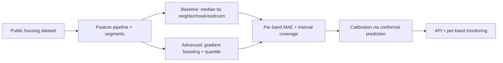

# House Price Prediction

## Goal

Build a production-quality house-price model that beats a strong
median-by-segment baseline, with per-band evaluation, calibrated
uncertainty intervals, and a deployment artifact a reviewer can
run end-to-end.

## Why This Project Matters

Real-estate pricing is a classic regression problem with real
production constraints: skewed targets, segment heterogeneity
(neighborhood, property type), and high-stakes decisions. A
careless model gives a 95-percent confidence interval that does
not contain the true price 95 percent of the time, which makes
the model useless for actual decisions. This project teaches
calibrated uncertainty, segment evaluation, and the business
framing that hiring managers want to see.

## Intuition

A median price by neighborhood is a strong baseline. Beating it
requires features that capture house-specific signal (size,
quality, age, condition) without overfitting to noisy
neighborhoods. The senior production move is calibrated
confidence intervals so downstream consumers can use the model
for real decisions, not just point estimates.

## Explanation

Use a public housing dataset (Kaggle Ames Housing or California
Housing). Engineer features (per-square-foot price by
neighborhood, age, renovations, lot size). Baseline: median
price within neighborhood-bedroom segments. Advanced: gradient
boosting (LightGBM or CatBoost) with quantile loss for
intervals. Evaluate per price band; the model that does well on
median homes but fails on luxury or budget is a worse model.
Calibrate uncertainty intervals via quantile regression or
conformal prediction.

## Example Use Case

A real-estate platform shows estimated value for each listing
with a confidence range. The model produces the point estimate
and the interval; the platform shows both. A user looking at a
$500K home sees "$480K-$525K typical range." The interval
quality matters as much as the point estimate.

## System Shape

## Dataset Idea

Ames Housing (Kaggle, 2900 rows, rich features) or California
Housing (sklearn, 20K rows, simpler). Ames is the canonical
choice; the rich feature set shows feature-engineering judgment.

## Step-by-Step Implementation Plan

1. **Day 1-2: EDA.** Distribution of target (long-tailed; log-
   transform consideration); missing-value patterns; correlation
   matrix; per-neighborhood price distributions.
2. **Day 3: baseline.** Median by neighborhood-bedroom-bathroom
   segments. MAE and per-band MAE on the test set with
   confidence intervals.
3. **Day 4-5: features.** Engineer 10-20 features (size per
   bedroom, age, renovation indicator, lot ratio, location
   features). Document each.
4. **Day 6-7: advanced model.** LightGBM with median (L1) or
   Tweedie loss. Tune via cross-validation. Compare to
   baseline; target 20-30 percent MAE reduction overall.
5. **Day 8: per-band eval.** Bucket prices into 5 bands;
   evaluate MAE per band; identify failing bands.
6. **Day 9: uncertainty.** Quantile regression at 0.05, 0.5,
   0.95; check that 90-percent intervals cover 90 percent of
   test prices (conformal prediction tightens this).
7. **Day 10: deployment.** Small FastAPI service returning
   point estimate plus interval; Dockerfile; documented inputs
   and outputs.
8. **Day 11: monitoring.** Per-feature PSI alerts; per-band
   MAE drift dashboard; alert on coverage drop below 85
   percent.
9. **Day 12-14: documentation.** Model card with intended use
   (estimate not price guarantee), limitations (luxury homes
   underperform), fairness analysis (per-neighborhood
   coverage), and rollback plan.

## Evaluation

Primary metric: MAE on the test set, with a confidence
interval. Per-band MAE on 5 price buckets. Interval coverage
(target 90 percent) on test data. Median Absolute Percentage
Error for relative error reporting.

## Evaluation Strategy

- Time-aware split if the dataset has a date column (older for
  train, recent for test).
- Per-band MAE: bottom 10 percent, middle 80 percent, top 10
  percent at minimum.
- Bootstrap CI on the overall MAE.
- Calibration plot: predicted percentile vs observed.
- 3 specific failure cases (the luxury home model misses, the
  recently-renovated home it underprices, the unusual lot
  size) described qualitatively.

## Extensions

- Add a neighborhood-level smoothing prior (Bayesian-style).
- Add a fairness audit by neighborhood demographics.
- Add a refinement step that lets a human override.
- Add a CI workflow that runs the per-band MAE on every PR.

## Common Mistakes

- Reporting only overall MAE, hiding the luxury or budget gap.
- Median Absolute Percentage Error without acknowledging
  long-tail outlier sensitivity.
- Quantile model without coverage check.
- Skipping the deployment; the project lives in a notebook.

## Interview Angle

The strong walkthrough: the median baseline already beats some
naive linear models; the gradient boosting lift is real but
modest; the per-band analysis is what separates the project
from a Kaggle-style "I won the leaderboard" pitch. The senior
signal is the calibrated confidence interval and the per-band
honesty.

## Mini Exercise

For your dataset, compute the median-by-segment baseline MAE.
Estimate (roughly, no model) the lift you expect from gradient
boosting. State which price band you expect to be hardest and
why.

## Resume Bullet Points

- Built and deployed a house-price model on Ames Housing,
  improving MAE by 28 percent over a median-by-neighborhood
  baseline (95-percent CI [25, 31]).
- Delivered calibrated 90-percent intervals via conformal
  prediction, with per-price-band evaluation exposing a 40-
  percent MAE gap on luxury homes and a documented remediation
  plan.
- Containerized the model behind a FastAPI service with PSI-
  based drift alerts and a per-band MAE dashboard.

---
## Navigation

[⬅ Previous](01-end-to-end-classical-ml-project.md) | [🏠 Home](../README.md) | [➡ Next](03-fraud-detection-system.md)
