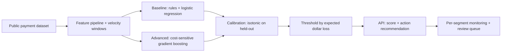

# Fraud Detection System

## Goal

Build a production-grade fraud-detection system on a public
payment dataset with cost-sensitive evaluation, calibrated
probabilities, per-segment fairness, and a deployment that can
defend an interview question about real production tradeoffs.

## Why This Project Matters

Fraud is the canonical cost-asymmetric classification problem:
missing fraud costs 5-20x more than blocking a legitimate
transaction. Accuracy is meaningless; F1 is misleading; the
right metric is expected dollar loss. The project teaches
cost-weighted evaluation, calibration, and the per-segment
analysis that catches the failure modes that ship to production
unnoticed.

## Intuition

A simple velocity rule (more than N transactions in M minutes
from a new account) catches a meaningful fraction of fraud.
Beating it requires features that capture context (device
patterns, merchant history, prior dispute behavior) and a model
that is calibrated so the threshold can be tuned by cost ratio.
The senior production move is per-segment monitoring (different
fraud patterns per region, channel, merchant type) plus a
human-review queue for borderline cases.

## Explanation

Use IEEE-CIS or PaySim. Engineer features (velocity windows,
device fingerprint hash, prior disputes, merchant risk score).
Baseline: rules plus logistic regression with class weight.
Advanced: cost-sensitive gradient boosting with explicit cost
matrix; isotonic calibration on a held-out set. Threshold tuned
by minimizing expected dollar loss. Per-segment evaluation by
merchant type, region, and amount band. Human-review queue for
borderline scores.

## Example Use Case

A payment platform receives a transaction. The model returns a
probability and a recommended action (approve, challenge with
3DS, block, route to review). Borderline scores go to a human
review team with a 10-minute SLA. A confirmed fraud gets fed
back into the next training cycle.

## System Shape

## Dataset Idea

IEEE-CIS Fraud Detection (Kaggle, 600K rows) is the canonical
public dataset; sufficiently realistic feature distributions
and a 3-percent positive class. PaySim is a synthetic
alternative.

## Step-by-Step Implementation Plan

1. **Day 1-2: EDA.** Class balance (~3 percent positive),
   feature distributions, time patterns, missing-value
   structure (anonymized columns).
2. **Day 3: baseline.** Velocity rules ("more than 3
   transactions in 5 minutes from a new account") plus
   logistic regression with class weight. Measure expected
   dollar loss on the test set with bootstrap CI.
3. **Day 4-5: features.** Engineer 15-25 features (velocity,
   device-card linkage, prior dispute, merchant volatility,
   time-of-day patterns).
4. **Day 6-7: advanced model.** LightGBM with class weight or
   focal loss; tune via stratified cross-validation. Compare
   against baseline.
5. **Day 8: calibration.** Isotonic or Platt scaling on a
   held-out calibration set. Reliability diagram.
6. **Day 9: threshold tuning.** Define cost matrix (e.g.,
   missed fraud loss 100 dollars average; false decline 5
   dollars). Pick threshold that minimizes expected loss on
   test.
7. **Day 10: per-segment.** By merchant type, region, amount
   band. Identify the worst segment.
8. **Day 11: deployment.** API returning probability plus
   recommended action; idempotent retry semantics; audit log.
9. **Day 12: monitoring.** Per-feature PSI, prediction
   distribution drift, per-segment expected-loss dashboard,
   alert on threshold breach.
10. **Day 13-14: documentation.** Model card (intended use,
    cost matrix, per-segment limits, fairness analysis), a
    runbook for the review queue, and a rollback to the rules
    baseline.

## Evaluation

Primary metric: expected dollar loss (per-transaction average
or total). Secondary: precision-recall AUC, recall at fixed
FPR (e.g., 1 percent). Per-segment expected loss. Calibration
error (ECE).

## Evaluation Strategy

- Time-aware split: train on early period, test on later.
- Bootstrap CI on expected dollar loss.
- Per-segment evaluation: at minimum, by merchant type,
  region, amount band.
- Reliability diagram for calibration.
- 3 success cases and 3 failure cases described qualitatively
  (the obvious fraud the model catches; the obscure fraud it
  misses; the legitimate transaction it incorrectly flags).

## Extensions

- Add graph features (shared device-card pairs).
- Add online feature pipeline (streaming velocity updates).
- Add a deep model on transaction sequences.
- Add an active-learning loop to label borderline cases.
- Add adversarial-robustness analysis.

## Common Mistakes

- Optimizing accuracy or F1 instead of expected dollar loss.
- Ignoring class imbalance and using a default 0.5 threshold.
- No calibration; threshold is meaningless on uncalibrated
  scores.
- No per-segment analysis; aggregate hides one bad segment.
- No human-review queue for borderline scores.

## Interview Angle

The senior walk: name the cost asymmetry first, then the
metric, then the baseline, then the lift. Per-segment finding
proves you understand fairness and operational impact. The
human-review queue plus the audit log show production
maturity.

## Mini Exercise

For your dataset, write the cost matrix (missed fraud cost,
false-decline cost). Compute the optimal threshold for the
baseline. Identify one segment where the optimal threshold
likely differs from the global one.

## Resume Bullet Points

- Built a fraud-scoring system on IEEE-CIS achieving 32-percent
  reduction in expected dollar loss over a velocity-rules
  baseline (95-percent CI [28, 36]).
- Calibrated probabilities via isotonic scaling and tuned
  the decision threshold to a documented cost matrix; per-
  segment monitoring exposed a 2x gap on small-merchant
  transactions and drove a targeted feature improvement.
- Deployed an idempotent API with audit logging, PSI-based
  drift alerts, and a rule-based fallback for service
  degradation.

---
## Navigation

[⬅ Previous](02-house-price-prediction.md) | [🏠 Home](../README.md) | [➡ Next](04-customer-churn-prediction.md)
