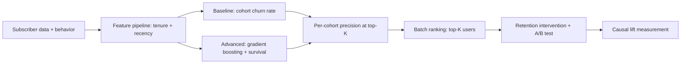

# Customer Churn Prediction

## Goal

Build a churn-prediction system on a public telco or SaaS
dataset that beats a tenure-based baseline, surfaces actionable
risk drivers, and supports a real intervention pipeline (offer
a discount, route to retention team).

## Why This Project Matters

Churn modeling is high-leverage and well-defined: every
prevented churn pays for itself many times over. The challenge
is causal: identifying users likely to churn is necessary but
not sufficient; the model must surface users where intervention
plausibly changes outcome. Hiring managers ask about churn
because it tests metric design (precision at top-K), feature
engineering (tenure, recency, support contacts), and the
deployment shape (batch precompute or online).

## Intuition

A simple "users who logged in last more than 30 days ago" rule
catches a significant fraction. Beating it requires behavioral
features (recency, frequency, value patterns) and survival-
style modeling that estimates time-to-churn, not just binary
likelihood. The senior production move is precision at top-K
(retention team can only call 5000 users a month) plus a
controlled experiment to measure intervention effect.

## Explanation

Use Telco Customer Churn (Kaggle, 7K rows) or build a synthetic
SaaS-style dataset. Engineer features (tenure buckets, recency,
support-contact frequency, plan tier, billing-issue count).
Baseline: cohort-based churn rate (segment by tenure and plan).
Advanced: gradient boosting on engineered features; survival
model (Cox proportional hazards or random survival forest) for
time-to-churn. Calibrate; rank users by predicted churn
probability; intervene on top-K.

## Example Use Case

Monthly batch: score every active customer; rank by predicted
churn risk; route the top 5000 to the retention team for
outreach. The intervention (discount, support call) is the
treatment; A/B test the model-driven targeting against random
or rule-based selection to measure causal lift.

## System Shape

## Dataset Idea

Telco Customer Churn (IBM, hosted on Kaggle, 7K rows) is the
canonical public dataset. Synthetic SaaS data is acceptable if
you preserve realistic feature distributions and a
5-15-percent positive class.

## Step-by-Step Implementation Plan

1. **Day 1-2: EDA.** Churn rate by tenure, plan, and contract
   type. Recency distributions. Missing-data patterns.
2. **Day 3: baseline.** Cohort churn rate by tenure-plan
   bucket. Rank users by their cohort's churn rate. Measure
   precision at K.
3. **Day 4-5: features.** Engineer 10-20 features (tenure,
   recency since last interaction, support-contact frequency,
   billing patterns, plan changes).
4. **Day 6-7: advanced model.** LightGBM with class weight;
   AUC plus precision at top-K. Compare to baseline.
5. **Day 8: survival.** Random survival forest or Cox PH for
   time-to-churn estimation; restricted mean survival time
   per user for ranking.
6. **Day 9: calibration.** Isotonic on a held-out set;
   precision-at-K stability across calibration changes.
7. **Day 10: A/B design.** Pre-register a 50/50 experiment:
   model-targeted intervention vs random within the at-risk
   pool. Sample size for 10-percent retention lift detection.
8. **Day 11-12: deployment.** Monthly batch job; feature
   freshness contract; idempotent execution; audit log.
9. **Day 13: monitoring.** Per-cohort churn rate drift;
   precision-at-K stability; intervention success rate.
10. **Day 14: documentation.** Model card, intervention
    runbook, A/B-test results template.

## Evaluation

Primary metric: precision at top 5000 (or appropriate K).
Secondary: ROC-AUC, calibration error, per-cohort precision.
A/B-test causal lift on the intervention as the final
business metric.

## Evaluation Strategy

- Time-aware split: train on data through month T, predict
  churn in month T+1, test on month T+2 (delayed labels).
- Bootstrap CI on precision at K.
- Per-cohort precision (by tenure bucket and plan).
- A/B test: pre-registered hypothesis, sample size, run
  length.
- 3 success cases (the high-risk user the model flagged) and 3
  failure cases (the low-risk user who churned anyway)
  described qualitatively.

## Extensions

- Survival modeling for time-to-churn ranking.
- Uplift modeling: predict who would benefit from intervention,
  not just who is at risk.
- Multi-step churn (tier downgrade, payment failure, full
  churn).
- Long-term retention follow-up: did interventions work after
  3 months?

## Common Mistakes

- Predicting churn likelihood but ignoring whether the
  intervention helps.
- Using future-looking features (next-month plan change) that
  leak.
- Ranking by probability without per-cohort calibration.
- No A/B test; treating model predictions as causal.

## Interview Angle

The senior walk: name the cohort baseline first, then the
lift; describe the precision-at-K metric and why it matters
for the retention team's capacity; describe the A/B test that
measures causal intervention lift, not just predictive
accuracy. The uplift-modeling extension signals depth.

## Mini Exercise

For your dataset, define K (the retention-team monthly
capacity). Compute the baseline cohort precision at K.
Estimate the lift you expect from gradient boosting plus
calibration. State one segment where the model is likely to
underperform and why.

## Resume Bullet Points

- Built a churn-prediction pipeline on telecom data improving
  precision at top-5000 from 0.34 (cohort baseline) to 0.51
  (gradient boosting plus survival modeling), validated by a
  90-percent-power A/B test on the intervention.
- Per-cohort precision exposed a 2.5x gap on month-to-month
  contract customers, driving a tenure-bucket-specific
  threshold and a documented retention-team runbook.
- Deployed as a monthly batch with feature-freshness
  contracts, drift monitoring, and a pre-registered A/B-test
  template for evaluating intervention lift.

---
## Navigation

[⬅ Previous](03-fraud-detection-system.md) | [🏠 Home](../README.md) | [➡ Next](05-recommendation-system.md)
