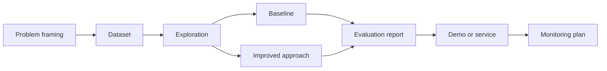

# Customer Churn Prediction

## Goal

Build a focused customer churn prediction that demonstrates practical machine learning engineering: problem
framing, data handling, a measurable baseline, an improved approach, evaluation, communication, and
production thinking.

## Why This Project Matters

This project is useful because subscription retention work forces you to connect model quality with user impact.
The strongest portfolio version shows not only a model score, but also data assumptions, error
analysis, monitoring needs, and the tradeoffs behind the final design.

## Intuition

Think of the project as a small production system. The model is one component. The surrounding work
defines the user decision, validates the data, compares against a baseline, measures failure modes,
and explains when the system should ask for human review.

## Explanation

Use usage, billing, support, and churn labels. Start with this baseline: recency and usage rules. Compare it with survival or gradient boosted model. Keep the data split,
features, model version, and evaluation script easy to reproduce. Write down every assumption that
would change if the system had real users.

## Example Use Case

A realistic version of this project could help a team make a decision in subscription retention. The system should
show the input, output, confidence or score, and one explanation of why the output is reasonable or
where it might fail.

## System Shape

## Dataset Idea

Use usage, billing, support, and churn labels. If a public dataset is not available, create a small synthetic dataset that preserves
the structure of the real problem: inputs, labels or judgments, timestamps where useful, and edge
cases.

## Step-by-Step Implementation Plan

1. Write the product problem, target user, and success metric.
2. Create or collect the dataset and document each column or field.
3. Perform exploratory analysis and identify data quality risks.
4. Build the baseline: recency and usage rules.
5. Train or configure the improved approach: survival or gradient boosted model.
6. Compare both approaches on the same split.
7. Analyze errors by segment and severity.
8. Package a small demo script, notebook, or API.
9. Add a model card style summary covering intended use, limits, risks, and monitoring.
10. Prepare a two-minute interview explanation.

## Evaluation

Use lift, calibration, and intervention cost. Add guardrails for latency, cost, fairness or safety where relevant. Include examples
where the system succeeds, fails, and should defer to a human.

## Common Mistakes

- Starting with the advanced approach before measuring the baseline.
- Choosing a metric that does not match the user decision.
- Ignoring data leakage, missing values, drift, or delayed labels.
- Showing only aggregate results without segment analysis.
- Leaving out monitoring, rollback, privacy, or ownership.

## Resume Bullet Points

- Built a customer churn prediction with documented data pipeline, baseline, model comparison, and evaluation.
- Improved lift, calibration, and intervention cost while adding error analysis and production risk assessment.
- Communicated tradeoffs using business impact, failure modes, and deployment constraints.

## Interview Angle

Start with the user problem, then describe the dataset, baseline, improved approach, metric, and
biggest lesson from error analysis. End with what you would do next if the project had real users.

## Mini Exercise

Write a one-page project proposal before coding. If you cannot define the metric, baseline, and
deployment path, simplify the project until you can.

---
## Navigation

[⬅ Previous](03-fraud-detection-system.md) | [🏠 Home](../README.md) | [➡ Next](05-recommendation-system.md)
