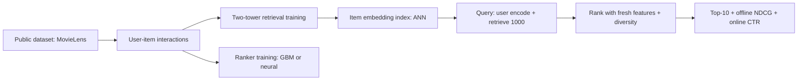

# Recommendation System

## Goal

Build a two-stage recommendation system on a public movie or
product dataset: candidate generation via two-tower retrieval
plus a ranker for top-K, with A/B-ready evaluation, diversity
guardrails, and a deployable artifact.

## Why This Project Matters

Recommenders are the highest-value ML system in many products.
The two-stage pattern (retrieval plus ranking) is the universal
production architecture; understanding it deeply separates
candidates with surface knowledge from those who can ship at
scale. The project teaches counterfactual evaluation (offline
metrics often disagree with online), exposure bias, and
diversity-aware ranking that prevents filter bubbles.

## Intuition

Pure popularity ranking is the strong baseline most personalized
recommenders fail to beat by much offline. Beating it requires
capturing user-specific preferences without losing diversity.
The senior production move is two-stage architecture (cheap
retrieval, expensive ranking) plus diversity penalties to
prevent collapse, plus offline-online gap awareness so the
team avoids shipping a metric mover that does not move
engagement.

## Explanation

Use MovieLens-25M or Amazon Reviews. Build a two-tower
retrieval model (user tower, item tower, shared embedding
space). Train with sampled-softmax or in-batch negatives.
Pre-compute item embeddings; ANN-index them. At query time,
encode the user, retrieve top 1000 candidates. Rank the
candidates with a gradient-boosted or neural ranker using
contextual features (time of day, recent activity, device).
Apply diversity (MMR or category quota). Serve top 10. Eval
NDCG and Recall@K offline; track CTR online via A/B test.

## Example Use Case

A movie streaming service shows "for you" recommendations.
Each request: encode the user, retrieve 1000 candidates, rank
with fresh contextual features, apply diversity, return top
10. Latency budget under 100 ms p99 with the retrieval and
ranking distributed across services.

## System Shape

## Dataset Idea

MovieLens-25M (GroupLens, 25M ratings, rich movie metadata)
is the canonical choice. Amazon Reviews (Stanford, reviews
plus product metadata) for product-recommendation framing.

## Step-by-Step Implementation Plan

1. **Day 1-2: data prep.** User-item interactions matrix;
   train-validation-test split (time-aware: predict month
   T+1 from data through month T).
2. **Day 3: baseline.** Popularity per user-segment; recall@10
   on the held-out test set.
3. **Day 4-6: two-tower retrieval.** PyTorch implementation;
   sampled-softmax loss; ANN index (FAISS or HNSWlib).
   Recall@10 vs the baseline.
4. **Day 7-8: ranker.** Gradient boosting on contextual
   features. NDCG@10 on the candidate set.
5. **Day 9: diversity.** MMR re-ranking with a tunable lambda;
   measure diversity (intra-list distance) plus engagement
   metric.
6. **Day 10: counterfactual eval.** Inverse-propensity weighted
   estimator on logged data; compare against naive offline
   evaluation.
7. **Day 11-12: deployment.** Two-service architecture (retrieval
   service, ranking service); pre-computed item embeddings
   refreshed daily; ANN index in memory; latency profiling.
8. **Day 13: A/B design.** Pre-registered metric (CTR or
   session length); 50/50 holdout; sample size for 2-percent
   lift detection.
9. **Day 14: monitoring.** Per-segment NDCG drift; per-segment
   CTR; cold-start fallback; provider-side coverage metric.

## Evaluation

Primary metric: NDCG@10 on a labeled test set. Secondary:
Recall@100, MRR, intra-list diversity. Online metric for A/B:
CTR or session engagement. Counterfactual estimator on logged
data.

## Evaluation Strategy

- Time-aware train-test split.
- NDCG@10 with bootstrap CI.
- Per-segment metrics (active users, new users, by category).
- Counterfactual offline eval (IPW) before A/B.
- Diversity: intra-list distance with a clear threshold.

## Extensions

- Sequence model (GRU or transformer) on user behavior.
- Multi-task ranker (CTR plus dwell time plus completion).
- Cold-start: content-based fallback for new items and users.
- Causal inference on the recommendation effect.
- Multi-objective optimization (engagement plus diversity plus
  revenue).

## Common Mistakes

- Pure offline NDCG without counterfactual correction.
- No diversity guardrail; the ranker collapses to a narrow
  filter bubble.
- Ignoring cold-start; the system is broken for new users.
- One-stage architecture; cannot scale to large catalogs.
- No A/B; offline gains do not transfer to engagement.

## Interview Angle

The senior walk: name the two-stage architecture; describe the
retrieval-vs-ranking split and the latency budget; state the
counterfactual estimator and why it differs from naive offline;
name the diversity tradeoff; close with the A/B test and the
provider-side fairness metric. The candidate who stops at "I
trained a two-tower" misses the production tradeoffs.

## Mini Exercise

For your dataset, compute the popularity-baseline Recall@10.
Estimate the lift you expect from a two-tower retriever. State
one segment where the model is likely to underperform and the
diversity penalty you would apply.

## Resume Bullet Points

- Built a two-stage recommender on MovieLens-25M with
  two-tower retrieval and a gradient-boosted ranker, achieving
  NDCG@10 of 0.42 (vs 0.27 popularity baseline; 95-percent CI
  [0.40, 0.44]).
- Counterfactual offline evaluation via IPW corrected a
  9-percent over-estimate in naive offline NDCG and informed
  the A/B-test sample-size design.
- Deployed retrieval and ranking as separate services with a
  100ms p99 SLO, daily index refresh, and a provider-side
  coverage metric to prevent filter-bubble collapse.

---
## Navigation

[⬅ Previous](04-customer-churn-prediction.md) | [🏠 Home](../README.md) | [➡ Next](06-search-ranking-system.md)
