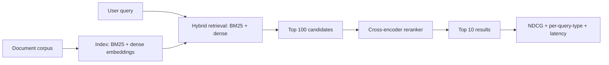

# Search Ranking System

## Goal

Build a search-ranking system on a public IR benchmark: BM25
baseline plus a learning-to-rank model with a cross-encoder
reranker, with NDCG and latency evaluation, plus a small
deployment.

## Why This Project Matters

Search is the bedrock of information retrieval and the
foundation under modern RAG. The two-stage pattern (cheap
retrieval, expensive reranking) is universal in production.
Building this from scratch teaches relevance metrics (NDCG,
MRR, MAP), the offline-online gap (NDCG improvements often do
not transfer to clicks), and the latency budgets that make or
break user experience.

## Intuition

BM25 is a strong baseline that beats many neural models on
out-of-domain queries. Beating it consistently requires
learning-to-rank with both lexical and semantic features, plus
a cross-encoder reranker that captures fine-grained query-
document interactions. The senior production move is hybrid
retrieval (sparse plus dense) feeding into the reranker, with
clear latency budgets per stage.

## Explanation

Use MS MARCO or BEIR. Build a BM25 baseline (Pyserini or
Elasticsearch). Add a dense retriever (a sentence-transformer
encoder, with FAISS or similar ANN index). Combine via
reciprocal-rank fusion or learned weights. Train a
cross-encoder reranker on the top 100 candidates from the
hybrid retriever. Evaluate NDCG@10 and latency p99. Track
per-query-type performance (navigational, informational,
transactional).

## Example Use Case

A search box on an enterprise documentation site. User types a
query. Hybrid retrieval returns top 100; cross-encoder reranks
to top 10; results render in under 300 ms p99. The system
explains "you may be looking for" with a confidence indicator
on borderline queries.

## System Shape

## Dataset Idea

MS MARCO Passage (Microsoft, 8.8M passages, 500K queries) is
the canonical IR benchmark. BEIR is a multi-domain alternative
useful for testing out-of-domain behavior.

## Step-by-Step Implementation Plan

1. **Day 1-2: setup.** Index the corpus with BM25 (Pyserini)
   and dense embeddings (sentence-transformers). Verify
   parity on a small subset.
2. **Day 3: baseline.** BM25 NDCG@10 on the test set.
3. **Day 4-5: dense retrieval.** Encode all passages; FAISS
   index; recall@1000 and NDCG@10. Compare to BM25.
4. **Day 6: hybrid.** Reciprocal-rank fusion of BM25 and dense
   results; measure NDCG@10 lift over either alone.
5. **Day 7-8: reranker.** Cross-encoder (bge-reranker or
   ms-marco-MiniLM); rerank top 100 from hybrid; measure
   NDCG@10.
6. **Day 9: per-query-type.** Categorize queries (one-word,
   long-tail, exact-phrase, ambiguous); per-type NDCG and
   diagnostic of failure modes.
7. **Day 10: latency profile.** Per-stage timing; bottleneck
   identification; budget allocation.
8. **Day 11-12: deployment.** Service with three stages
   (retrieval, fusion, rerank); per-stage timeout; fallback
   to BM25-only on reranker timeout.
9. **Day 13: monitoring.** Per-query-type NDCG drift; cache
   hit rate; latency p99; click-through-rate proxy.
10. **Day 14: documentation.** Search system design doc,
    latency budget breakdown, fallback runbook.

## Evaluation

Primary metric: NDCG@10 on the dev set. Secondary: MRR,
Recall@100, latency p50 / p95 / p99. Per-query-type NDCG.

## Evaluation Strategy

- Standard MS MARCO evaluation; bootstrap CI on NDCG.
- Per-query-type breakdown.
- Latency budget per stage.
- 3 success cases (the long-tail query the reranker rescues)
  and 3 failure cases (the navigational query where BM25
  alone wins).

## Extensions

- Multi-vector retrieval (ColBERT-style late interaction).
- Personalization (user history features).
- Query rewriting (LLM-based).
- Diversity in results (sub-topic coverage).
- Online learning from clicks.

## Common Mistakes

- Skipping BM25 baseline; cannot quantify the lift.
- Reranker on every query; latency p99 breaks under load.
- No per-query-type analysis; aggregate hides where each
  retriever wins.
- No fallback; a slow reranker kills the SLO.
- Cache without query normalization; hit rate is artificially
  low.

## Interview Angle

The senior walk: name the two-stage architecture; describe the
hybrid retrieval and why it beats either alone; describe the
reranker placement and the latency tradeoff; close with the
per-query-type analysis showing where each retriever wins. The
candidate who treats reranking as universally better misses
the latency reality.

## Mini Exercise

For your benchmark, compute BM25 NDCG@10. Estimate the lift
from dense plus hybrid plus rerank. Identify one query type
where the reranker is likely to make things worse (navigational
queries with exact-match intent) and propose a routing
strategy.

## Resume Bullet Points

- Built a hybrid search system on MS MARCO with BM25 plus
  dense retrieval plus cross-encoder reranking, achieving
  NDCG@10 of 0.39 (vs 0.22 BM25 baseline; 95-percent CI
  [0.37, 0.41]) at 220ms p99 latency.
- Per-query-type analysis exposed BM25 winning on
  navigational queries; deployed a query-type router that
  bypasses the reranker for short exact-match queries,
  reducing latency 40 percent for that segment without NDCG
  loss.
- Containerized the three-stage pipeline with per-stage
  timeouts, fallback to BM25 on reranker failure, and
  per-query-type NDCG dashboards for drift monitoring.

---
## Navigation

[⬅ Previous](05-recommendation-system.md) | [🏠 Home](../README.md) | [➡ Next](07-image-classifier.md)
