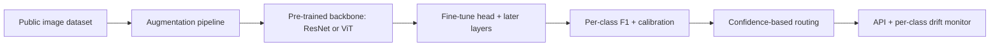

# Image Classifier

## Goal

Build an image classifier on a small public dataset using
transfer learning, with rigorous augmentation, per-class
evaluation, and a deployed inference endpoint.

## Why This Project Matters

Image classification is the canonical computer-vision task and
the foundation for many production CV systems. Hiring managers
ask about it because it tests transfer learning judgment,
augmentation discipline, and the per-class evaluation that
separates "0.95 macro F1" from "0.95 average that hides 0.4 on
the hard class." A small public dataset makes the project
reproducible by reviewers.

## Intuition

A pre-trained backbone fine-tuned on a small dataset beats a
from-scratch model, often by a large margin. The senior
production move is matching model capacity to data: 5K images
cannot support a 100M-parameter network from scratch, but a
fine-tuned backbone with strong augmentation can produce a
useful classifier.

## Explanation

Use CIFAR-10, Fashion-MNIST, or a Kaggle small dataset. Choose
a pre-trained backbone (ResNet50 or ViT-B/16) and freeze early
layers, fine-tune the head and later layers. Apply augmentation
(RandAugment, Mixup, CutMix). Use cosine LR schedule with
warmup. Evaluate per-class F1 plus calibration. Deploy as a
small API or batch.

## Example Use Case

A medical imaging classifier on a public X-ray dataset routes
images by predicted abnormality category. The system returns
the top-3 predictions with confidence; below a threshold, route
to manual review.

## System Shape

## Dataset Idea

CIFAR-10 (60K images, 10 classes) is the standard learning
dataset. For a more interesting capstone, use Tiny-ImageNet
(100K images, 200 classes) or a Kaggle domain-specific dataset
(plant disease, road sign, etc.).

## Step-by-Step Implementation Plan

1. **Day 1: data exploration.** Class distribution; image-
   resolution distribution; sample inspection by class.
2. **Day 2: baseline.** Linear probe on a frozen pre-trained
   backbone (no fine-tuning). Macro F1 and per-class accuracy
   on the test set.
3. **Day 3-5: fine-tune.** Unfreeze later layers; AdamW with
   cosine schedule; basic augmentation (random crop, flip,
   color jitter).
4. **Day 6: stronger augmentation.** RandAugment or Mixup;
   compare to basic.
5. **Day 7: per-class analysis.** Confusion matrix; per-class
   precision / recall / F1; identify the worst class.
6. **Day 8: calibration.** Temperature scaling on a held-out
   set; reliability diagram.
7. **Day 9: hard-example mining.** Inspect 50 misclassified
   examples; categorize errors (mislabeled, ambiguous,
   genuine model failure).
8. **Day 10: deployment.** TorchScript or ONNX export;
   FastAPI service returning top-K predictions plus
   confidence; CPU plus GPU benchmarks.
9. **Day 11: monitoring.** Per-class accuracy drift on a
   labeled stream; input-distribution drift via PSI on
   image-level statistics; canary deployment with rollback.
10. **Day 12-14: documentation.** Model card with intended
    use, per-class limits, fairness analysis (per-subgroup if
    applicable), and a confidence-routing runbook.

## Evaluation

Primary metric: Macro F1 (treats all classes equally).
Secondary: per-class precision and recall, calibration error,
top-3 accuracy. For imbalanced datasets, report per-class
metrics first; aggregate-only is misleading.

## Evaluation Strategy

- Stratified train-validation-test split.
- Bootstrap CI on macro F1.
- Per-class breakdown; identify the worst class with at least
  two metrics.
- Confusion matrix.
- 3 success cases (clean classifications) and 3 failure cases
  (mislabeled, ambiguous, genuine errors) described
  qualitatively.

## Extensions

- Self-supervised pre-training on unlabeled data.
- Semi-supervised learning with pseudo-labels.
- Active learning loop on borderline examples.
- Adversarial robustness analysis.
- Knowledge distillation to a smaller deployable model.

## Common Mistakes

- Training from scratch on a small dataset.
- Reporting top-1 accuracy on imbalanced data without per-
  class breakdown.
- No augmentation; the model overfits.
- No calibration; confidence-based routing is meaningless.
- No deployment artifact; the model lives in a notebook.

## Interview Angle

The senior walk: name the transfer learning choice; describe
augmentation and calibration; surface the per-class gap as a
strength of your evaluation; name the deployment shape and the
confidence-routing rule. The candidate who reports macro F1
without per-class analysis loses the "what could go wrong"
question.

## Mini Exercise

For your dataset, list the class distribution and identify the
class likely to be hardest. Estimate the macro F1 lift from
transfer learning vs from-scratch. Define the confidence
threshold for routing to manual review.

## Resume Bullet Points

- Built an image classifier on CIFAR-10 using a fine-tuned
  ResNet50 backbone, achieving macro F1 of 0.93 (vs 0.78
  from-scratch baseline; 95-percent CI [0.92, 0.94]).
- Per-class analysis exposed a 12-point F1 gap on the cat
  class; iterated on augmentation and class-weighted loss to
  close the gap to 4 points.
- Deployed an ONNX-exported FastAPI service with temperature-
  scaling calibration, confidence-based manual-review routing,
  and per-class drift monitoring on a labeled production
  sample.

---
## Navigation

[⬅ Previous](06-search-ranking-system.md) | [🏠 Home](../README.md) | [➡ Next](08-nlp-text-classifier.md)
