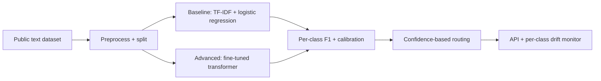

# NLP Text Classifier

## Goal

Build a text classifier on a public NLP dataset using a
TF-IDF baseline plus a fine-tuned transformer, with per-
class evaluation, calibration, and a deployable inference
endpoint.

## Why This Project Matters

Text classification is the most common production NLP task:
spam, sentiment, topic, intent, abuse. The pattern (sparse
linear baseline first, then transformer) demonstrates judgment
about complexity tradeoffs. Hiring managers ask about it
because it tests data hygiene, calibration, per-class
analysis, and the deployment cost of larger models.

## Intuition

A TF-IDF logistic regression on bigrams is a strong baseline
that beats many over-engineered systems on small or
imbalanced datasets. Beating it requires a fine-tuned
transformer, which is operationally heavier (latency, GPU
cost, retraining schedule). The senior production move is
acknowledging when the linear baseline is good enough and
shipping the simpler thing.

## Explanation

Use AG News, IMDB, or a Kaggle text dataset. Build a TF-IDF
plus logistic regression baseline. Train a fine-tuned
transformer (DistilBERT or RoBERTa) on the same split.
Compare; report the lift. Per-class evaluation. Calibrate.
Deploy as a small API with both model versions for fallback.

## Example Use Case

A support-ticket classifier routes incoming tickets to the
right team. The classifier returns the top-2 categories with
confidence; below a threshold, route to a human triage queue.
The system uses the linear model when latency budget is tight
and the transformer when accuracy matters and budget allows.

## System Shape

## Dataset Idea

AG News (Kaggle, 120K news articles, 4 classes) is the
canonical NLP classification dataset. IMDB sentiment (50K
reviews, binary) for a simpler scope. Real domain-specific
data via Hugging Face Datasets if available.

## Step-by-Step Implementation Plan

1. **Day 1: data exploration.** Class balance; document length
   distribution; vocabulary statistics; sample inspection by
   class.
2. **Day 2: baseline.** TF-IDF (with bigrams) plus logistic
   regression with L2 regularization. Macro F1 on the test
   set with bootstrap CI.
3. **Day 3-4: transformer.** Fine-tune DistilBERT (smaller,
   faster) on the same split. AdamW, learning-rate warmup,
   3 epochs typical. Macro F1 vs baseline.
4. **Day 5: per-class analysis.** Confusion matrix; per-class
   F1; identify misclassification patterns.
5. **Day 6: calibration.** Temperature scaling on a held-out
   set; reliability diagram.
6. **Day 7: hard-example mining.** Inspect 50 misclassified
   examples; identify ambiguous, mislabeled, or
   transformer-distinct failures.
7. **Day 8: latency profile.** Linear baseline at less than
   5ms; transformer typically 20-100ms on CPU, 5-20ms on
   GPU. Document the cost-quality tradeoff.
8. **Day 9-10: deployment.** ONNX-exported transformer
   service plus a fallback to the linear model on timeout
   or high-load. FastAPI; Dockerfile.
9. **Day 11: monitoring.** Per-class F1 drift on a labeled
   stream; input-distribution drift (vocabulary shift, length
   shift); cost per request; canary plus rollback.
10. **Day 12-14: documentation.** Model card with intended
    use, per-class limits, calibration notes, and a
    confidence-routing runbook.

## Evaluation

Primary metric: Macro F1 (treats all classes equally).
Secondary: per-class precision and recall, calibration
error (ECE), latency p95. For imbalanced datasets, report
per-class metrics first.

## Evaluation Strategy

- Stratified train-validation-test split.
- Bootstrap CI on macro F1.
- Per-class breakdown; identify the worst class.
- Confusion matrix.
- 3 success and 3 failure cases described qualitatively.

## Extensions

- Multi-label classification (one document can have multiple
  labels).
- Active learning on borderline examples.
- Domain adaptation (fine-tune on out-of-distribution data).
- Distillation: train a smaller model to mimic the
  transformer.
- Multilingual extension with XLM-R.

## Common Mistakes

- Skipping the linear baseline; cannot quantify the lift.
- Reporting macro F1 without per-class breakdown.
- No calibration; confidence-based routing meaningless.
- No fallback; transformer outage breaks the API.
- Vocabulary drift unaddressed; the model rots.

## Interview Angle

The senior walk: name the linear baseline and the lift from
the transformer; describe the per-class F1 gap honestly;
name the latency-cost tradeoff between models; close with the
fallback plan and the per-class drift monitor.

## Mini Exercise

For your dataset, compute the TF-IDF logistic regression
baseline. Estimate the lift from a fine-tuned transformer.
Define the latency budget that determines which model serves
production traffic.

## Resume Bullet Points

- Built a text classifier on AG News with a TF-IDF baseline
  (macro F1 0.89) plus a fine-tuned DistilBERT (macro F1
  0.94, 95-percent CI [0.93, 0.95]) and per-class analysis.
- Per-class F1 exposed a 5-point gap on the technology class;
  iterated on training data balance to close the gap to 2
  points.
- Deployed the ONNX-exported transformer behind a FastAPI
  service with a TF-IDF fallback for high-load periods,
  temperature-scaling calibration, and per-class drift
  monitoring.

---
## Navigation

[⬅ Previous](07-image-classifier.md) | [🏠 Home](../README.md) | [➡ Next](09-semantic-search-engine.md)
