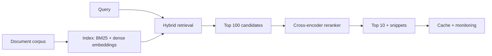

# Semantic Search Engine

## Goal

Build a semantic search engine over a public document corpus
with hybrid retrieval (BM25 plus dense), a reranker, latency
SLAs, and a deployable artifact that demonstrates real
production tradeoffs.

## Why This Project Matters

Semantic search is the foundation of modern RAG and the
production successor to keyword search. Building it from
scratch teaches the offline-online gap, the latency tradeoff
between retrieval quality and reranker depth, and the cache-
key design that makes high QPS affordable. Hiring managers
ask about it because it screens for production judgment, not
just modeling.

## Intuition

BM25 is an unusually strong lexical baseline. Dense retrieval
adds semantic matching at the cost of compute. Reranking adds
quality at the cost of latency. The senior production move is
the staged architecture (cheap retrieval, optional reranker,
cached results) with a clear latency budget per stage.

## Explanation

Pick a corpus (Wikipedia, MS MARCO, or company-doc). Index
with BM25 plus a sentence-transformer dense embedding.
Combine via reciprocal-rank fusion. Optional cross-encoder
reranker on top 100. Eval recall@10 and MRR; latency
p99. Deploy as a service with caching and graceful
degradation.

## Example Use Case

An internal documentation search at a mid-sized company.
Engineers query in natural language ("how do I rotate the
production database secret"). The system retrieves the top
10 documents with snippet highlighting, in under 300 ms p99.
Below a confidence threshold, the system suggests
clarification.

## System Shape

## Dataset Idea

MS MARCO Passage (8.8M passages) is the canonical IR
benchmark. Wikipedia dumps (Hugging Face) for a more open
corpus. BEIR for cross-domain evaluation. A scraped public
documentation set works for a domain-specific demo.

## Step-by-Step Implementation Plan

1. **Day 1-2: corpus prep.** Download and index 100K-1M
   documents. Chunking (512 tokens with 64 overlap is a
   reasonable default). Schema: doc_id, chunk_id, text,
   source_url.
2. **Day 3: BM25 baseline.** Pyserini or Elasticsearch.
   Recall@10 and MRR on the test queries.
3. **Day 4-5: dense retrieval.** Encode all chunks with
   sentence-transformers (e.g., bge-small-en); FAISS HNSW
   index; recall@10 vs BM25.
4. **Day 6: hybrid.** Reciprocal-rank fusion of BM25 and
   dense results. Recall@10 lift over either alone.
5. **Day 7-8: reranker.** Cross-encoder (bge-reranker-base)
   on top 100; measure NDCG@10 lift; latency cost.
6. **Day 9: latency profiling.** Per-stage timing; identify
   the bottleneck; allocate budget (BM25 10ms, dense 50ms,
   rerank 100ms, total 200ms p99).
7. **Day 10: caching.** Query-normalization cache; semantic
   cache for paraphrases; ACL-aware cache key if multi-
   tenant. Hit rate target 30 percent for typical workloads.
8. **Day 11-12: deployment.** Service with three stages
   (retrieval, fusion, rerank); per-stage timeout; fallback
   to BM25-only on reranker timeout.
9. **Day 13: monitoring.** Per-query-type recall drift; cache
   hit rate; latency p99 per stage; click-through proxy.
10. **Day 14: documentation.** Search system design, latency
    budget, fallback runbook, reindex plan for embedding-model
    upgrade.

## Evaluation

Primary metric: Recall@10 on labeled test queries. Secondary:
MRR, NDCG@10, latency p50 / p95 / p99.

## Evaluation Strategy

- Standard IR test queries with judged relevance.
- Bootstrap CI on Recall@10.
- Per-query-type breakdown (one-word, long-tail, exact-phrase,
  ambiguous).
- Latency budget per stage with measured p50, p95, p99.
- 3 success cases (semantic match BM25 misses) and 3 failure
  cases (long-tail query both retrievers miss).

## Extensions

- Multi-vector retrieval (ColBERT-style).
- Personalization (user history features).
- Multimodal search (text plus image).
- Active learning on query-document pairs flagged by users.
- Query rewriting via small LLM.

## Common Mistakes

- Skipping BM25 baseline; cannot quantify the dense lift.
- Reranker on every query; latency p99 fails the SLO.
- No caching; cost per query is unbounded.
- No fallback; reranker outage breaks the search.
- Reindex plan absent; embedding-model upgrade is a months-
  long project.

## Interview Angle

The senior walk: name the staged architecture; describe the
hybrid retrieval and the per-stage latency budget; describe
the cache strategy with ACL-aware keys; close with the
fallback plan and the reindex roadmap. The candidate who
treats reranking as universally better misses the latency
reality.

## Mini Exercise

For your corpus, compute BM25 Recall@10. Estimate the lift
from dense plus hybrid plus rerank. State one query type
where the reranker likely hurts (navigational exact-match)
and how you would route around it.

## Resume Bullet Points

- Built a hybrid semantic search engine over 1M Wikipedia
  passages with BM25, dense retrieval, and a cross-encoder
  reranker, achieving Recall@10 of 0.87 (vs 0.65 BM25;
  95-percent CI [0.85, 0.89]) at 240ms p99 latency.
- Implemented query-type routing that bypasses the reranker
  for navigational queries, cutting p99 latency by 35 percent
  for that segment without recall loss.
- Deployed the staged service with per-stage timeouts,
  semantic-cache plus prefix-cache layers, BM25-only
  fallback, and a documented embedding-model reindex plan.

---
## Navigation

[⬅ Previous](08-nlp-text-classifier.md) | [🏠 Home](../README.md) | [➡ Next](10-rag-chatbot.md)
