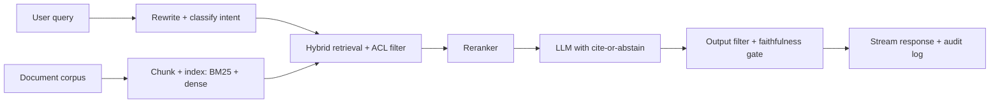

# RAG Chatbot

## Goal

Build a retrieval-augmented chatbot over a public document
corpus with cite-or-abstain contracts, faithfulness eval,
ACL-aware retrieval, and a deployable artifact that handles
the production failure modes of LLM-powered features.

## Why This Project Matters

RAG is the dominant pattern for grounded LLM features in
production. Building one teaches the full LLM-systems stack:
chunking, hybrid retrieval, reranking, citation contracts,
faithfulness measurement, and the security layer
(prompt-injection defenses). Hiring managers screen on this
project because it reveals systems judgment, not just
prompting tricks.

## Intuition

A single-call LLM with no retrieval hallucinates outside its
training data. A naive RAG (retrieve top-5, prepend to prompt,
generate) helps but fails on complex queries, conflicting
sources, or hostile retrieved content. The senior production
move is the layered architecture: query rewrite, hybrid
retrieval with ACL pre-filter, reranker, generation with
cite-or-abstain, output filter, faithfulness evaluation.

## Explanation

Use a public docs corpus (FastAPI docs, Python docs, or a
similar). Chunk with overlap. Index with BM25 plus dense
embeddings. Build a chatbot that retrieves top 100, reranks
to top 5-10, generates with a cite-or-abstain contract,
filters output. Eval recall and faithfulness. Deploy with
ACL stub, audit log, and a production-ready
prompt-injection defense.

## Example Use Case

An internal documentation chatbot answers engineer questions
about company systems. It retrieves the top relevant chunks
with permission filtering, generates an answer with citations,
and abstains when evidence is weak. The 5-percent of queries
where the system abstains route to a human triage queue.

## System Shape

## Dataset Idea

A public technical-documentation set (Python docs, FastAPI
docs, scikit-learn docs) chunked into 200-500 sections.
Sufficient for evaluation. For a more interesting domain, a
public legal or medical doc set (MIMIC if you have access).

## Step-by-Step Implementation Plan

1. **Day 1-2: corpus prep.** Scrape or download docs;
   normalize HTML; chunk at 512 tokens with 64 overlap; add
   metadata (source_url, last_updated, ACL tag).
2. **Day 3: index.** BM25 plus dense embeddings (bge-small-en
   or similar); test with 20 sample queries.
3. **Day 4: retrieval baseline.** Hybrid retrieval; Recall@10
   on a labeled question set.
4. **Day 5: reranker.** Cross-encoder on top 100; measure
   Recall@5 and NDCG@10 lift.
5. **Day 6-7: generation.** LLM call with structured prompt:
   "answer the question using only the provided context;
   cite sources with [doc_id]; if evidence is insufficient,
   say so." Run on 50 sample queries; inspect outputs.
6. **Day 8: faithfulness eval.** Build a 100-question eval
   set with reference answers; run the system; LLM judge for
   per-claim faithfulness; calibrate against 30 human-judged
   examples.
7. **Day 9: abstention.** Add a confidence gate: if reranker
   top score is below threshold, abstain. Tune threshold by
   abstention rate vs faithfulness rate.
8. **Day 10: prompt-injection defense.** Wrap retrieved
   context in `<document>` tags; instruct the model to treat
   tagged content as data, not instructions; output filter
   for known injection patterns.
9. **Day 11-12: deployment.** API with streaming response;
   audit log per request (query, retrieved chunks, generated
   answer); ACL stub (for a real product, hook into
   auth).
10. **Day 13-14: monitoring.** Faithfulness drift on a
    sampled stream; abstention rate per query type; cost per
    request; latency p99.

## Evaluation

Primary metric: faithfulness (per-claim support against
retrieved evidence; LLM-as-judge calibrated against humans).
Secondary: Recall@5 on retrieval, abstention rate (target
5-10 percent), citation accuracy, latency p99, cost per
request.

## Evaluation Strategy

- Versioned eval set of 100-200 representative questions
  with reference answers or rubrics.
- Faithfulness via LLM-judge calibrated against humans on 30
  samples.
- Per-question-type breakdown (factual, definitional,
  multi-hop).
- 3 success cases, 3 expected-abstention cases, 3 known
  failure cases.
- A/B against a no-retrieval baseline showing the lift in
  faithfulness.

## Extensions

- Query rewriting via small LLM.
- Multi-hop retrieval for complex questions.
- Source-conflict resolution: when retrieved chunks
  contradict, surface the conflict.
- Per-segment faithfulness monitoring.
- Red-team probe set for prompt-injection regression.

## Common Mistakes

- No abstention contract; the model fabricates when evidence
  is weak.
- No prompt-injection defense; retrieved content can hijack
  the output.
- Chunking too large or too small; retrieval quality caps the
  system.
- No ACL on retrieval; cross-tenant leakage.
- No faithfulness eval; quality drift goes undetected.

## Interview Angle

The senior walk: name the layered architecture; describe the
chunking and retrieval choices and why; describe the cite-or-
abstain contract and how it shapes behavior; describe the
prompt-injection defense (tagging, output filter); close with
the faithfulness eval and the production monitoring. The
candidate who skips the abstention or injection defense
loses the security question.

## Mini Exercise

For your corpus, sketch the chunking strategy and the
expected Recall@10 with hybrid retrieval. Define the
abstention threshold based on the reranker score
distribution. Identify one indirect-injection pathway that
your defense must catch.

## Resume Bullet Points

- Built a RAG chatbot over technical documentation with
  hybrid retrieval, cross-encoder reranking, and cite-or-
  abstain generation, achieving 0.91 faithfulness and
  Recall@5 of 0.84 on a 200-question eval set.
- Implemented prompt-injection defenses (content tagging,
  output filter) and an evidence-strength abstention gate
  (5-percent abstention rate, 0.96 faithfulness on
  non-abstained answers).
- Deployed a streaming API with per-request audit logs,
  faithfulness drift monitoring, and a calibrated LLM-as-
  judge eval suite running in CI.

---
## Navigation

[⬅ Previous](09-semantic-search-engine.md) | [🏠 Home](../README.md) | [➡ Next](11-enterprise-rag-assistant.md)
