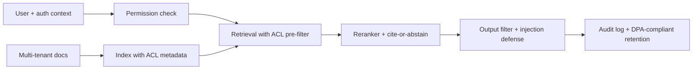

# Enterprise RAG Assistant

## Goal

Build a multi-tenant enterprise RAG assistant with permission-
aware retrieval, audit logs, faithfulness evaluation, and the
governance artifacts that satisfy enterprise procurement.

## Why This Project Matters

Enterprise RAG is the business-critical path for AI adoption
in regulated industries. The technical bar above a basic RAG
chatbot includes ACL on retrieval (per-document permissions),
audit trails, data residency, governance documentation, and
incident response. Hiring managers ask about it because it
tests production-engineering judgment in a setting where
mistakes are existential (cross-tenant data leak, regulatory
fine).

## Intuition

A basic RAG works for a single-user demo. An enterprise RAG
must enforce that user A cannot retrieve documents user B
created or that user B should not see. ACL pre-filtering at
the index level is the only safe pattern; output-filtering
alone leaks. The senior production move is the audit log
that lets the enterprise security team review what the
assistant retrieved, on whose behalf, and what it generated.

## Explanation

Multi-tenant document corpus. Per-document ACL metadata in the
vector index. Pre-filter retrieval by the requesting user's
permissions. Cite sources with verifiable URLs (where
permitted). Audit log every request with user identity,
retrieved document IDs, response, and timestamp. Cite-or-
abstain contract. Indirect-prompt-injection defenses (content
tagging, output filter). Governance: model card, DPA
template, data-residency notes.

## Example Use Case

A consulting firm deploys an internal assistant over client
documents. Each consultant can only retrieve documents from
their own client engagements. The assistant cites sources with
links the consultant can verify. Audit logs are retained for
the regulatory window so security can investigate any data-
access concern. Cross-tenant leakage is the deployment-
blocking risk.

## System Shape

## Dataset Idea

Synthetic multi-tenant corpus: 3-5 simulated tenants with
private and shared document sets. Build the ACL metadata
from scratch. For a richer demo, use a real public docs set
plus synthetic ACL tags simulating multiple tenants.

## Step-by-Step Implementation Plan

1. **Day 1-2: tenant model.** Define 3-5 simulated tenants with
   per-tenant document sets and a small shared corpus. Tag
   each document with tenant_id and ACL.
2. **Day 3: index.** Vector store with metadata filter support
   (Qdrant, Weaviate, or pgvector); chunk and embed with
   per-document ACL preserved.
3. **Day 4: retrieval with pre-filter.** Hybrid retrieval with
   ACL filter at the index level (not post-filter). Test that
   user A cannot retrieve user B's documents.
4. **Day 5: reranker.** Cross-encoder on top 100 retrieved
   results.
5. **Day 6: generation.** LLM call with cite-or-abstain
   contract; structured output for the citation list.
6. **Day 7: prompt-injection defense.** Tag retrieved content
   in the prompt; instruct the model to treat tagged content
   as data; output filter for known injection patterns.
7. **Day 8: audit log.** Per-request log with user identity,
   query, retrieved doc IDs, response, timestamp; immutable
   storage; retention policy aligned with regulatory window.
8. **Day 9: red-team probes.** Test cross-tenant leakage with
   crafted queries; test indirect injection with malicious
   document content; document the test suite.
9. **Day 10-11: deployment.** API with auth context, streaming
   response, audit log; ACL-aware semantic cache (cache key
   includes user ID or ACL hash).
10. **Day 12: governance docs.** Model card with intended use,
    fairness analysis, privacy review; DPA template for
    customers; sub-processor list.
11. **Day 13: monitoring.** Faithfulness drift; per-tenant
    metrics; ACL-failure rate (should be zero); incident
    response runbook.
12. **Day 14: documentation.** Reviewer-ready README with the
    threat model, the ACL design, the audit log spec.

## Evaluation

Primary metric: faithfulness on a 200-question eval set;
ACL-failure rate (must be zero on the red-team suite).
Secondary: Recall@5, citation accuracy, abstention rate,
latency p99.

## Evaluation Strategy

- Per-tenant eval: each user can only see their own documents
  in retrieval results.
- Red-team suite for cross-tenant leakage and injection.
- Faithfulness via calibrated LLM-judge.
- Audit-log completeness check: every request logged, every
  field captured.
- 3 success cases, 3 expected-abstention cases, 3 known
  failure cases.

## Extensions

- SSO integration for production auth.
- Per-document data-residency enforcement (EU users see only
  EU-hosted documents).
- Differential-privacy noise on aggregate query metrics.
- Per-customer model fine-tuning with strict isolation.
- Compliance certifications (SOC 2, ISO 27001, ISO 42001).

## Common Mistakes

- ACL filtering on the LLM output instead of the retrieval
  index. Cross-tenant leak waiting to happen.
- Cache without ACL-aware key. Different users hit each
  other's cached responses.
- No audit log; security cannot investigate.
- No injection defense for retrieved content; one malicious
  doc compromises the assistant.
- No tenant isolation in the embedding pipeline; embeddings
  for one tenant could leak via the index.

## Interview Angle

The senior walk: name the multi-tenant model first; describe
the ACL pre-filter at the index level (not post-filter);
describe the cache-key design; describe the audit log;
describe the injection defense; close with the governance
artifacts (DPA, sub-processor list, retention). The
candidate who treats this as a basic RAG plus a filter at the
end loses the question.

## Mini Exercise

Sketch the multi-tenant index schema. Identify three places
where cross-tenant leakage could occur (index, cache, log).
For each, propose the control that prevents it.

## Resume Bullet Points

- Built a multi-tenant enterprise RAG assistant with
  per-document ACL pre-filtering, ACL-aware caching, and
  immutable audit logs (zero cross-tenant leakage on a 50-
  query red-team suite).
- Implemented indirect-prompt-injection defenses (content
  tagging, output filtering) and a cite-or-abstain contract
  achieving 0.93 faithfulness with 6-percent abstention rate.
- Documented the governance package (model card, DPA
  template, sub-processor list, retention policy) sufficient
  for enterprise procurement review.

---
## Navigation

[⬅ Previous](10-rag-chatbot.md) | [🏠 Home](../README.md) | [➡ Next](12-llm-evaluation-dashboard.md)
