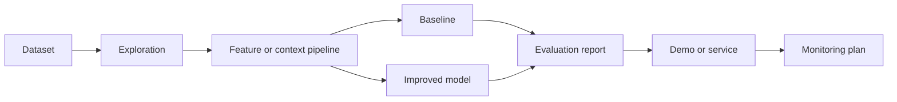

# LLM Evaluation Dashboard

## Goal

Build an end-to-end llm evaluation dashboard that demonstrates real machine learning engineering skill:
problem framing, data handling, modeling, evaluation, communication, and production thinking.

## Skills Learned

- Turning a vague product idea into a measurable ML objective.
- Creating clean training, validation, and test workflows.
- Building a baseline before advanced modeling.
- Evaluating both model quality and product usefulness.
- Explaining tradeoffs clearly in interviews and project writeups.

## Architecture

## Dataset Idea

Use a public or self-created dataset that can be stored locally without secrets. If real data is not
available, create a small synthetic dataset that preserves the structure of the problem: inputs,
labels or expected outputs, timestamps where useful, and edge cases.

## Step-by-Step Implementation Plan

1. Write the product problem, target user, and success metric.
2. Create or collect a small dataset and document each column.
3. Perform exploratory analysis and identify data quality risks.
4. Build the simplest baseline that can be evaluated.
5. Train an improved model or retrieval pipeline.
6. Compare baseline and improved approach on the same split.
7. Analyze errors by segment and severity.
8. Package a small demo script, notebook, or API.
9. Add a model card style summary: intended use, limits, risks, and monitoring.
10. Prepare a two-minute interview explanation.

## Evaluation

Choose one primary metric and several guardrails. For classification, consider precision, recall, F1,
ROC AUC, PR AUC, calibration, and confusion matrix segments. For retrieval or ranking, consider
recall at k, precision at k, MRR, NDCG, latency, and human judgment. For LLM systems, evaluate
faithfulness, relevance, refusal quality, safety, and cost.

## Extensions

- Add experiment tracking with a simple CSV or JSON log.
- Add a command-line inference script.
- Add monitoring checks for missing fields and distribution drift.
- Add a small evaluation set of hard examples.
- Add a README section that explains failure modes honestly.

## Resume Bullet Points

- Built an end-to-end llm evaluation dashboard with documented data pipeline, baseline, model comparison, and
evaluation.
- Improved the selected metric while adding error analysis, monitoring plan, and production risk
assessment.
- Communicated model tradeoffs using business impact, failure modes, and deployment constraints.

## Interview Explanation

Start with the user problem, then describe the dataset, baseline, model, metric, and biggest lesson
from error analysis. End with what you would do next if this system had real users.

## Mini Exercise

Write a one-page project proposal before coding. If you cannot define the metric, baseline, and
deployment path, simplify the project until you can.

---
## Navigation

[⬅ Previous](11-enterprise-rag-assistant.md) | [🏠 Home](../README.md) | [➡ Next](13-agentic-research-assistant.md)
