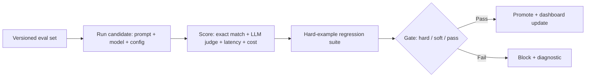

# LLM Evaluation Dashboard

## Goal

Build an evaluation harness and dashboard for an LLM-powered
feature: versioned eval set, multi-metric scoring, calibrated
LLM-as-judge, regression suite, and a CI integration that
gates merges.

## Why This Project Matters

The eval harness is the most underrated piece of production
LLM infrastructure. A team with a strong eval can swap models,
prompts, and retrieval configs freely; a team without one is
locked into the current configuration because they cannot
tell if a change helped. Hiring managers ask about evaluation
because shipping an LLM feature without it is the single
largest production-ML risk in 2026.

## Intuition

Spot-checking 10 examples is not eval. A real eval has a
versioned set of 200-500 representative inputs with reference
answers or rubrics, multiple metrics matched to the task, an
LLM-judge calibrated against humans, a hard-example regression
suite, and CI integration that gates merges. The senior
production move is treating the eval as the contract: every
prompt or model change runs against it; every gate failure
blocks the change.

## Explanation

Wrap an existing LLM feature (your RAG chatbot, your
classifier, your agent) in an evaluation framework. Build a
versioned eval set with reference answers. Score with multiple
metrics: task-specific exact match where applicable, LLM-judge
for open-ended generation, latency, cost. Calibrate the judge.
Build a hard-example suite. Wire into CI. Build a dashboard
showing metric trends across releases.

## Example Use Case

The team owning a customer-support assistant runs the eval
harness on every prompt change. The dashboard shows
faithfulness, deflection rate, and cost-per-resolved-ticket
across the last 20 prompt versions. A regression on the
hard-example suite blocks merge automatically; the engineer
sees the failing examples and fixes the prompt.

## System Shape

## Dataset Idea

Build a 200-question eval set for an existing LLM feature
(your RAG chatbot or text classifier from earlier capstones)
with reference answers or rubrics. Include common cases (60
percent), hard cases (30 percent), and adversarial cases
(10 percent). Version the set; add new failures from
production traces over time.

## Step-by-Step Implementation Plan

1. **Day 1-2: eval set construction.** 200 representative
   inputs with reference answers or rubrics. Stratify across
   query types and difficulty.
2. **Day 3: scoring framework.** Per-metric scorer functions
   (exact match, F1, BLEU where appropriate, LLM judge for
   open-ended). Versioned eval set ID and result schema.
3. **Day 4: LLM judge.** Pilot the judge against 50 human-
   judged examples; compute agreement (Cohen's kappa);
   target above 0.6.
4. **Day 5: bias audits.** Length bias, position bias,
   self-preference; mitigations (randomize position, use a
   different family as judge).
5. **Day 6: hard-example regression suite.** 30-50 specific
   inputs that broke the system in the past; expected
   behaviors documented.
6. **Day 7: gating logic.** Hard gate (regression on
   hard-example or critical-metric drop above threshold);
   soft gate (drop on non-critical metric); pass criteria.
7. **Day 8-9: CI integration.** GitHub Actions workflow that
   runs the eval on every PR; gates merge; comments the
   diff against main.
8. **Day 10: dashboard.** Metric trends across releases;
   per-question-type breakdown; cost trends; LLM-judge
   calibration drift.
9. **Day 11: shadow / canary integration.** Hook into
   production traffic samples; daily eval on 1-percent
   sample; alert on drift.
10. **Day 12-14: documentation.** README on how to use the
    framework; runbook for handling regressions; calibration
    refresh schedule.

## Evaluation

Primary outputs: per-prompt metric trend chart; CI pass/fail
rate; calibration kappa over time; cost per evaluation run.
The framework's success metric is "did it catch the
regression that would have shipped to users."

## Evaluation Strategy

- Self-test: introduce a known regression in the prompt;
  verify the gate fires.
- Calibration on the LLM-judge measured monthly.
- Comparison: feature-team-without-eval vs feature-team-
  with-eval shipping cadence and incident rate.
- 3 cases where the framework caught a regression and 3
  cases where the team caught something the framework
  missed.

## Extensions

- Multi-model evaluation (compare 3 candidate models).
- Cost-quality Pareto frontier visualization.
- Production-traffic shadow evaluation.
- Adversarial prompt-injection regression suite.
- Self-improving eval set: production failures auto-add to
  the suite.

## Common Mistakes

- Eval set too small (under 50); statistical noise dominates.
- LLM judge uncalibrated; biases produce false signals.
- No hard-example suite; old failures recur.
- Eval not in CI; it is a thing the team runs sometimes, not
  a contract.
- No regression alerts; slow drift goes undetected.

## Interview Angle

The senior walk: name the eval set as a contract; describe
calibration of the LLM judge; describe the gating policy and
how it ties to risk; describe the CI integration; close with
production-traffic sampling and the iteration loop. The
candidate who treats eval as "I checked some examples"
loses the production-readiness question.

## Mini Exercise

For an LLM feature you have used, list the 5 most likely
failure modes. Build a 5-input regression set covering each.
Define the gate criteria for each metric (hard, soft, pass).

## Resume Bullet Points

- Built an LLM evaluation framework with a 200-question
  versioned eval set, calibrated LLM-as-judge (kappa 0.74
  vs human), and a hard-example regression suite that gates
  merges via GitHub Actions.
- Caught 4 prompt regressions before production over 3
  months, each diagnosed via the framework's per-question
  diff view; reduced average prompt-change incident response
  from 2 days to 30 minutes.
- Shipped a metric-trend dashboard tracking faithfulness,
  cost, and latency across releases, with daily production-
  traffic sampling and per-segment drift alerts.

---
## Navigation

[⬅ Previous](11-enterprise-rag-assistant.md) | [🏠 Home](../README.md) | [➡ Next](13-agentic-research-assistant.md)
