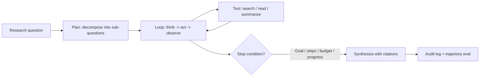

# Agentic Research Assistant

## Goal

Build an agent that performs multi-step research tasks (search,
read, synthesize) with bounded autonomy: tool budgets, stop
conditions, audit logs, and the trajectory evaluation that
proves it works without burning unbounded cost.

## Why This Project Matters

Agents are the production frontier of LLM systems and the
highest-risk pattern (unbounded loops, irreversible actions,
prompt injection from retrieved content). Building a real
agent with bounded autonomy demonstrates the senior judgment
hiring managers screen for: knowing when an agent is
justified, how to constrain it, and how to evaluate
trajectories.

## Intuition

A basic agent loop without stop conditions burns money on
infinite searches. A reasonable agent has step caps, cost
budgets, progress detectors, and trajectory evaluation. The
senior production move is treating the loop as the dominant
risk and engineering accordingly.

## Explanation

Build a single agent (not multi-agent) that takes a research
question, decomposes it, calls tools (web search, document
read, summarize), and returns a cited synthesis. ReAct loop
with explicit stop conditions: max 8 steps, cost budget per
task, low-confidence escalation, progress detector on
repetition. Audit log every action. Trajectory eval on a
20-question benchmark.

## Example Use Case

A researcher asks "compare the published claims about
algorithm X across three vendor blog posts." The agent
searches for the three posts, reads each, extracts claims,
synthesizes a side-by-side comparison with citations. The
trajectory log shows each search, each read, each extraction.
A user can audit the work.

## System Shape

## Dataset Idea

A 20-question benchmark of multi-hop research questions with
known good answers (sourced from public knowledge: Wikipedia
comparisons, public documentation, published benchmarks).
Augment with 5 hard-case questions (no good answer exists; the
agent should report what it found rather than fabricate).

## Step-by-Step Implementation Plan

1. **Day 1-2: tool definition.** Three tools: search (web or
   public corpus), read (fetch a URL or doc), summarize (LLM
   call on text). JSON schemas for each. Validation.
2. **Day 3-4: loop framework.** ReAct implementation; context
   management (summarize prior steps when context grows);
   each step logged with thought, action, args, result.
3. **Day 5: stop conditions.** Max steps (8), cost budget per
   task (input plus output tokens), wall time, progress
   detector (same tool plus same args twice = stuck).
4. **Day 6-7: low-confidence escalation.** Self-confidence
   reporting at each step; below threshold, escalate to
   human-readable failure with the trajectory.
5. **Day 8: synthesis with citations.** Final step generates
   the answer with structured citations (source URL, claim
   reference).
6. **Day 9: audit log.** Per-task log: question, steps taken,
   total cost, total wall time, final answer, citations,
   stop reason.
7. **Day 10: trajectory eval.** 20-question benchmark; metrics:
   task success (correct synthesis), steps per task, cost per
   task, citation accuracy, unauthorized-action rate (should
   be zero).
8. **Day 11: prompt-injection defense.** Tag retrieved content
   in the loop; treat tool outputs as untrusted; output
   filter on the final synthesis.
9. **Day 12-13: deployment.** API with streaming step-by-step
   updates so the user can see progress; audit log retention
   per regulatory window.
10. **Day 14: documentation.** Model card with intended use
    (research, not autonomous action), limits (web search
    quality, citation completeness), and a kill-switch
    runbook.

## Evaluation

Primary metric: task success rate on the 20-question benchmark
(was the synthesis correct against the known answer).
Secondary: average steps per task (target 3-6), cost per task,
citation accuracy (each cited claim is supported), abstention
rate on hard cases.

## Evaluation Strategy

- 20-question benchmark with known good answers.
- 5-question hard-case set where abstention is correct
  behavior.
- Trajectory inspection on 30 random tasks; categorize
  failures (looping, wrong tool, fabricated citation,
  retrieval failure).
- Cost-per-task distribution; alert on tail spend.
- Per-question-type breakdown.

## Extensions

- Multi-step plans with replanning on failure.
- Tool-permission tiers (read-only by default; state-
  changing tools require approval).
- Human-in-the-loop queue for low-confidence outputs.
- Cost-quality Pareto: cheaper model first, escalate to
  stronger on hard questions.
- Self-correction: a critic agent reviews the synthesis.

## Common Mistakes

- No stop conditions; one stuck task burns hundreds of
  dollars.
- No progress detector; the agent loops on the same failing
  search.
- No trajectory eval; the team only sees final-answer
  quality.
- No injection defense for retrieved content; the agent
  follows malicious instructions.
- No audit log; postmortems are guesswork.

## Interview Angle

The senior walk: name the bounded-autonomy frame first;
describe the stop conditions with concrete values; describe
the trajectory eval and the cost-per-task distribution;
describe the injection defense and the audit log; close with
the kill-switch runbook. The candidate who builds an
unbounded agent and shows the demo loses the production-
readiness question.

## Mini Exercise

For your benchmark, define the cost budget per task and
estimate the average cost. Identify one likely failure mode
(looping search on a hard query) and the stop condition that
catches it.

## Resume Bullet Points

- Built a bounded-autonomy research agent with three tools
  (search, read, summarize), achieving 0.78 task success
  rate on a 20-question multi-hop benchmark with average 4
  steps per task and $0.18 cost per task.
- Stop conditions (8-step cap, budget, progress detector on
  repeated actions, low-confidence escalation) reduced
  failure-mode tail spend by an estimated 40x compared to an
  unbounded baseline.
- Deployed with per-step streaming updates, immutable audit
  logs, and a documented kill-switch runbook; trajectory
  inspection on 30 random tasks drove iterative tool-prompt
  improvements.

---
## Navigation

[⬅ Previous](12-llm-evaluation-dashboard.md) | [🏠 Home](../README.md) | [➡ Next](14-ai-customer-support-agent.md)
