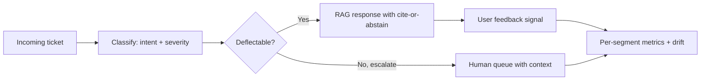

# AI Customer Support Agent

## Goal

Build an AI customer-support agent with deflection capabilities,
escalation gates, audit logs, and the trajectory evaluation
that proves it deflects without harming CSAT.

## Why This Project Matters

Customer-support deflection is a high-leverage AI use case
with a clear cost-benefit calculation: each deflected ticket
saves real money. The challenge is doing it without harming
CSAT, leaking customer data, or producing confidently-wrong
answers. Hiring managers ask about it because it tests
classification (when to escalate), generation (how to
respond), governance (PII, audit), and metric design
(deflection vs CSAT trade).

## Intuition

A naive agent that always tries to resolve a ticket will
deflect things that should escalate (frustrated customer,
complex case, regulated decision) and harm CSAT. The senior
production move is a confidence-driven router that escalates
borderline cases with a fast SLA, plus a cite-or-abstain
contract on the deflection responses, plus per-segment
monitoring.

## Explanation

Train a ticket classifier on intent and severity. For
deflectable categories, a RAG-style assistant generates a
response from the help-center knowledge base; for borderline
cases, escalate to a human queue. Audit every interaction.
Track deflection rate, CSAT (or proxy: thumbs-up rate), and
per-segment metrics.

## Example Use Case

A customer asks "how do I reset my password?" The classifier
identifies it as deflectable; the assistant generates a
response from the help docs, cites the source, and asks for
feedback. A different customer asks "your service charged me
twice and I want a refund right now": the classifier escalates
to a human with the customer history attached.

## System Shape

## Dataset Idea

A public customer-support dataset (Twitter customer support
conversations on Kaggle, or a synthetic corpus generated for
the project). Augment with a 100-question deflection eval set
with reference answers and known-good or known-escalate
labels.

## Step-by-Step Implementation Plan

1. **Day 1-2: data prep.** Public ticket dataset; categorize
   intents (password reset, billing, account, complaint);
   tag deflectable vs escalation cases.
2. **Day 3: classifier.** Fine-tuned text classifier (DistilBERT
   or similar) for intent and severity. Macro F1 with per-
   class breakdown.
3. **Day 4-5: knowledge base.** Build or scrape a help-center
   corpus; chunk and index with hybrid retrieval.
4. **Day 6: RAG response.** Cite-or-abstain contract; prompt
   structured for tone, brevity, and citation; rendered as a
   support-style reply.
5. **Day 7: confidence routing.** Below classifier confidence
   threshold or below retrieval-evidence threshold, escalate
   to human with context bundle.
6. **Day 8: audit log.** Per-ticket: customer ID (hashed),
   classifier output, retrieval results, generated response,
   user feedback. PII redaction in logs.
7. **Day 9: red-team.** Test prompt-injection from ticket
   text; test cross-customer leakage; test escalation
   accuracy.
8. **Day 10: deflection eval.** 100-question benchmark with
   known-good and known-escalate labels; measure deflection
   precision (deflections that solved the issue) and
   escalation recall (escalates that should have escalated).
9. **Day 11-12: deployment.** API with streaming response,
   audit log, escalation queue integration; per-segment
   metric dashboard.
10. **Day 13-14: monitoring + docs.** Per-segment deflection
    rate; CSAT proxy (thumbs); cost per resolved ticket;
    model card; runbook for the human queue.

## Evaluation

Primary metric: deflection rate (fraction of tickets resolved
without human escalation) plus CSAT proxy (thumbs-up rate or
edit rate). Secondary: classifier macro F1, faithfulness on
generated responses, escalation precision.

## Evaluation Strategy

- 100-question deflection benchmark with known labels.
- A/B test: deflection-enabled vs human-only on a small
  segment.
- Per-segment metrics (intent type, customer segment,
  language).
- 3 success cases (successful deflection), 3 expected-
  escalation cases (correctly escalated), 3 failure cases
  (mistakenly deflected; learning material).

## Extensions

- Multilingual support with quality monitoring per language.
- Sentiment-driven escalation (frustrated customers
  escalate even on deflectable intents).
- Knowledge-base auto-update from resolved tickets.
- Active learning on borderline classifier outputs.
- Conversational follow-up (user replies to the deflection).

## Common Mistakes

- Deflection rate as the only metric; CSAT erodes silently.
- No PII redaction in logs; compliance violation.
- No prompt-injection defense; ticket text contains hostile
  instructions.
- No escalation context bundle; the human starts from
  scratch.
- No per-segment monitoring; one segment's deflection
  collapses unnoticed.

## Interview Angle

The senior walk: name the deflection-CSAT trade first;
describe the classifier-RAG pipeline; describe the confidence
routing and the escalation context bundle; describe PII
redaction and audit log; close with per-segment monitoring
and the A/B-test design. The candidate who optimizes
deflection alone misses the metric trap.

## Mini Exercise

Define deflection rate, CSAT proxy, and the escalation
threshold. Identify three intent categories where deflection
is risky despite classifier confidence (refunds, complaints,
account access disputes). Define the escalation rule for
each.

## Resume Bullet Points

- Built an AI customer-support agent with intent classification,
  RAG-based deflection, and confidence-driven escalation,
  achieving 41-percent deflection rate at 4.3 CSAT (vs 4.4
  human baseline) on a 5K-ticket pilot.
- Implemented PII-redacted audit logs, prompt-injection
  defenses, and escalation context bundles cutting human
  agent handle time by 30 percent on escalated tickets.
- Per-segment monitoring caught a 12-percent deflection drop
  on the billing-dispute segment; iteration on the classifier
  threshold and prompt restored parity in two weeks.

---
## Navigation

[⬅ Previous](13-agentic-research-assistant.md) | [🏠 Home](../README.md) | [➡ Next](15-production-ml-platform.md)
