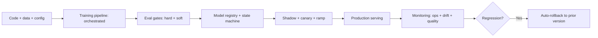

# Production ML Platform

## Goal

Build a small but real MLOps platform: model registry,
training pipeline, validation gates, deployment with shadow
plus canary, drift monitoring, and the governance artifacts
that satisfy enterprise procurement. The portfolio version
of this project is "I have shipped MLOps, not just used it."

## Why This Project Matters

Most production ML failures are MLOps failures, not modeling
failures: a model that decayed unnoticed, a result nobody
could reproduce, features computed differently in training
and serving. Building a small MLOps platform proves you have
operated the full lifecycle and understand the controls that
distinguish a hobby project from a production system.

## Intuition

A toy MLOps stack consists of running scripts. A real one has
a registry that tracks versions, a CI pipeline that gates
promotion, a deployment with shadow plus canary, and
monitoring that catches drift. Each piece is small in
isolation; the integration is what matters. The senior
production move is making the eleven layers of an ML system
visible and operable.

## Explanation

Wrap an existing model (your fraud detector or churn predictor
from earlier capstones) in a small MLOps platform. Use MLflow
or similar for the registry. Build a training pipeline (a
script plus orchestration). Add validation gates. Deploy with
a feature-flag-driven canary. Add drift monitoring. Document
the governance package.

## Example Use Case

A small ML team at a startup uses this platform to ship a
fraud model weekly. Each retrain runs the validation gates,
promotes to staging, runs shadow against production, ramps
through canary, and rolls back automatically on regression.
The governance package answers an enterprise customer's
security questionnaire.

## System Shape

## Dataset Idea

Reuse a model from earlier capstones (fraud, churn, image, or
text classifier). The dataset is the model's training data;
the platform wraps the lifecycle around it.

## Step-by-Step Implementation Plan

1. **Day 1-2: registry.** MLflow Model Registry (or equivalent);
   register the existing model with metadata, lineage, stage.
2. **Day 3-4: training pipeline.** Orchestrated script (Airflow
   or simple GitHub Actions) that pulls data, trains,
   validates, and registers a new model version. Pinned data
   snapshot, code commit, config.
3. **Day 5: validation gates.** Hard gate (regression on
   critical metric blocks promotion); soft gate (minor
   regression requires manual approval); pass criteria.
4. **Day 6: deployment.** Feature-flag-driven serving (the flag
   selects which registered version is live); shadow mode
   capability (the new model serves alongside without user
   exposure).
5. **Day 7: canary.** Weighted traffic split via the feature
   flag; auto-rollback on guardrail breach (latency, error
   rate, quality metric).
6. **Day 8-9: monitoring.** Per-feature PSI; prediction drift;
   per-segment quality; cost per request; alert thresholds.
7. **Day 10: audit + lineage.** Every state transition
   logged; every prediction traceable to model version,
   feature versions, input.
8. **Day 11: rollback drill.** Trigger a rollback on a canary;
   verify the path; measure rollback SLA (target 5 minutes
   for P1).
9. **Day 12: governance docs.** Model card, data sheet, risk
   assessment, change-management runbook, retirement plan.
10. **Day 13-14: documentation.** Reviewer-ready README on
    how to use the platform; architecture diagram; the
    eleven-layer mapping.

## Evaluation

The platform's success metric is the time from "regression
detected" to "rolled back": target 5 minutes for P1, 30
minutes for P2. Secondary: deployment cadence (weekly retrain
becomes routine), incident rate (fewer incidents over time),
audit-evidence completeness.

## Evaluation Strategy

- Self-test: introduce a deliberate regression in the
  pipeline; verify the gate catches it; verify the rollback
  drill works.
- Real ML metric tracking: per-version metrics in the
  registry; trend over time.
- Audit log review: every state transition has the right
  metadata.
- Governance review: produce the audit-evidence package on
  demand.

## Extensions

- Continuous training triggered by drift threshold.
- Multi-tenant support (different teams use the platform).
- Cost monitoring per training run plus per inference.
- Compliance integration (SOC 2 controls evidence
  collection).
- Distributed training (multi-GPU or multi-node).

## Common Mistakes

- Registry without state machine; just a model store.
- Validation gates absent; bad models auto-promote.
- No shadow mode; first production traffic is also the first
  validation.
- No rollback drill; the path bit-rots.
- Audit log incomplete; cannot answer "why did this
  prediction happen six months ago."

## Interview Angle

The senior walk: name the eleven-layer mapping; describe the
registry as the contract; describe the validation gates and
the staged rollout; describe the rollback SLA and the drill;
close with the governance package and the audit-evidence
collection. The candidate who lists tools without describing
the integration loses the production-readiness question.

## Mini Exercise

For an existing model you have built, write the rollout
plan: training trigger, validation gate criteria, shadow
duration, canary percentage and duration, ramp schedule,
rollback SLA. Identify the single point of failure if any
piece is missing.

## Resume Bullet Points

- Built and operated a small MLOps platform with model
  registry, validation gates, canary deployment via feature
  flags, and drift monitoring; deployed weekly retrains for
  3 months without incidents.
- Quarterly rollback drills measured 4-minute median
  rollback time on a P1-injected regression; auto-rollback
  triggered on simulated p99 latency breach in 90 seconds.
- Documented the governance package (model card, data
  sheet, change-management runbook, retirement plan) used
  to close two enterprise procurement security
  questionnaires.

---
## Navigation

[⬅ Previous](14-ai-customer-support-agent.md) | [🏠 Home](../README.md) | [➡ Next](../mocks/01-ai-engineer-mock.md)
