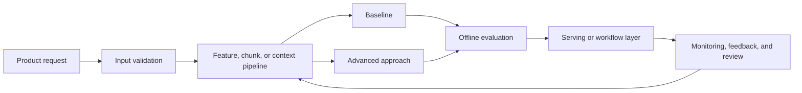

# Fraud Detection

## Problem Statement

Build a fraud detection for payments and account risk. The system uses transaction amount, merchant, device, account age, velocity features, location, and prior disputes to support this output:
approve, challenge, block, or route to review. Treat the case as an interview design exercise and a production review: define the
decision, start with a baseline, measure quality honestly, and explain how the system behaves when
confidence is low.

## Domain Context

In this domain, the model is part of an operational decision. A strong design makes the cost of a
wrong output explicit, defines what data is available at decision time, and explains how the system
will recover when confidence is low. The highest-risk failure to plan around is blocking a legitimate high-value payment during checkout.

## Functional Requirements

- Ingest transaction amount, merchant, device, account age, velocity features, location, and prior disputes.
- Produce approve, challenge, block, or route to review.
- Provide confidence, evidence, or explanation when the workflow needs it.
- Support human review for low-confidence or high-risk outputs.
- Capture feedback so the system can be evaluated and improved.

## Non-Functional Requirements

- Meet latency expectations for the product surface.
- Keep data access, privacy, and retention rules explicit.
- Provide reproducible training or evaluation runs.
- Support monitoring, alerting, rollback, and ownership.
- Degrade gracefully when dependencies or model outputs fail.

## Assumptions

- Historical examples or documents are available for baseline development.
- Labels, outcomes, or human judgments can be collected for evaluation.
- The first version should prioritize measurable reliability over model complexity.
- Deployment traffic may differ from development data.

## Data Assumptions

- Inputs are timestamped so training, validation, and serving windows can be separated.
- Sensitive fields are minimized, redacted, or access-controlled before modeling.
- Labels or judgments have known delay, noise, and reviewer disagreement.
- Feedback can be joined back to model versions, prompts, features, or retrieval indexes.

## Architecture Diagram

## Data Model or Data Design

Track raw inputs, normalized features or chunks, labels or judgments, model outputs, confidence
scores, timestamps, entity identifiers, and feedback events. Include version fields for features,
models, prompts, retrieval indexes, and evaluation datasets so offline results can be compared with
production behavior.

## API Design

A minimal production API should accept the domain input, return the output, confidence, model
version, explanation or evidence when needed, and an audit identifier for tracing. Batch jobs should
produce the same logical fields in a versioned artifact so results can be replayed and inspected.

## Baseline Approach

Start with velocity rules (more than N transactions in M minutes
from a new account), allow and deny lists, and a calibrated tree
model on tabular features. Engineered features that move the
needle: per-card velocity windows (last 1 hour, 24 hours, 7
days), prior-disputes count per merchant and per card, device-
fingerprint hash, BIN risk score, geolocation distance from
recent transactions, and time-since-account-creation. The
baseline should be easy to explain, cheap to run, and strong
enough to expose data quality problems before advanced modeling
begins.

## Advanced Approach

After measuring the baseline, consider sequence features, graph signals across shared devices, and cost-sensitive gradient boosting. Add complexity only when it improves a named
metric or reduces a known operational risk.

## Model Choices

| Option | When it fits | Main risk |
| --- | --- | --- |
| Rules or search baseline | The workflow needs explainability and fast iteration | Can miss nuanced patterns |
| Classical model | Tabular or sparse features carry strong signal | Can leak features or underfit complex behavior |
| Deep model or LLM workflow | Text, images, retrieval, or reasoning dominate the task | Higher latency, cost, and evaluation burden |
| Human review | Errors are costly or confidence is low | Review capacity can become the bottleneck |

## Evaluation Plan

Evaluate with fraud loss prevented, false decline rate, review precision, chargeback rate, and latency. Include slice analysis for important user, item, time, source, language, or
risk segments. Keep a small set of hard examples for regression checks and review disagreements
between model outputs and human judgment.

## Metrics and Guardrails

| Metric Type | Examples |
| --- | --- |
| Primary quality | fraud loss prevented, false decline rate, review precision, chargeback rate, and latency |
| Guardrail | Latency, cost, privacy incidents, unsafe actions, and user complaints |
| Data quality | Missing fields, stale inputs, label delay, and source coverage |
| Operations | Error rate, timeout rate, review backlog, rollback count, and alert response time |

## Scaling Strategy

Separate offline processing from online serving, cache stable computations, precompute embeddings or
features where possible, and define data freshness requirements. Use batch, streaming, or online
inference based on latency and consistency needs.

## Reliability Strategy

Use validation checks, fallback responses, timeouts, retries with limits, canary releases, rollback
plans, and human escalation for high-risk cases. Monitor both technical health and output quality.

## Security Considerations

Limit access to sensitive inputs, redact private fields where possible, enforce authorization before
retrieval or prediction, log only what is necessary, and review prompt or tool injection risks for
LLM workflows.

## Observability

Capture input distributions, model version, prompt or retrieval version, latency, cost, errors,
confidence, decision outcomes, and human feedback. Use dashboards and alerts tied to user impact.

## Bottlenecks

Common bottlenecks include slow feature generation, expensive model calls, poor retrieval recall,
manual labeling throughput, delayed ground truth, and noisy feedback loops.

## Failure Modes

- The system optimizes an offline metric that does not match the product decision.
- Feedback loops reinforce early mistakes or popular items.
- A data pipeline change silently shifts feature values or retrieval quality.
- Confidence is poorly calibrated, causing the system to automate cases that need review.
- The critical failure to plan around is blocking a legitimate high-value payment during checkout.
- Adversarial fraud rings test thresholds with small probe
  transactions; static thresholds fail without periodic
  recalibration on a fresh adversary distribution.
- Label arrival is delayed weeks (chargebacks settle slowly);
  concept drift accumulates if monitoring relies on labels alone
  rather than calibrated proxy signals.

## Tradeoffs

- Simplicity versus model quality.
- Latency versus richer context or larger models.
- Precision versus recall or relevance depth.
- Automation versus human review.
- Freshness versus reproducibility.

## Interview Explanation Script

I would start by clarifying the decision this system supports,
the available data, and the cost of blocking a legitimate high-
value payment during checkout. Then I would build velocity
rules, allow and deny lists, and a calibrated tree model on
tabular features, define metrics around fraud loss prevented,
false decline rate, review precision, chargeback rate, and
latency, inspect errors by segment, and only then consider
sequence features, graph signals across shared devices, and
cost-sensitive gradient boosting. For production, I would add
monitoring, fallback behavior, privacy review, and a feedback
loop before increasing automation.

## Follow-Up Questions

- What baseline would you build first?
- How do you handle delayed labels (chargebacks arrive weeks
  later) when training and monitoring?
- Which metric matters most and which metrics are guardrails?
- What happens when confidence is low?
- How do you defend the model against adversarial probing
  patterns?
- How does the cost matrix shift when serving high-trust
  business accounts vs new consumers?

## Common Mistakes

- Starting with an advanced model before defining the decision and metric.
- Ignoring delayed labels, missing data, or leakage.
- Reporting one aggregate score without segment analysis.
- Forgetting monitoring, rollback, security, and ownership.
- Treating offline performance as proof of production reliability.
- Optimizing accuracy or AUC instead of cost-weighted expected
  loss aligned to the business cost matrix.
- Ignoring per-merchant or per-region fraud-pattern
  heterogeneity; a global threshold misses an entire segment.

---
## Navigation

[⬅ Previous](01-spam-classifier.md) | [🏠 Home](../README.md) | [➡ Next](03-credit-risk-model.md)
