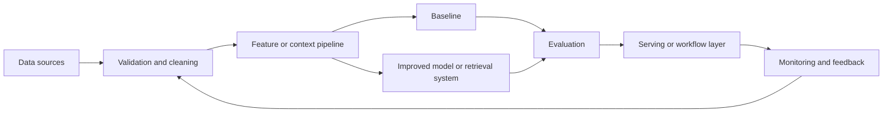

# Time Series Forecasting

## Problem Statement

Design a production-minded time series forecasting case study for demand, traffic, or resource planning. The system should use timestamped observations, calendar features, promotions, outages, and external drivers
to produce forecast with prediction intervals and anomaly flags. The goal is to show how a practical ML or AI design moves from product framing
to data, modeling, evaluation, serving, monitoring, and human review.

## Domain Context

In this domain, the model is part of an operational decision. A strong design makes the cost of a
wrong output explicit, defines what data is available at decision time, and explains how the system
will recover when confidence is low. The highest-risk failure to plan around is missing a demand spike that causes stockouts or capacity incidents.

## Functional Requirements

- Ingest timestamped observations, calendar features, promotions, outages, and external drivers.
- Produce forecast with prediction intervals and anomaly flags.
- Provide confidence, evidence, or explanation when the workflow needs it.
- Support human review for low-confidence or high-risk outputs.
- Capture feedback so the system can be evaluated and improved.

## Non-Functional Requirements

- Meet latency expectations for the product surface.
- Keep data access, privacy, and retention rules explicit.
- Provide reproducible training or evaluation runs.
- Support monitoring, alerting, rollback, and ownership.
- Degrade gracefully when dependencies or model outputs fail.

## Assumptions

- Historical examples or documents are available for baseline development.
- Labels, outcomes, or human judgments can be collected for evaluation.
- The first version should prioritize measurable reliability over model complexity.
- Deployment traffic may differ from development data.

## Architecture Diagram

## Data Model or Data Design

Track raw inputs, normalized features or chunks, labels or judgments, model outputs, confidence
scores, timestamps, entity identifiers, and feedback events. Include version fields for features,
models, prompts, retrieval indexes, and evaluation datasets so offline results can be compared with
production behavior.

## API Design

A minimal production API should accept the domain input, return the output, confidence, model
version, explanation or evidence when needed, and an audit identifier for tracing. Batch jobs should
produce the same logical fields in a versioned artifact so results can be replayed and inspected.

## Baseline Approach

Start with seasonal naive forecasts, moving averages, and simple regression on calendar features. The baseline should be easy to explain, cheap to run, and strong enough to
expose data quality problems before advanced modeling begins.

## Advanced Approach

After measuring the baseline, consider gradient boosting, probabilistic forecasting, or sequence models with covariates. Add complexity only when it improves a named
metric or reduces a known operational risk.

## Evaluation Plan

Evaluate with MAE, WAPE, interval coverage, bias by segment, and business planning error. Include slice analysis for important user, item, time, source, language, or
risk segments. Keep a small set of hard examples for regression checks and review disagreements
between model outputs and human judgment.

## Scaling Strategy

Separate offline processing from online serving, cache stable computations, precompute embeddings or
features where possible, and define data freshness requirements. Use batch, streaming, or online
inference based on latency and consistency needs.

## Reliability Strategy

Use validation checks, fallback responses, timeouts, retries with limits, canary releases, rollback
plans, and human escalation for high-risk cases. Monitor both technical health and output quality.

## Security Considerations

Limit access to sensitive inputs, redact private fields where possible, enforce authorization before
retrieval or prediction, log only what is necessary, and review prompt or tool injection risks for
LLM workflows.

## Observability

Capture input distributions, model version, prompt or retrieval version, latency, cost, errors,
confidence, decision outcomes, and human feedback. Use dashboards and alerts tied to user impact.

## Bottlenecks

Common bottlenecks include slow feature generation, expensive model calls, poor retrieval recall,
manual labeling throughput, delayed ground truth, and noisy feedback loops.

## Tradeoffs

- Simplicity versus model quality.
- Latency versus richer context or larger models.
- Precision versus recall or relevance depth.
- Automation versus human review.
- Freshness versus reproducibility.

## Interview Explanation Script

I would start by clarifying the decision this system supports, the available data, and the cost of
missing a demand spike that causes stockouts or capacity incidents. Then I would build seasonal naive forecasts, moving averages, and simple regression on calendar features, define metrics around MAE, WAPE, interval coverage, bias by segment, and business planning error, inspect errors by segment,
and only then consider gradient boosting, probabilistic forecasting, or sequence models with covariates. For production, I would add monitoring, fallback behavior, privacy
review, and a feedback loop before increasing automation.

## Follow-Up Questions

- What baseline would you build first?
- How would you prevent leakage?
- Which metric matters most and which metrics are guardrails?
- What happens when confidence is low?
- How would the design change at ten times the traffic?

## Common Mistakes

- Starting with an advanced model before defining the decision and metric.
- Ignoring delayed labels, missing data, or leakage.
- Reporting one aggregate score without segment analysis.
- Forgetting monitoring, rollback, security, and ownership.
- Treating offline performance as proof of production reliability.

---
## Navigation

[⬅ Previous](07-ad-click-through-rate-prediction.md) | [🏠 Home](../README.md) | [➡ Next](09-document-classification.md)
