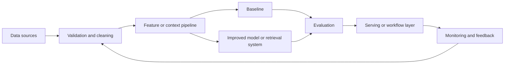

# Enterprise Knowledge Assistant

## Problem Statement

Design a production-minded enterprise knowledge assistant system that turns raw data or documents into a useful
decision, prediction, ranking, answer, or workflow action. The goal is to define a realistic system,
not only a model experiment.

## Functional Requirements

- Accept the relevant user, item, event, document, or workflow input.
- Produce a prediction, ranking, recommendation, answer, alert, or action.
- Provide a confidence signal, explanation, or evidence when the workflow needs it.
- Support human review for low-confidence or high-risk outputs.
- Capture feedback so the system can be evaluated and improved.

## Non-Functional Requirements

- Meet latency expectations for the product surface.
- Keep data access, privacy, and retention rules explicit.
- Provide reproducible training or evaluation runs.
- Support monitoring, alerting, rollback, and ownership.
- Degrade gracefully when dependencies or model outputs fail.

## Assumptions

- Historical examples or documents are available for baseline development.
- Labels, outcomes, or human judgments can be collected for evaluation.
- The first version should prioritize measurable reliability over model complexity.
- Deployment traffic may differ from development data.

## Architecture Diagram

## Data Model or Data Design

Track raw inputs, normalized features or chunks, labels or judgments, model outputs, confidence
scores, timestamps, user or entity identifiers, and feedback events. For RAG or search systems,
store document identifiers, chunk boundaries, embedding versions, metadata filters, and retrieval
traces.

## API Design

A minimal production API should expose a request endpoint, a response schema with output and
confidence, an explanation or evidence field when needed, and an audit identifier for tracing. Batch
jobs should produce the same logical fields in a versioned artifact.

## Baseline Approach

Start with a simple ruleset, majority-class predictor, lexical search, nearest-neighbor retrieval,
linear model, or shallow tree model. The baseline should be easy to explain and should reveal data
quality problems before advanced modeling begins.

## Advanced Approach

After measuring the baseline, consider gradient boosting, calibrated classifiers, two-stage ranking,
deep models for unstructured data, hybrid retrieval with reranking, RAG, or constrained agent
workflows. Add complexity only when it improves a named metric or reliability requirement.

## Scaling Strategy

Separate offline processing from online serving, cache stable computations, precompute embeddings or
features where possible, and define data freshness requirements. Use batch, streaming, or online
inference based on latency and consistency needs.

## Reliability Strategy

Use validation checks, fallback responses, timeouts, retries with limits, canary releases, rollback
plans, and human escalation for high-risk cases. Monitor both technical health and output quality.

## Security Considerations

Limit access to sensitive inputs, redact private fields where possible, enforce authorization before
retrieval or prediction, log only what is necessary, and review prompt or tool injection risks for
LLM workflows.

## Observability

Capture input distributions, model version, prompt or retrieval version, latency, cost, errors,
confidence, decision outcomes, and human feedback. Use dashboards and alerts tied to user impact.

## Bottlenecks

Common bottlenecks include slow feature generation, expensive model calls, poor retrieval recall,
manual labeling throughput, delayed ground truth, and noisy feedback loops.

## Tradeoffs

- Simplicity versus model quality.
- Latency versus richer context or larger models.
- Precision versus recall.
- Automation versus human review.
- Freshness versus reproducibility.

## Interview Explanation Script

I would start by clarifying the decision this system supports and the cost of mistakes. Then I would
build a baseline, choose a split that matches deployment, define a primary metric and guardrails, and
inspect errors by segment. For production, I would add monitoring, fallback behavior, privacy review,
and a feedback loop before increasing model complexity.

## Follow-Up Questions

- What baseline would you build first?
- How would you prevent leakage?
- Which metric matters most and which metrics are guardrails?
- What happens when confidence is low?
- How would the design change at ten times the traffic?

## Common Mistakes

- Starting with an advanced model before defining the decision and metric.
- Ignoring delayed labels, missing data, or leakage.
- Reporting one aggregate score without segment analysis.
- Forgetting monitoring, rollback, security, and ownership.
- Treating offline performance as proof of production reliability.

---
## Navigation

[⬅ Previous](11-chatbot-with-rag.md) | [🏠 Home](../README.md) | [➡ Next](13-customer-support-agent.md)
