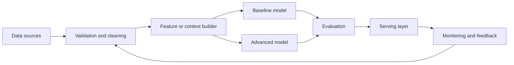

# Code Assistant

## Problem Statement

Build a production-minded code assistant system that solves a measurable business problem instead of only
demonstrating a model. The goal is to translate raw events, records, or documents into decisions that
can be evaluated, monitored, and improved.

## Requirements

- Define a clear user or business action triggered by the model output.
- Support a simple baseline before moving to complex models.
- Keep training, validation, and test data separated by time or entity when leakage is possible.
- Provide interpretable metrics for stakeholders and diagnostic metrics for engineers.
- Include a plan for monitoring, failure handling, and periodic review.

## Data

Start with historical examples containing inputs, timestamps, labels or weak labels, and outcome
signals. Useful fields often include user or account identifiers, event history, item or document
features, and the final decision or outcome. Treat missing data and delayed labels as first-class
design constraints.

## Baseline Approach

Create a baseline that a team could understand in one meeting: heuristic rules, majority class,
keyword matching, logistic regression, nearest neighbors, or a simple retrieval approach depending on
the task. The baseline gives you a floor for performance and exposes data quality issues early.

## Advanced Approach

Move to a stronger architecture only after the baseline is measured. Options include gradient
boosting for tabular data, neural networks for unstructured inputs, two-stage retrieval and ranking,
RAG for grounded language answers, or an agent workflow for multi-step tool use. The advanced design
should improve a named metric without making operations unmanageable.

## Architecture Diagram

## Model Choices

- Baseline: simple rules or linear models to establish a reliable reference.
- Main model: choose the smallest model family that captures the dominant signal.
- Calibration or reranking: add when raw scores must become reliable probabilities or ordered lists.
- Human review: use for high-risk, low-confidence, or policy-sensitive decisions.

## Metrics

Track both offline and production metrics. Offline metrics may include precision, recall, F1, ROC
AUC, PR AUC, RMSE, NDCG, recall at k, latency, or faithfulness. Production metrics should connect to
the workflow: saved time, reduced loss, higher satisfaction, fewer escalations, or better conversion.

## Failure Modes

- Data leakage from future events or duplicated entities.
- Silent distribution shift after product, policy, or user behavior changes.
- Over-optimization of one metric while harming user trust or fairness.
- Poor handling of missing, rare, adversarial, or out-of-domain examples.
- Lack of rollback, audit trail, or owner when the model fails.

## Production Considerations

Production readiness requires versioned data, reproducible training, clear model ownership, monitored
serving, alert thresholds, privacy review, and a human escalation path. For language systems, also
track grounding quality, unsafe outputs, prompt changes, retrieval drift, and cost per successful
task.

## Interview Discussion Points

- What is the simplest baseline and why?
- How would you split the data to avoid leakage?
- Which metric would you optimize and which metric would you only monitor?
- How would you debug false positives and false negatives?
- What changes when this becomes a real-time service?

## Mini Exercise

Sketch the first version of this system for a company you know. Name the dataset, baseline,
deployment path, top three metrics, and the first alert you would configure.

---
## Navigation

[⬅ Previous](13-customer-support-agent.md) | [🏠 Home](../README.md) | [➡ Next](15-ai-meeting-summarizer.md)
