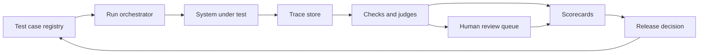

# LLM Evaluation Platform

## Problem Statement

Design an LLM evaluation platform that helps teams decide whether a prompt, model, retrieval
pipeline, tool workflow, or release candidate is safe and useful enough to ship. The platform should
run versioned test sets, collect model outputs and traces, apply deterministic checks and judge
rubrics, support human review, detect regressions, and produce release recommendations with
evidence.

The central product question is not "what score did the model get?" It is "what changed, where did
quality improve or regress, and is the remaining risk acceptable for this workflow?"

## Domain Context

LLM quality is multidimensional. A release can improve average helpfulness while worsening
faithfulness, tool correctness, refusal behavior, latency, cost, or a high-risk customer workflow.
The platform must preserve enough context to debug the failure: prompt, model, retrieval results,
tool calls, judge version, human labels, dataset version, and trace metadata.

The highest-risk failure is shipping a model change because the evaluation set missed a critical
workflow or because the judge rewarded fluent but unsupported answers.

## Functional Requirements

- Ingest test cases with prompt, expected behavior, rubric, tags, risk level, source, and owner.
- Run candidate systems against selected datasets and capture output text, citations, tool traces,
  latency, token usage, cost, errors, and model versions.
- Support deterministic checks such as JSON validity, required fields, forbidden terms, citation
  presence, refusal rules, and tool-call schema validation.
- Support rubric-based judging with calibrated LLM judges and human review queues.
- Compare runs across model, prompt, retrieval, tool, and dataset versions.
- Detect regressions by slice, severity, and workflow owner.
- Produce release scorecards with pass, fail, needs review, and known-risk decisions.

## Non-Functional Requirements

- Reproduce past runs with immutable dataset, prompt, model, judge, and code versions.
- Protect sensitive prompts, documents, user traces, and human-review notes.
- Provide clear audit trails for release decisions.
- Keep evaluation cost predictable through sampling, caching, and run budgets.
- Support asynchronous batch evaluation and fast smoke tests for pull requests.
- Degrade gracefully when model providers, judges, or tracing systems fail.

## Assumptions

- Teams can provide workflow-specific prompts, expected behavior, and risk tags.
- Some test cases have human labels or expert-written rubrics; others start as unlabeled examples
  that need review.
- The first release should prioritize regression detection and traceability over broad automation.
- LLM-as-judge is useful only after calibration against human review.

## Architecture Diagram

## Data Model or Data Design

Core tables or documents should include:

- **TestCase:** id, prompt, expected behavior, rubric, tags, risk level, owner, source, created time,
  dataset version, and redaction policy.
- **Run:** run id, system version, prompt version, model version, retrieval index version, tool
  version, judge version, started time, and status.
- **Trace:** input, output, retrieved context ids, citations, tool calls, errors, latency, token
  usage, cost, and safety events.
- **Score:** check name, score, pass/fail, explanation, confidence, judge id, human override, and
  reviewed time.
- **Decision:** release recommendation, required fixes, accepted risks, approver, and rollback notes.

Version every artifact that can change. Without versioning, a scorecard cannot explain why quality
moved.

## API Design

Minimal APIs:

- `POST /datasets/{id}/test-cases` creates or updates versioned test cases.
- `POST /runs` starts an evaluation for a system version and dataset selection.
- `GET /runs/{id}` returns status, aggregate metrics, cost, and failure counts.
- `GET /runs/{id}/failures` returns filtered failures by tag, severity, workflow, and check.
- `POST /reviews/{trace_id}` records a human judgment or override.
- `POST /decisions` records release recommendation and approver notes.

Responses should include run id, version ids, audit id, and links to failed traces.

## Baseline Approach

Start with curated golden test sets, deterministic checks, and human-reviewed release notes. This
baseline catches obvious regressions, schema breaks, missing citations, unsafe tool calls, and known
workflow failures before adding automated judges.

## Advanced Approach

Add calibrated LLM-as-judge for rubric scoring, pairwise comparison for subjective quality, semantic
clustering for failure discovery, and active sampling to route uncertain or high-impact traces to
human reviewers. Add automation only where judge agreement and regression detection are measured.

## Evaluation Plan

Evaluate the platform itself with:

- Human-judge agreement and disagreement analysis.
- Regression detection rate on seeded failures.
- False alarm rate and reviewer workload.
- Coverage by workflow, language, risk level, and tool path.
- Time to diagnose a failed release candidate.
- Evaluation cost per run and latency for smoke tests.

For LLM systems under test, track task success, faithfulness, citation accuracy, instruction
following, refusal quality, tool correctness, safety, latency, and cost.

## Scaling Strategy

Separate smoke tests from full batch evaluations. Cache model outputs for unchanged test cases and
system versions when policy allows. Use asynchronous workers for large runs, shard by dataset or
workflow, and store traces in append-only versioned storage. Keep high-risk tests always-on, while
sampling lower-risk regression suites when cost is constrained.

## Reliability Strategy

Use idempotent run orchestration, retries with limits, provider timeouts, partial-run reporting,
canary judge versions, and rollback for bad rubrics or datasets. A failed judge call should not hide
the system output; it should mark the trace as unevaluated and route it to review.

## Security Considerations

Redact secrets and private data before judge prompts when possible. Restrict access by workflow and
dataset owner. Avoid sending sensitive traces to unapproved providers. Log prompts, outputs, and
tool traces only according to retention policy. Treat judge prompts and rubrics as production logic
because they can alter release decisions.

## Observability

Track run status, queue depth, evaluation latency, judge error rate, provider errors, cost, token
usage, review backlog, pass rate by suite, failure clusters, and release decisions. Dashboards should
show both system quality and evaluation platform health.

## Bottlenecks

Common bottlenecks include slow model calls, expensive judges, low-quality rubrics, insufficient
human review capacity, missing trace metadata, unowned test cases, and stale datasets that no longer
match product workflows.

## Tradeoffs

- Deterministic checks are cheap and reproducible but miss subjective quality failures.
- LLM judges scale review but can reward fluency and inherit bias.
- Human review is higher quality for hard cases but slow and expensive.
- Broad test coverage reduces blind spots but increases cost and maintenance.
- Strict release gates reduce regressions but can slow iteration.

## Interview Explanation Script

I would frame this as a release-risk platform for LLM systems. First, I would build a versioned test
case registry and run orchestrator that captures prompts, outputs, retrieval context, tool traces,
latency, cost, and model versions. The baseline would use golden sets, deterministic checks, and
human review for high-risk workflows. Then I would add calibrated LLM judges and pairwise comparison
only after measuring agreement with humans. The key metrics are regression detection, judge
agreement, coverage, false alarms, review workload, and evaluation cost. I would secure sensitive
traces, version every artifact, and make release decisions auditable.

## Follow-Up Questions

- How would you calibrate an LLM judge?
- What failures should deterministic checks catch before judge scoring?
- How would you avoid overfitting to the evaluation set?
- How would you handle sensitive customer traces?
- What should block a release automatically?
- How would the platform support RAG or tool-using agents?

## Common Mistakes

- Treating one aggregate judge score as a release decision.
- Failing to version datasets, prompts, models, judges, and retrieval indexes.
- Ignoring human-judge disagreement.
- Evaluating final text but not retrieved evidence or tool traces.
- Letting stale test cases create false confidence.
- Omitting privacy controls for prompts and traces.

---
## Navigation

[⬅ Previous](15-ai-meeting-summarizer.md) | [🏠 Home](../README.md) | [➡ Next](17-vector-search-at-scale.md)
