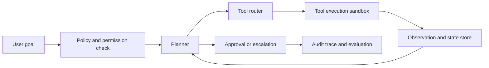

# AI Agent for Workflows

## Problem Statement

Design an AI agent platform that helps users complete multi-step workflows such as support refunds,
meeting scheduling, expense triage, CRM updates, document processing, or internal research. The
system should translate a user goal into a plan, call approved tools, track state, validate results,
ask for clarification when needed, and escalate risky actions to humans.

The core design challenge is controlled autonomy: the agent should save time without silently taking
unsafe, unauthorized, or irreversible actions.

## Domain Context

Workflow agents combine language understanding, planning, tool use, memory, permissions, and audit
traces. Their failures are operational, not just conversational. A wrong answer may be annoying, but
a wrong tool call can send an email, issue a refund, modify a record, leak data, or create duplicate
work.

The highest-risk failure is calling a state-changing tool without required approval or with the wrong
entity, user, or policy context.

## Functional Requirements

- Accept a user goal, workflow type, available tools, task state, permissions, documents, and
  approval policy.
- Produce a plan, intermediate status, completed task, tool trace, clarification request, or
  escalation request.
- Validate tool calls against schemas, permissions, preconditions, and side-effect policies.
- Support read-only tools, write tools, approval-gated tools, and forbidden tools.
- Keep an auditable trace of plans, tool calls, observations, user confirmations, and final outcome.
- Detect low confidence, conflicting evidence, missing permissions, and unsafe instructions.
- Capture human feedback and corrections for evaluation and improvement.

## Non-Functional Requirements

- Enforce least-privilege access to tools and data.
- Keep latency acceptable for interactive workflows and support asynchronous long-running tasks.
- Make partial progress recoverable after timeouts or tool failures.
- Protect secrets, private documents, and customer data.
- Provide deterministic replay for incident review.
- Support monitoring, alerting, rollback, and kill switches for risky tools.

## Assumptions

- The first version will automate narrow workflows rather than arbitrary tasks.
- Tool APIs already exist or can be wrapped with validation layers.
- High-risk write actions require human approval until the system has strong evidence.
- Evaluation can use historical workflow traces, simulated tasks, and human review.
- The agent should not train on sensitive traces without explicit policy approval.

## Architecture Diagram

## Data Model or Data Design

Core entities:

- **Task:** task id, user id, workflow type, goal, status, risk level, created time, and owner.
- **State:** current plan, completed steps, pending approvals, memory references, and tool outputs.
- **ToolCall:** tool name, schema version, arguments, permission check, approval id, result, error,
  latency, and side-effect classification.
- **Policy:** allowed actions, forbidden actions, approval thresholds, data scopes, and escalation
  rules.
- **Trace:** prompts, model decisions, observations, validations, user confirmations, and final
  outcome.
- **Feedback:** human rating, correction, unsafe-action label, resolution state, and notes.

Keep state explicit. Hidden model memory is not a reliable source of truth for workflow execution.

## API Design

Minimal APIs:

- `POST /tasks` creates a workflow task with user goal, workflow type, and context references.
- `POST /tasks/{id}/step` advances one validated plan-act-observe step.
- `POST /tasks/{id}/approve` records user or reviewer approval for a proposed action.
- `GET /tasks/{id}` returns status, plan, pending approvals, and audit trace summary.
- `POST /tools/{name}/validate` checks schema, permissions, and preconditions before execution.
- `POST /feedback` records correction, rating, or unsafe-action report.

State-changing tool APIs should be idempotent where possible and return audit identifiers.

## Baseline Approach

Start with deterministic workflow forms, rules, retrieval, and human approval. For example, a refund
assistant can retrieve policy, prefill a recommendation, and ask a human to approve the final action.
This baseline exposes tool contracts, policy ambiguity, and approval needs before autonomous planning.

## Advanced Approach

Add an LLM planner with strict step limits, typed tool schemas, tool validation, memory scoped to the
task, and approval checkpoints. Later, add workflow-specific fine-tuning or examples only after the
trace evaluation shows repeated planning failures that prompting and rules do not solve.

## Evaluation Plan

Evaluate at the trace level:

- Task success rate and completion time.
- Unsafe action rate and unsafe near-miss rate.
- Approval precision: how often requested approvals were actually needed.
- Tool-call validity and tool error recovery.
- Clarification quality and escalation accuracy.
- Human intervention rate, latency, cost, and user satisfaction.
- Auditability: whether a reviewer can reconstruct why an action happened.

Use simulated adversarial tasks, permission-denied cases, ambiguous goals, stale documents, tool
timeouts, and conflicting instructions as hard examples.

## Scaling Strategy

Start with a few high-value workflows and shared platform primitives: tool registry, policy engine,
state store, audit log, evaluation harness, and approval service. Scale by adding workflow templates,
not by giving one general agent unlimited tools. Run long workflows asynchronously and notify users
when approval or clarification is needed.

## Reliability Strategy

Use step limits, timeouts, retries with idempotency keys, circuit breakers for tools, partial-state
recovery, and kill switches for write actions. If validation fails, the agent should stop or ask for
help rather than invent a workaround. Canary new prompts, tools, or policies on low-risk workflows
before broad rollout.

## Security Considerations

Use least-privilege tool scopes, separate read and write permissions, redact secrets from prompts,
and prevent user or retrieved text from overriding tool policy. Require approval for irreversible or
external actions. Log enough for audits but avoid storing unnecessary sensitive content. Treat prompt
injection as a workflow security issue because it can affect tool calls.

## Observability

Monitor task volume, success rate, escalation rate, unsafe-action attempts, approval backlog, tool
latency, tool errors, model cost, step count, retries, policy denials, and user corrections. Review
complete traces for high-risk failures, not just final messages.

## Bottlenecks

Common bottlenecks include incomplete tool schemas, ambiguous policies, approval backlog, tool
timeouts, poor entity resolution, hidden state bugs, insufficient audit traces, and evaluation sets
that cover happy paths but not unsafe edge cases.

## Tradeoffs

- More autonomy reduces manual effort but increases safety and audit burden.
- Strict approvals reduce risk but may erase productivity gains.
- General agents are flexible but harder to evaluate than workflow-specific agents.
- Detailed traces improve debugging but raise privacy and retention concerns.
- Longer plans can solve richer tasks but increase latency, cost, and failure surface.

## Interview Explanation Script

I would design this as a controlled workflow automation platform rather than a fully autonomous
assistant. The baseline is deterministic forms, retrieval, rules, and human approval. The first agent
version adds an LLM planner, typed tools, explicit state, validation, and approval checkpoints. Every
tool call is checked for schema, permission, preconditions, and side effects before execution. I
would evaluate task success, unsafe action rate, intervention rate, tool validity, latency, cost, and
auditability. The most important production controls are least privilege, approval for risky writes,
trace review, rollback, and kill switches.

## Follow-Up Questions

- Which tools should be read-only in the first release?
- How do you recover from a timeout after partial progress?
- What actions require human approval?
- How would you evaluate unsafe near misses?
- How do you prevent prompt injection from changing tool policy?
- When would you choose a deterministic workflow over an agent?

## Common Mistakes

- Describing an agent without tool schemas, permissions, or state.
- Optimizing task success while ignoring unsafe actions.
- Allowing state-changing tools without approval or rollback.
- Hiding partial failures from users and operators.
- Treating memory as a source of truth.
- Building a general agent before proving a narrow workflow.

---
## Navigation

[⬅ Previous](19-personalization-engine.md) | [🏠 Home](../README.md) | [➡ Next](../interview-prep/01-ai-engineer-roadmap.md)
