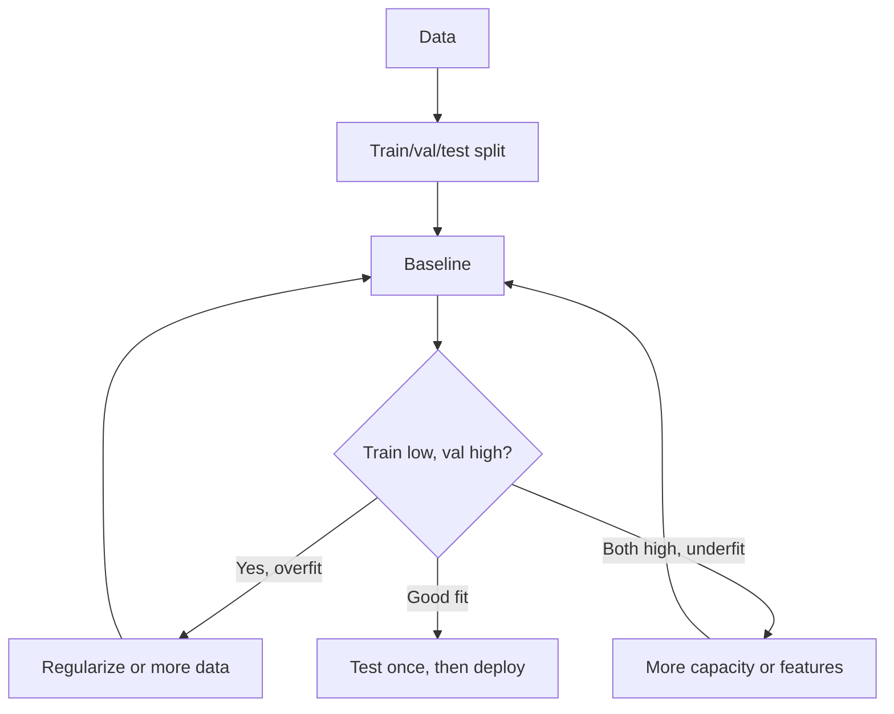

# ML Fundamentals Cheatsheet

## Intuition

Machine learning fits a function from data instead of hand-coding rules. You give the model examples,
it finds patterns that minimize a loss, and you hope those patterns generalize to new data. Every
fundamentals question reduces to four things: the data, the objective, how you measure success, and
whether the result holds outside the training set.

## Explanation

The core vocabulary you must be able to define cold:

- **Supervised:** learn a mapping from inputs to known labels (regression, classification).
- **Unsupervised:** find structure without labels (clustering, dimensionality reduction).
- **Self-supervised:** create labels from the data itself (next-token prediction, masked tokens).
- **Reinforcement:** learn a policy from reward signals.
- **Parameters:** values learned during training (weights). **Hyperparameters:** values you set
  before training (learning rate, depth, regularization strength).
- **Bias-variance:** high bias = underfit (too simple); high variance = overfit (memorizes noise).
- **Generalization gap:** train score minus validation score. Large gap means overfitting.

## Why It Matters

Most real failures are not exotic. They are leakage, a bad train/test split, a metric that does not
match the business goal, or a model that overfits and looks great offline then collapses in
production. Fundamentals are the checklist that catches these before they ship.

## Key Formulas And Rules

| Idea | Formula or rule |
| --- | --- |
| MSE loss | mean of (y - y_hat)^2 |
| Log loss | -[y log p + (1-y) log(1-p)] |
| Bias-variance | total error = bias^2 + variance + irreducible noise |
| Train/val/test | fit on train, tune on val, report once on test |
| Overfit signal | train error low, val error high and rising |
| Regularization | L1 drives weights to zero (sparsity), L2 shrinks them |

## Example

You build a churn model with 95 percent accuracy and celebrate. But only 5 percent of users churn,
so predicting "no churn" for everyone also scores 95 percent. The accuracy was meaningless. The fix
is a metric tied to the decision (recall on churners, or precision at the contact budget) and a
baseline (majority class) to compare against.

## Interview Angle

Answer shape: define the task, name a baseline, pick a metric that matches the goal, state how you
split data to avoid leakage, then describe the bias-variance tradeoff you expect and how you would
detect overfitting.

**Strong answer:** "I start with the simplest baseline, hold out a clean test set, and pick a metric
that matches the cost of errors before I touch model choice."

**Weak answer:** "I would try a neural network and check the accuracy."

## Common Mistakes

- Tuning on the test set, so the reported score is optimistic.
- Leakage: a feature that encodes the label or future information.
- Using accuracy on imbalanced data.
- Comparing models without a baseline.
- Confusing parameters with hyperparameters in interviews.

## Mini Exercise

Take any dataset. Write its task type, a one-line baseline, the metric you would optimize, the metric
you would guardrail, and one leakage risk. Then state whether you expect bias or variance to dominate
and why.

## Diagram

---
## Navigation

[⬅ Previous](../quizzes/20-final-review-quiz.md) | [🏠 Home](../README.md) | [➡ Next](02-math-for-ml-cheatsheet.md)
