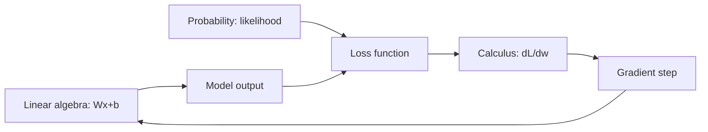

# Math For ML Cheatsheet

## Intuition

Three branches carry almost all of ML. Linear algebra moves and combines data (a layer is a matrix
multiply). Calculus tells you which direction reduces error (the gradient). Probability lets you
reason about uncertainty and write loss functions as likelihoods. You do not need every proof, but
you should know what each tool computes and why.

## Explanation

- **Vectors and matrices:** data is rows of feature vectors; a linear layer is `y = Wx + b`.
- **Dot product:** measures alignment; cosine similarity normalizes it by length.
- **Norms:** L2 is Euclidean length, L1 is sum of absolute values (used in regularization).
- **Gradient:** vector of partial derivatives; points uphill, so we step against it.
- **Chain rule:** the engine of backpropagation; gradients multiply through layers.
- **Eigenvectors:** directions a matrix only scales; PCA keeps the top-variance ones.
- **Probability:** expectation is a weighted average; variance measures spread; Bayes flips
  conditionals.

## Why It Matters

When training diverges, vanishes, or explodes, the cause is usually mathematical: a learning rate
that overshoots the curvature, gradients that shrink through many layers, or a loss that is not what
you think it is. Reading these symptoms requires the math, not just the library call.

## Key Formulas

| Concept | Formula |
| --- | --- |
| Gradient descent | w := w - lr * dL/dw |
| Cosine similarity | (a . b) / (norm(a) * norm(b)) |
| Cross-entropy | -sum over classes of y_c * log(p_c) |
| Bayes | P(A given B) = P(B given A) * P(A) / P(B) |
| Variance | E[x^2] - (E[x])^2 |
| Softmax | exp(z_i) / sum_j exp(z_j) |

## Example

A model's loss explodes after a few steps. You suspect the learning rate. The update is
`w := w - lr * grad`. If `lr` is too large relative to the loss curvature, each step overshoots the
minimum and the loss grows. You lower `lr` by 10x or add gradient clipping, and training stabilizes.
The fix came directly from reading the update rule.

## Interview Angle

Expect "explain backprop", "why does softmax use exp", "what is the gradient of MSE", or "what does
PCA optimize". Answer with the formula plus one sentence of meaning. For backprop: forward pass
computes outputs, the loss measures error, and the chain rule propagates `dL/dw` backward so each
weight knows how to change.

## Common Mistakes

- Confusing the gradient direction (it points uphill; descent subtracts it).
- Forgetting softmax is shift-invariant, so subtract the max for numerical stability.
- Treating correlation as the dot product without normalizing.
- Saying PCA "removes noise" instead of "keeps maximum-variance directions".

## Mini Exercise

Derive the gradient of MSE `L = (y - wx)^2` with respect to `w` by hand. Then write one sentence on
how that gradient drives the weight update, and what happens if the learning rate is too high.

## Diagram

---
## Navigation

[⬅ Previous](01-ml-fundamentals-cheatsheet.md) | [🏠 Home](../README.md) | [➡ Next](03-statistics-cheatsheet.md)
