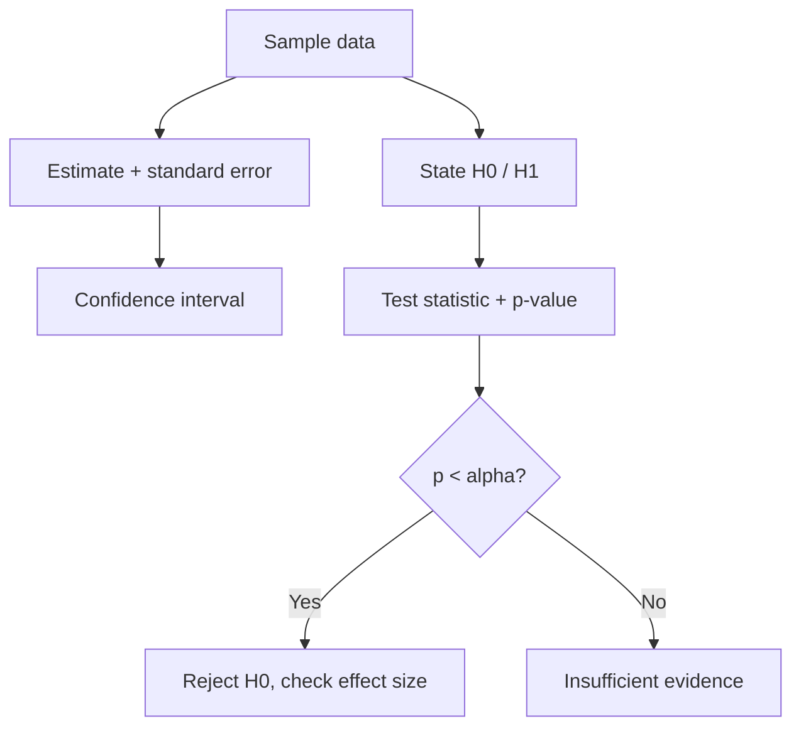

# Statistics Cheatsheet

## Intuition

Statistics is how you reason from a sample to a conclusion while being honest about uncertainty. You
never see the full population, so you estimate, attach an interval, and ask whether an observed
difference is real or could be noise. Most data-science interviews live here.

## Explanation

- **Estimate plus uncertainty:** a point estimate (mean, proportion) is incomplete without a standard
  error and a confidence interval.
- **Hypothesis test:** assume the null (no effect), compute a test statistic, get a p-value (the
  probability of data this extreme if the null were true), and compare to alpha.
- **p-value is not** the probability the null is true, and it is not the effect size.
- **Type I error:** false positive (reject a true null), rate alpha. **Type II:** false negative,
  rate beta. **Power** = 1 - beta.
- **CLT:** sample means are approximately normal for large n, which is why so many tests use the
  normal or t distribution.

## Why It Matters

A/B tests, metric movements, and "is this model actually better" questions all hinge on
distinguishing signal from noise. Reading a result without a confidence interval or peeking at a test
early is how teams ship changes that do nothing or hurt.

## Key Formulas

| Concept | Formula or rule |
| --- | --- |
| Standard error of mean | s / sqrt(n) |
| 95 percent CI | estimate +/- 1.96 * SE |
| z statistic | (estimate - null) / SE |
| Bayes | P(H given D) = P(D given H) P(H) / P(D) |
| Power drivers | larger effect, larger n, lower variance, higher alpha |

## Example

An A/B test shows the variant has 12.0 percent conversion versus 11.5 percent for control. Is it
real? You compute the difference, its standard error from both sample sizes, and a confidence
interval. If the 95 percent CI for the lift includes 0, you cannot claim an effect yet. If you also
peeked daily and stopped when it looked good, your false-positive rate is far above 5 percent.

## Interview Angle

Common prompts: "explain a p-value to a non-technical PM", "what is the difference between Type I and
Type II error", "how would you size an A/B test", "correlation vs causation". Always pair the
definition with the decision it informs.

**Strong answer to p-value:** "If there were truly no effect, the p-value is how often we would see a
result at least this extreme by chance. A small p-value means the data is surprising under the null."

## Common Mistakes

- Saying the p-value is the probability the hypothesis is true.
- Peeking and stopping A/B tests early without correction.
- Ignoring effect size; statistical significance is not practical significance.
- Confusing correlation with causation when confounders exist.
- Forgetting multiple-comparison inflation when testing many metrics.

## Mini Exercise

Design an A/B test for a checkout button change. State the metric, the null and alternative, the
minimum detectable effect, the required sample size drivers, and one guardrail metric. Then explain
how you would avoid peeking bias.

## Diagram

---
## Navigation

[⬅ Previous](02-math-for-ml-cheatsheet.md) | [🏠 Home](../README.md) | [➡ Next](04-classical-ml-cheatsheet.md)
