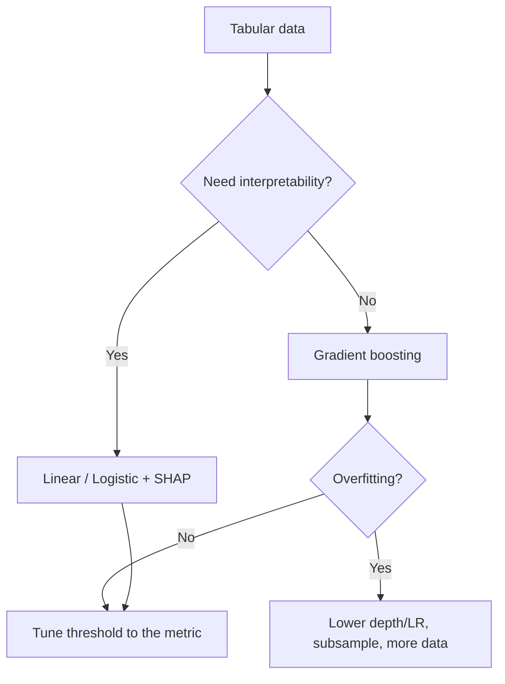

# Classical ML Cheatsheet

## Intuition

For tabular data, classical models still win most of the time. The whole game is picking the right
model family for the data shape, engineering good features, and tuning a few knobs. Gradient-boosted
trees are the default strong baseline; linear models are the default interpretable baseline.

## Explanation

| Model | Use when | Watch out for |
| --- | --- | --- |
| Linear / Logistic regression | Linear signal, need interpretability | Underfits nonlinearity; scale features |
| KNN | Small data, local structure | Slow at inference; curse of dimensionality |
| Naive Bayes | Text, high dimensions, fast | Strong independence assumption |
| Decision tree | Need a readable rule | Overfits alone |
| Random forest | Strong, low-tuning baseline | Larger, less interpretable |
| Gradient boosting (XGBoost/LightGBM) | Best tabular accuracy | Tuning and overfitting if unchecked |
| SVM | Clear margin, medium data | Kernel and scaling sensitive |
| K-Means / DBSCAN | Unsupervised grouping | K-Means needs k; assumes round clusters |
| PCA | Reduce dimensions, denoise | Components are not interpretable |

## Why It Matters

Reaching for deep learning on a 50k-row tabular problem is a classic anti-pattern. Boosted trees
train in seconds, handle mixed feature types, and usually beat a neural net there. Knowing the map of
models saves time and signals maturity in interviews.

## Key Decisions

- **Bagging (random forest):** trains trees in parallel on bootstraps, reduces variance.
- **Boosting (XGBoost):** trains trees sequentially on residuals, reduces bias.
- **Regularization:** Lasso (L1) selects features, Ridge (L2) shrinks; boosting uses depth, learning
  rate, and subsampling.
- **Class imbalance:** class weights, resampling, or threshold tuning, not just accuracy.

## Example

Fraud detection on tabular transactions: start with logistic regression for a transparent baseline,
then LightGBM for accuracy. Fraud is rare, so optimize PR-AUC and recall at a fixed review budget,
not accuracy. Use SHAP to explain why a transaction was flagged for the review team.

## Interview Angle

Frequent prompts: "random forest vs gradient boosting", "why scale features for SVM/KNN but not
trees", "L1 vs L2", "how to handle imbalance". Trees split on thresholds so monotonic scaling does
not matter; distance and margin models need scaling.

## Common Mistakes

- Jumping to deep learning on small tabular data.
- Not scaling features for KNN, SVM, or linear models.
- Using accuracy on imbalanced data.
- Letting a single deep tree overfit instead of using an ensemble.
- Reading raw tree-count importance without SHAP or permutation checks.

## Mini Exercise

Given a 100k-row tabular dataset with 10 percent positives, write your model progression (baseline to
strong), the metric you would optimize, two features you would engineer, and how you would tune the
decision threshold.

## Diagram

---
## Navigation

[⬅ Previous](03-statistics-cheatsheet.md) | [🏠 Home](../README.md) | [➡ Next](05-evaluation-metrics-cheatsheet.md)
