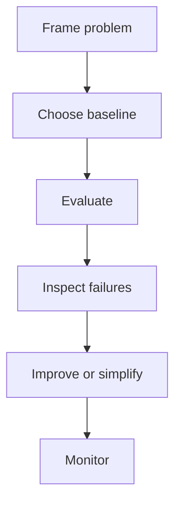

# Evaluation Metrics Cheatsheet

## Intuition

Evaluation Metrics is easiest to revise as a decision checklist. For any concept, ask what problem it solves,
what data or signal it needs, how it is evaluated, and what can fail in production.

## Explanation

Use this page as a fast reference for the ideas, metrics, traps, and answer structures connected to
Evaluation Metrics. The goal is not to memorize isolated definitions. The goal is to move quickly from concept
to example, then from example to interview-ready reasoning.

## Why It Matters

Interviewers and real teams both look for the same signal: can you connect a technical idea to a
measurable decision, defend a baseline, and explain tradeoffs clearly. Evaluation Metrics is useful only when it
helps you reason about data quality, model behavior, evaluation, cost, latency, or user impact.

## Example

If you are asked about Evaluation Metrics, start with a concrete workflow such as search, recommendations,
fraud review, support routing, document retrieval, or model monitoring. Name the input, output,
baseline, metric, and one failure mode before adding detail.

## High-Yield Checklist

| Question | What a strong answer includes |
| --- | --- |
| What problem is being solved? | User, decision, input, output, and constraints |
| What is the baseline? | A simple measurable reference such as rules, majority class, linear model, lexical search, or retrieval |
| What metric matters? | A primary metric tied to the decision plus guardrails for safety, latency, cost, or fairness |
| What can go wrong? | Leakage, drift, bias, missing data, poor calibration, overfitting, or unsafe automation |
| What happens in production? | Monitoring, rollback, ownership, retraining triggers, and human escalation |

## Interview Angle

Use this answer shape: define the concept, give a small example, identify the baseline, choose the
metric, name the failure mode, and explain what you would monitor after launch.

## Common Mistakes

- Reciting definitions without a concrete user decision.
- Skipping the baseline and starting with a complex model.
- Reporting one metric without segment or failure analysis.
- Ignoring data leakage, drift, privacy, latency, cost, or rollback.
- Treating a polished demo as proof of production readiness.

## Mini Exercise

Explain Evaluation Metrics in two minutes. Record the answer and check whether it included problem framing,
baseline, metric, failure mode, and production plan.

## Diagram

---
## Navigation

[⬅ Previous](04-classical-ml-cheatsheet.md) | [🏠 Home](../README.md) | [➡ Next](06-feature-engineering-cheatsheet.md)
